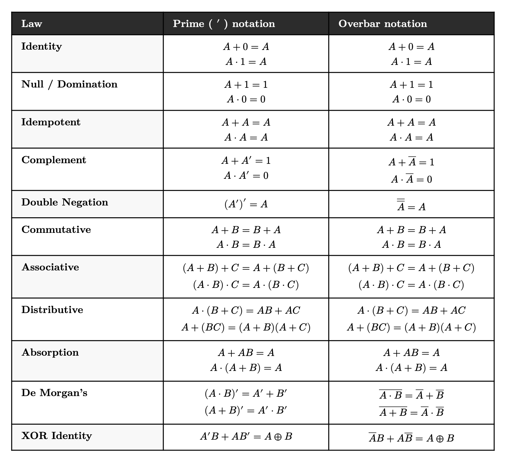

# TEJ4M — Final Exam Review Guide

**Exam date:** Monday, June 16, 2026  
**Duration:** 2 hours  
**Total marks:** 70  
**Tools permitted:** Non-programmable calculator; Boolean Laws reference table (provided with the exam). Closed book — no other notes or materials.

---

## Exam Structure

The exam has eight sections. Parts A, B, and C are answered on a provided ZipGrade card. Parts D through H are written directly on the exam paper.

| Section | Type | Marks |
|---------|------|------:|
| Part A | Multiple Choice — Knowledge | 14 |
| Part B | Multiple Choice — Thinking | 12 |
| Part C | Matching | 10 |
| Part D | Boolean Simplification | 8 |
| Part E | Short Answer — Circuit Design | 8 |
| Part F | Short Answer — Networking | 4 |
| Part G | Python GPIO — Application | 8 |
| Part H | Design Challenge | 6 |
| **Total** | | **70** |

The following Boolean Laws reference table is provided with the exam and you may use it throughout:



---

## Unit Coverage at a Glance

| Unit | Approximate marks | Notes |
|------|------------------:|-------|
| Unit 1 — Networking | ~10 | MCQ + short answer |
| Unit 2 — Linux | ~8 | MCQ + matching |
| Unit 3 — Digital Logic | ~22 | MCQ + Boolean simplification + circuit design |
| Unit 4 — Physical Computing (RPi) | ~30 | MCQ + GPIO application + design challenge |

**Unit 4 carries the most marks on the exam — and it is the only unit that did not have its own quiz or test.** Prepare this unit as carefully as you would for a separate test.

---

## What to Study

### Unit 1: Networking

> **Emphasis note:** For networking commands (`ipconfig`, `ping`, `traceroute`, `nmap`, etc.), you are expected to **read and interpret the output** shown to you, not write the commands from memory. Focus on what the output tells you about the state of the network.

**Core topics:**

- **TCP/IP model** — the four layers (Physical/Link, Internet, Transport, Application) and what each is responsible for
- **IP vs MAC addresses** — what each is used for; which layer uses which
- **ARP** — what it resolves, when it runs
- **DHCP** — what it assigns; what a 169.254.x.x address tells you
- **DNS** — resolving hostnames to IP addresses
- **NAT** — why private and public IP addresses coexist
- **TCP vs UDP** — reliability and ordering guarantees; when each is used
- **Switches vs routers** — what each does; what addressing each uses
- **Wireless networks** — SSID, access points, 802.11 at a conceptual level
- **Basic diagnostics** — reading `ipconfig`/`ifconfig` output; recognizing signs of DHCP failure; troubleshooting steps

**Key terms:** default gateway, subnet mask, packet, frame, port, SSID, ARP, DHCP, DNS, NAT, TCP, UDP, LAN, WAN

---

### Unit 2: Linux

> **Emphasis note:** Same approach as networking. For most Linux commands, you are expected to **read and understand** them when shown, not write them from memory. The exception is **`chmod` permissions notation**: be comfortable interpreting both symbolic (`rwxr-x---`) and numeric (`755`, `700`) forms.

**Core topics:**

- **Filesystem hierarchy** — know the purpose of these directories:
  - `/etc` — configuration files
  - `/var` — variable runtime data (logs, web server content)
  - `/home` — user home directories
  - `/tmp` — temporary files
  - `/proc` — virtual filesystem for process/system information
  - `/usr` — user-installed programs and utilities
- **File permissions** — owner / group / others; read (4) / write (2) / execute (1)
- **`chmod`** — changing permissions with numeric or symbolic notation
- **Pipes and redirection** — `|`, `>`, `<` conceptually
- **Package management** — the concept of `apt install`, `apt update`, `apt upgrade`
- **SSH** — what it is and why it is used (connects to Unit 4 as well)

---

### Unit 3: Digital Logic

This unit has the heaviest written-work sections on the exam. Parts D and E both require showing work step by step; marks are allocated per step, not just for the final answer.

**Core topics:**

- **Logic gates** — AND, OR, NOT, NAND, NOR, XOR: truth tables and symbols
- **Boolean algebra laws** — you have the reference table during the exam, but you should be fluent enough to apply them without hunting for every step. Know: Distributive, Identity, Null, Complement, Idempotent, Absorption, De Morgan's
- **Sum of Products (SOP)** — reading a truth table, identifying minterms, writing the expression
- **Boolean simplification** — step by step, naming the law at each step. Practice this skill more than any other in Unit 3.
- **Gate counting** — two separate counts: once allowing multi-input gates, once assuming only 2-input gates
- **Half adder** — truth table, equations (XOR for Sum; AND for Carry Out), circuit diagram
- **Half subtractor** — same structure as the half adder, different operation: computes A minus B, outputs Difference and Borrow Out. Derive the truth table from scratch, write SOP equations for each output, then simplify and draw the circuit.
- **Full adder** — adds two bits plus a carry in; outputs Sum and Carry Out
- **Ripple carry adder** — how full adders chain; why carry propagates from LSB to MSB
- **ALU design** — control signal selects operation (know the control codes from your lab)
- **Circuit reading** — given a diagram, write the Boolean equation; evaluate for specific inputs; reason about mutual exclusivity or edge cases

**XOR identity to know cold:**
```
A'·B + A·B' = A ⊕ B
```
This comes up when simplifying difference outputs.

---

### Unit 4: Physical Computing (Raspberry Pi)

Since there was no separate test for this unit, it receives significant coverage on the final. Use the practice questions at the end of this guide to prepare for the specific question formats.

**Analog and Digital Signals** (`01-analog-digital.md`)

- What makes a signal analog vs. digital
- **ADC (Analog-to-Digital Converter)** — how it samples a continuously varying signal and encodes it as binary
  - **Sample rate** — how many times per second the ADC reads the signal (Hz)
  - **Bit depth** — number of bits per sample; determines how many levels are available (2ⁿ)
  - **Quantization error** — the rounding error between the true voltage and the nearest representable level
- **DAC (Digital-to-Analog Converter)** — converting binary values back to analog output
- **PWM (Pulse Width Modulation)** — simulating analog output with a digital signal; duty cycle; why it is used for motor speed control and LED dimming
- Trade-offs in ADC design: storage cost, processing cost, energy, and diminishing returns at very high specifications

**Python for GPIO** (`02-python-for-gpio.md`)

- What a Raspberry Pi is — single-board computer; 40-pin GPIO header
- **GPIO** = General Purpose Input/Output
- **BCM vs BOARD pin numbering** — always use BCM; it matches the numbers on GPIO reference cards
- Python essentials for GPIO:
  - Variables, `for` loop, `while True` loop, `if / elif / else`
  - **`try / finally`** — guarantees cleanup code runs even on Ctrl+C
- **`GPIO.cleanup()`** — resets all pins to their default state; forgetting it leaves LEDs on and motors running
- All six key GPIO calls and what each does — see the table below
- `GPIO.HIGH` and `True` are interchangeable in `GPIO.output()`; same for `GPIO.LOW` and `False`
- **SSH** — connecting to the Pi over the network without a monitor (headless operation)
- `scp` — transferring files to the Pi from your laptop

**Key GPIO calls:**

| Call | What it does |
|------|-------------|
| `GPIO.setmode(GPIO.BCM)` | Selects BCM pin numbering — must be the first GPIO call |
| `GPIO.setup(pin, GPIO.OUT)` | Configures a pin to send signals |
| `GPIO.setup(pin, GPIO.IN)` | Configures a pin to receive signals |
| `GPIO.output(pin, GPIO.HIGH)` | Sets an output pin HIGH (3.3V) |
| `GPIO.output(pin, GPIO.LOW)` | Sets an output pin LOW (0V) |
| `GPIO.input(pin)` | Reads an input pin — returns `True` (HIGH) or `False` (LOW) |
| `GPIO.cleanup()` | Resets all GPIO pins — always call this when the script ends |

**Physical circuits** (Labs 01–04)

- **LED circuit** — output pin, current-limiting resistor; why the resistor is needed
- **Pull-down resistor** — why a floating input pin is unreliable; how a pull-down fixes it (holds the pin LOW when the button is open; button press overrides it with 3.3V)
- **Motor driver (L293D / H-bridge)** — why you cannot drive a motor directly from a GPIO pin (current limit, back-EMF); what a motor driver does
  - EN (enable) pin — HIGH activates the channel; LOW disables it regardless of IN pins
  - IN1 / IN2 control direction (HIGH/LOW vs LOW/HIGH = forward vs reverse)
  - Vm (motor power) vs Vss (logic power) — distinct pins, different roles
- **PWM for motor speed** — `GPIO.PWM(pin, freq)`, `.start(duty_cycle)`, `.ChangeDutyCycle(value)` where value is 0–100; duty cycle determines effective power
- **RC timing trick** (Lab 04) — the Pi has no analog input; using a capacitor to convert resistance into a time measurement that a digital pin can read

**Design thinking**

Given a project description, be prepared to:
1. **Sketch** the physical setup with all components labelled
2. **List the hardware** required (RPi, motor driver, sensors, buttons, LEDs, resistors, power supply)
3. **Outline the code logic** — main loop, sensor checks, motor/LED control, cleanup on exit. Plain English, arrows, or rough Python — all acceptable.

---

## Unit 4 Practice Questions

Try each question before opening the solution. The question formats match what appears on the exam.

---

### Analog / Digital

**Q1.** An ADC uses **6-bit depth**. How many discrete voltage levels can it represent per sample?

<details>
<summary>Solution</summary>

**64 levels.**

With *n* bits, there are 2ⁿ possible levels. 2⁶ = 64.

</details>

---

**Q2.** An audio ADC samples at 44,100 Hz with 16-bit depth. A digital thermometer samples at 2 Hz with 10-bit depth. Explain why these two systems use such different specifications.

<details>
<summary>Solution</summary>

Human hearing extends up to about 20,000 Hz. To faithfully capture a signal at that frequency, the sample rate must be more than twice as fast: 44,100 Hz provides that margin. 16-bit depth gives 65,536 levels, fine enough to represent amplitude detail below the threshold of human hearing.

Body temperature changes at most a fraction of a degree over many minutes. Two samples per second is more than sufficient; faster sampling generates data with no benefit. 10-bit depth gives 1,024 levels, more than enough precision for medical temperature readings.

The right specifications depend on what the signal actually requires.

</details>

---

**Q3.** What is **quantization error**, and when is it larger — with a 4-bit ADC or a 16-bit ADC?

<details>
<summary>Solution</summary>

Quantization error is the difference between the true analog voltage and the nearest representable digital level after sampling. Because digital levels are discrete, the measured voltage must be rounded to the closest available step; that rounding is the error.

A 4-bit ADC has only 16 levels (2⁴), so its steps are large and the rounding error can be substantial. A 16-bit ADC has 65,536 levels (2¹⁶), so its steps are tiny and the error is negligible. Quantization error is **larger** with a 4-bit ADC.

</details>

---

### GPIO Concepts

**Q4.** A student writes:

```python
GPIO.setup(SENSOR_PIN, GPIO.OUT)
```

`SENSOR_PIN` is connected to a button. What is wrong, and what should the line say?

<details>
<summary>Solution</summary>

A button is an **input** device: it sends a signal to the Pi. `GPIO.OUT` configures the pin to send a signal outward, which is backwards. Calling `GPIO.input()` on an output pin will behave incorrectly or fail.

The correct line is:

```python
GPIO.setup(SENSOR_PIN, GPIO.IN)
```

</details>

---

**Q5.** What does `GPIO.setmode(GPIO.BCM)` do, and why must it come before any other GPIO call?

<details>
<summary>Solution</summary>

It selects the **Broadcom chip (BCM) pin numbering scheme**. Under BCM, the numbers in your script match the GPIO numbers printed on reference cards and pinout diagrams (e.g., BCM 18, BCM 27). The alternative, `GPIO.BOARD`, numbers pins by their physical position on the 40-pin header.

This call must come first because every subsequent `GPIO.setup()`, `GPIO.output()`, and `GPIO.input()` call uses pin numbers, and the library needs to know the numbering scheme before it can interpret them.

</details>

---

### Script Tracing

**Q6.** Read the following script and answer the questions below.

```python
import RPi.GPIO as GPIO
import time

BUZZER = 17
LED    = 27
BUTTON = 22

GPIO.setmode(GPIO.BCM)
GPIO.setup(BUZZER, GPIO.OUT)
GPIO.setup(LED,    GPIO.OUT)
GPIO.setup(BUTTON, GPIO.IN)

try:
    for i in range(4):
        GPIO.output(BUZZER, GPIO.HIGH)
        time.sleep(0.1)
        GPIO.output(BUZZER, GPIO.LOW)
        time.sleep(0.1)

    while True:
        if GPIO.input(BUTTON) == True:
            GPIO.output(LED,    GPIO.HIGH)
            GPIO.output(BUZZER, GPIO.HIGH)
            time.sleep(0.5)
            GPIO.output(LED,    GPIO.LOW)
            GPIO.output(BUZZER, GPIO.LOW)
        time.sleep(0.05)

finally:
    GPIO.cleanup()
```

**(a)** What does the `for` loop do?

**(b)** In the `while True` loop, what happens when the button is pressed?

**(c)** What happens if the user presses Ctrl+C while the `while True` loop is running?

**(d)** Which pin(s) are configured as inputs?

<details>
<summary>Solution</summary>

**(a)** The buzzer beeps 4 times: 0.1 seconds on and 0.1 seconds off each time, 0.8 seconds total.

**(b)** The LED and buzzer both switch on simultaneously for 0.5 seconds, then both turn off. The loop continues checking the button every 50 ms.

**(c)** Ctrl+C raises a `KeyboardInterrupt`. Python jumps immediately to the `finally` block, which calls `GPIO.cleanup()`. All GPIO pins are reset to their default state (LED and buzzer off), and the script ends cleanly.

**(d)** BUTTON (BCM 22) is the only input. BUZZER (BCM 17) and LED (BCM 27) are both outputs.

</details>

---

### Debugging

**Q7.** The script below is intended to blink an LED 3 times and then hold it on, but it contains **two errors**. Identify each error, explain why it is wrong, and write the correction.

```python
import RPi.GPIO as GPIO
import time

LED = 18

GPIO.setmode(GPIO.BCM)
GPIO.setup(LED, GPIO.IN)

for i in range(3):
    GPIO.output(LED, GPIO.HIGH)
    time.sleep(0.5)
    GPIO.output(LED, GPIO.LOW)
    time.sleep(0.5)

try:
    while True:
        GPIO.output(LED, GPIO.HIGH)
        time.sleep(0.1)
finally:
    GPIO.cleanup()
```

<details>
<summary>Solution</summary>

**Error 1 — `GPIO.setup(LED, GPIO.IN)` (line 6)**

`LED` is an output device. `GPIO.IN` configures the pin to receive signals; calling `GPIO.output()` on an input pin will fail.

Correction: `GPIO.setup(LED, GPIO.OUT)`

---

**Error 2 — The `for` loop is outside the `try` block**

If the user presses Ctrl+C during the `for` loop (e.g., mid-`time.sleep`), the `finally` block is never reached and `GPIO.cleanup()` never runs. The LED stays in whatever state it was last set to.

Correction: move the `for` loop inside `try`:

```python
try:
    for i in range(3):
        GPIO.output(LED, GPIO.HIGH)
        time.sleep(0.5)
        GPIO.output(LED, GPIO.LOW)
        time.sleep(0.5)

    while True:
        GPIO.output(LED, GPIO.HIGH)
        time.sleep(0.1)

finally:
    GPIO.cleanup()
```

</details>

---

### Read and Explain (Plain English)

**Q8.** Read the script below carefully, then write a plain-English explanation of what this device does. Describe all LED behaviours, how the button is used, and what happens when the program ends. Do **not** reference variable names or code syntax — write as if describing the device's behaviour to someone who has never seen code.

```python
import RPi.GPIO as GPIO
import time

RED    = 17
GREEN  = 27
BUTTON = 22

GPIO.setmode(GPIO.BCM)
GPIO.setup(RED,    GPIO.OUT)
GPIO.setup(GREEN,  GPIO.OUT)
GPIO.setup(BUTTON, GPIO.IN)

try:
    GPIO.output(GREEN, GPIO.HIGH)

    while True:
        if GPIO.input(BUTTON) == True:
            GPIO.output(GREEN, GPIO.LOW)
            for i in range(3):
                GPIO.output(RED, GPIO.HIGH)
                time.sleep(0.3)
                GPIO.output(RED, GPIO.LOW)
                time.sleep(0.3)
            GPIO.output(GREEN, GPIO.HIGH)
        time.sleep(0.1)

finally:
    GPIO.cleanup()
```

<details>
<summary>Solution</summary>

When the device starts, the green LED turns on and holds steady.

The device then waits, checking the button many times per second. Nothing changes until the button is pressed.

When the button is pressed, the green LED turns off and the red LED flashes three times, about a third of a second on and off each time. After the three flashes, the green LED comes back on and the device returns to waiting.

If the program is stopped from the terminal, all GPIO pins are reset, both LEDs turn off, and the program ends cleanly.

</details>

---

### Script Tracing: Multiple Choice Format

**Q9.** Part B of the exam presents a GPIO script followed by multiple-choice questions. Practice that format below — choose your answer for each question before opening the solution.

```python
import RPi.GPIO as GPIO
import time

YELLOW = 18
BLUE   = 23
SWITCH = 25

GPIO.setmode(GPIO.BCM)
GPIO.setup(YELLOW, GPIO.OUT)
GPIO.setup(BLUE,   GPIO.OUT)
GPIO.setup(SWITCH, GPIO.IN)

try:
    for i in range(5):
        GPIO.output(YELLOW, GPIO.HIGH)
        time.sleep(0.2)
        GPIO.output(YELLOW, GPIO.LOW)
        time.sleep(0.2)

    while True:
        if GPIO.input(SWITCH) == True:
            GPIO.output(YELLOW, GPIO.LOW)
            GPIO.output(BLUE,   GPIO.HIGH)
        else:
            GPIO.output(YELLOW, GPIO.HIGH)
            GPIO.output(BLUE,   GPIO.LOW)
        time.sleep(0.1)

finally:
    GPIO.cleanup()
```

**(i)** What does the `for` loop do at the start of the script?

- A) Blinks BLUE five times with a 0.2-second on and 0.2-second off delay
- B) Reads the switch five times and stores the results
- C) Blinks YELLOW five times with a 0.2-second on and 0.2-second off delay
- D) Waits 5 seconds before the main loop begins

**(ii)** Once the `for` loop finishes, what does the `while True` loop do?

- A) Turns both LEDs on and keeps them on
- B) Blinks YELLOW and BLUE alternately regardless of the switch state
- C) Turns BLUE on when the switch is pressed; turns YELLOW on when it is not
- D) Turns YELLOW off permanently and keeps BLUE on

**(iii)** Which GPIO pin is configured as an **input**?

- A) 18
- B) 23
- C) 25
- D) Both 18 and 23

**(iv)** If Ctrl+C is pressed while the `while True` loop is running, what happens?

- A) The for loop runs again from the beginning
- B) Python crashes with a traceback and both LEDs stay on
- C) The finally block runs, GPIO.cleanup() resets all pins, and both LEDs turn off
- D) The while loop pauses until a key is pressed

**(v)** If the switch is **not** pressed, which LED is on?

- A) YELLOW (pin 18)
- B) BLUE (pin 23)
- C) Both LEDs are on
- D) Neither LED is on

**(vi)** The script uses `GPIO.BCM` pin numbering. What does this mean?

- A) Pins are numbered by their physical position on the 40-pin header (1 to 40)
- B) BCM stands for a 3.3V voltage standard used by Broadcom chips
- C) Pins are referenced by their Broadcom chip number, matching GPIO reference cards and pinout diagrams
- D) Pin numbers are auto-detected from the hardware at runtime

<details>
<summary>Solutions</summary>

**(i) C** — The for loop runs 5 times; each iteration turns YELLOW on for 0.2 s then off for 0.2 s. Total duration: 2 seconds.

**(ii) C** — `GPIO.input(SWITCH)` returns `True` when pressed. When True: YELLOW off, BLUE on. When False (else branch): YELLOW on, BLUE off.

**(iii) C** — Pin 25 (SWITCH) is set up with `GPIO.IN`. Pins 18 and 23 are outputs.

**(iv) C** — Ctrl+C raises a `KeyboardInterrupt`. Python jumps to the `finally` block, which calls `GPIO.cleanup()`, resetting all pins and turning both LEDs off.

**(v) A** — When the switch is not pressed, the `else` branch runs: YELLOW goes HIGH, BLUE goes LOW.

**(vi) C** — `GPIO.BCM` selects Broadcom chip pin numbering, matching the numbers on GPIO reference diagrams. The alternative is `GPIO.BOARD`, which numbers by physical header position.

</details>

---

### Second Design Challenge

**Q10.** You are designing a **Fan Speed Controller** using a Raspberry Pi. The system works as follows:

- A small DC fan is connected through a motor driver
- Three push buttons control the fan: LOW speed, HIGH speed, and OFF
- Pressing LOW runs the fan at roughly 30% power; pressing HIGH runs it at full power; pressing OFF stops it
- A green status LED is on whenever the fan is running, and off when it is stopped
- The system starts with the fan off and the LED off

Design this system.

**(a)** List the hardware components you would need.

**(b)** Outline the logic your code will follow. Plain English, arrows, or rough Python are all acceptable.

<details>
<summary>Solution</summary>

**(a) Hardware:**
- Raspberry Pi
- DC motor (fan) + L293D motor driver (or equivalent H-bridge)
- 3× push buttons (LOW, HIGH, OFF)
- 3× 10kΩ pull-down resistors (one per button)
- Green LED + 220Ω resistor
- Breadboard + jumper wires
- Power supply (USB for Pi; separate 5V supply for motor if needed)

Note: the enable pin of the L293D must connect to a PWM-capable GPIO pin (BCM 12 or 13) for speed control. Direction pins (IN1, IN2) are set once in setup; this fan runs in one direction only.

**(b) Code logic:**

```
setup:
    EN (enable pin)    → OUTPUT (PWM-capable pin, e.g. BCM 12)
    IN1, IN2           → OUTPUT (set IN1 HIGH, IN2 LOW for forward — done once)
    green LED          → OUTPUT
    LOW, HIGH, OFF buttons → INPUT

pwm = GPIO.PWM(EN_PIN, 100)
pwm.start(0)

loop forever:
    if LOW button pressed:
        pwm.ChangeDutyCycle(30)
        turn green LED ON

    if HIGH button pressed:
        pwm.ChangeDutyCycle(100)
        turn green LED ON

    if OFF button pressed:
        pwm.ChangeDutyCycle(0)
        turn green LED OFF

    sleep 0.05 s

on exit:
    pwm.stop()
    GPIO.cleanup()
```

</details>

---

### Design Challenge

**Q11.** You are designing a **Parking Sensor Alert** using a Raspberry Pi. The system works as follows:

- A push button simulates a "car present" sensor — pressing it represents a car entering a parking spot
- When the car arrives (button pressed), a green LED turns on
- After 5 seconds, a buzzer sounds three short beeps as a reminder that time is limited
- After a total of 10 seconds, the green LED turns off and a red LED turns on — indicating the car has overstayed
- A second button resets the system back to its initial state (both LEDs off, timer cleared)

Design this system.

**(a)** List the hardware components you would need.

**(b)** Outline the logic your code will follow. Plain English, arrows, or rough Python are all acceptable.

<details>
<summary>Solution</summary>

**(a) Hardware:**
- Raspberry Pi
- Green LED + 220Ω resistor
- Red LED + 220Ω resistor
- Buzzer (passive or active)
- 2× push buttons
- 2× 10kΩ pull-down resistors (one per button)
- Breadboard + jumper wires
- Power supply (USB)

**(b) Code logic:**

```
setup:
    green LED, red LED, buzzer → OUTPUT
    car button, reset button   → INPUT

state = "idle"   (idle / timing / overstay)
start_time = None

loop forever:

    if state == "idle":
        if car button pressed:
            turn green LED ON
            record start_time = now
            state = "timing"

    if state == "timing":
        elapsed = now - start_time
        if elapsed >= 5s AND not yet beeped:
            beep buzzer 3 times quickly
            mark beeped = True
        if elapsed >= 10s:
            turn green LED OFF
            turn red LED ON
            state = "overstay"
        if reset button pressed:
            turn green LED OFF
            state = "idle"

    if state == "overstay":
        if reset button pressed:
            turn red LED OFF
            state = "idle"

    sleep 0.05s

on exit:
    GPIO.cleanup()
```

Use `time.time()` to track elapsed time rather than `time.sleep(10)`. Sleeping blocks the entire loop, so the reset button and buzzer timing won't be detected mid-wait.

</details>

---

## Boolean Simplification Practice

The exam asks you to simplify an expression step by step, **naming the law at each step**. Practice these without looking at the reference table first, then verify.

---

**Practice A:** Simplify `Z = A·B + A·B'`

<details>
<summary>Solution</summary>

```
Z = A · B + A · B'
Z = A · (B + B')       — Distributive (factor A)
Z = A · 1              — Complement (B + B' = 1)
Z = A                  — Identity (A · 1 = A)
```

**Final: Z = A**

</details>

---

**Practice B:** Simplify `Z = A + A·B`

<details>
<summary>Solution</summary>

```
Z = A + A · B          — Absorption law directly: A + A·B = A
Z = A
```

Or expanded:
```
Z = A · 1 + A · B      — Identity (A = A · 1)
Z = A · (1 + B)        — Distributive (factor A)
Z = A · 1              — Null (1 + B = 1)
Z = A                  — Identity (A · 1 = A)
```

**Final: Z = A**

</details>

---

**Practice C:** Simplify `Z = A'·B·C + A·B·C + B·C`

<details>
<summary>Solution</summary>

```
Z = A'·B·C + A·B·C + B·C
Z = B·C·(A' + A) + B·C    — Distributive (factor B·C from first two terms)
Z = B·C · 1 + B·C         — Complement (A' + A = 1)
Z = B·C + B·C             — Identity (B·C · 1 = B·C)
Z = B·C                   — Idempotent (X + X = X)
```

**Final: Z = B·C**

</details>

---

**Practice D:** Simplify `Z = (A + B)·(A + B')`

<details>
<summary>Solution</summary>

Using the factored Distributive form `(X + Y)·(X + Z) = X + Y·Z`:

```
Z = (A + B)·(A + B')
Z = A + B·B'           — Distributive: X + YZ form (X = A, Y = B, Z = B')
Z = A + 0              — Complement (B · B' = 0)
Z = A                  — Identity (A + 0 = A)
```

**Final: Z = A**

> If the factored distributive law isn't on your sheet, expand to SOP first:  
> `Z = A·A + A·B' + B·A + B·B' = A + A·B' + A·B + 0 = A + A·(B' + B) = A + A = A`

</details>

---

**Practice E:** Simplify `Z = A·B·C + A·B·C' + A'·B·C + A'·B·C'`

<details>
<summary>Solution</summary>

```
Z = A·B·C + A·B·C' + A'·B·C + A'·B·C'
Z = A·B·(C + C') + A'·B·(C + C')   — Distributive (group first two, last two)
Z = A·B·1 + A'·B·1                 — Complement (C + C' = 1)
Z = A·B + A'·B                     — Identity
Z = B·(A + A')                     — Distributive (factor B)
Z = B·1                            — Complement
Z = B                              — Identity
```

**Final: Z = B**

</details>

---

## Quick-Reference: Key Terms

| Term | Unit | Definition |
|------|:----:|-----------|
| ARP | 1 | Maps a known IP address to the corresponding MAC address on the local network |
| DHCP | 1 | Automatically assigns IP address, subnet mask, and default gateway when a device joins a network |
| DNS | 1 | Resolves a hostname (e.g. google.com) to an IP address |
| SSID | 1 | The human-readable name that identifies a wireless network |
| NAT | 1 | Translates private IP addresses to a single public IP for internet routing |
| MAC address | 1 | Hardware address used by switches at the link layer to forward frames |
| /etc | 2 | Linux directory for configuration files |
| /var | 2 | Linux directory for variable runtime data: logs, web server content |
| chmod | 2 | Linux command to change file/directory read, write, and execute permissions |
| Minterm | 3 | A single AND term in an SOP expression — represents one truth table row where the output is 1 |
| SOP | 3 | Sum of Products — a Boolean expression written as an OR of AND terms |
| Half adder | 3 | Adds two bits → Sum (XOR) + Carry Out (AND) |
| Full adder | 3 | Adds two bits + Carry In → Sum + Carry Out |
| Ripple carry | 3 | When carry propagates one bit at a time from LSB to MSB through chained full adders |
| ADC | 4 | Analog-to-Digital Converter — samples an analog voltage and encodes it as binary |
| DAC | 4 | Digital-to-Analog Converter — converts binary values back to a continuously varying voltage |
| Sample rate | 4 | How many times per second an ADC takes a measurement (Hz) |
| Bit depth | 4 | Number of bits per sample; determines how many levels are available (2ⁿ) |
| Quantization error | 4 | The difference between a true analog voltage and the nearest representable digital level |
| PWM | 4 | Pulse Width Modulation — simulates analog output by rapidly switching a digital signal HIGH/LOW |
| Duty cycle | 4 | The percentage of time a PWM signal is HIGH; determines the effective power delivered |
| GPIO | 4 | General Purpose Input/Output — the configurable pins on the Raspberry Pi header |
| BCM | 4 | Broadcom chip pin numbering — the standard scheme; always use this in GPIO scripts |
| H-bridge | 4 | A circuit of four switches that routes current through a motor in either direction |
| Back-EMF | 4 | A reverse voltage spike generated when a motor's magnetic field collapses |
| EN pin | 4 | L293D enable pin — must be HIGH for the motor channel to respond to direction signals |

---

## Exam-Day Reminders

- **Boolean Laws table** is provided. Still, know the common ones (Distributive, Complement, Identity, Null, Absorption) well enough that you're not looking up every step.
- **Gate count question:** two separate columns, one for multi-input gates and one for 2-input gates only. Don't skip the 2-input column.
- **GPIO debugging:** re-read the labs and your own scripts. Know what can go wrong with pin direction setup and with script structure around cleanup.
- **Read-and-explain question:** write in plain English, as if describing the device to someone who has never seen code. Cover: startup behaviour, what each LED/output does, how the button is used, what happens on exit.
- **Design challenge:** you do not need working Python. A labelled sketch, a component list, and a clear logic outline earn full marks.
- **Networking diagnostic:** know the significance of special IP addresses — `127.0.0.1`, `169.254.x.x` — and what each tells you about the state of a connection.

Good luck on June 16.
