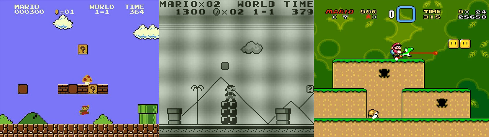
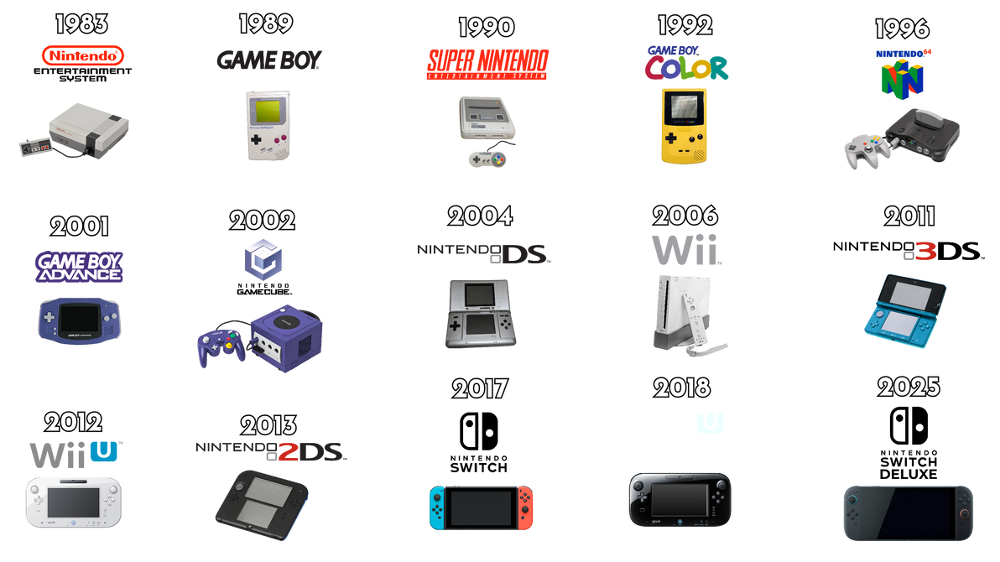

# Retro Gaming Emulation on Linux

**Course:** TEJ4M - Computer Engineering Technology (Grade 12)\
**Unit:** Linux and Processor Architecture\
**Timeline:** 5 work periods × 75 minutes

## Contents

- [Overview](#overview)
- [The Three Platforms](#the-three-platforms)
- [What You're Building](#what-youre-building)
- [Part 1: Set Up Your Emulators](#part-1-set-up-your-emulators)
- [Part 2: Choose Your Subject](#part-2-choose-your-subject)
- [Part 3: Explore and Document](#part-3-explore-and-document)
- [Part 4: Where Are We Now?](#part-4-where-are-we-now)
- [Your Deliverable](#your-deliverable)
  - [Submitting Your Work](#submitting-your-work)
- [Getting ROMs](#getting-roms)
- [Writing in Markdown](#writing-in-markdown)
- [Assessment Rubric](#assessment-rubric)

---

## Overview

The [Acer C720](https://www.intel.com/content/dam/www/public/us/en/documents/brochures/acer-chromebook-c720-datasheet.pdf) is over a decade old. Its Intel Celeron processor runs at 1.4 GHz with 2 GB of RAM. A modern web browser can [bring it to its knees](https://www.xda-developers.com/web-browsers-are-ram-hogs/). 

That said, it's still powerful enough that it can run every video game console released before the year 2000, including the Nintendo Entertainment System (NES), Game Boy, and Super Nintendo - all at full speed in a window on your Lubuntu desktop. (I think of these systems as the "golden age" of video games, not by any academic or historical definition other than the fact that it's what I, your Gen X'er teacher, grew up with. lol)



To put this into perspective, the NES had a 1.79 MHz processor. Your Chromebook's CPU runs approximately 800 times faster. That gap is what emulation takes advantage of. A machine with enough headroom can simulate a slower one in software, cycle by cycle, accurately enough that the software on top has no idea it isn't running on real hardware. 

For this project, you will install three retro video game console emulators on your Linux machine. Then, you'll pick a subject to trace across three generations of gaming hardware, and write about what you find.

---

## The Three Platforms

The three systems in this project span one of gaming's most significant hardware transitions.

**NES** (released in Japan as the **Famicom**, 1983; North America as the NES, 1985) was an 8-bit console built around a 6502-derived processor running at 1.79 MHz. Nintendo launched it into a North American market that had largely collapsed after the video game crash of 1983, and it became the platform that defined home console gaming for a generation.

**Game Boy** (Japan and North America, 1989) was also 8-bit, but built for a different goal: portability and battery life over raw performance. Its Z80-based processor ran at 4.19 MHz, but the display was a 160×144 monochrome screen with four shades of gray. Its designer, Gunpei Yokoi, described the philosophy as "lateral thinking with withered technology" — use mature, inexpensive components and win on software and price. The technical constraints are visible and audible in everything the Game Boy does.

**SNES** (released in Japan as the **Super Famicom**, 1990; North America as the Super Nintendo, 1991) moved to a 16-bit processor, but the more significant upgrade was in dedicated co-processors. Two dedicated video chips (Picture Processing Unit, or PPU) handled graphics, enabling features the scaling and rotation effects seen in games like F-Zero and Super Mario Kart. A Sony audio chip helped deliver 8-channel stereo sound with sample playback (i.e., digitized real-world audio recordings). The jump in visual and audio quality over the NES is not subtle.



| | NES / Famicom | Game Boy | SNES / Super Famicom |
|--|--|--|--|
| **Released** | Japan 1983, US 1985 | Japan 1989, US 1989 | Japan 1990, US 1991 |
| **CPU** | Ricoh 2A03 (6502-based), 8-bit, 1.79 MHz | Sharp LR35902 (Z80-based), 8-bit, 4.19 MHz | Ricoh 5A22 (65C816-based), 16-bit, 3.58 MHz |
| **Colours** | 54 possible, 25 on screen | 4 shades of gray | 32,768 possible, 256 on screen |
| **Sound** | 5 channels, no sample playback | 4 channels, no sample playback | Sony SPC700, 8 channels, sample playback |
| **Graphics** | Single PPU chip | Integrated, minimal | Two dedicated PPU co-processors |

This table is a starting point. Your report should go deeper: research the specific chips, understand what the architectural differences meant for game design, and connect what you observe in the games to what the hardware could actually do. If you want a refresher on the broader computing history behind these platforms, revisit the [Retro Computing Exploration](https://github.com/davecheng-tech/Class-Notes-and-Addenda/blob/main/TEJ4M/unit-2-linux/retro_computing.md) from earlier in the course.

---

## What You're Building

Pick something to **trace across three generations of gaming hardware**: the NES, the Game Boy, and the Super Nintendo.

Your retrospective can cover more than three titles, but your first three must be one from each of these platforms, in this order. The file share has Game Boy Color and Game Boy Advance ROMs mixed in with the original Game Boy collection — those are later hardware released after the SNES, so they don't fit the arc. For your required Game Boy entry, pick an original `.gb` file. (You can explore GBC or GBA as extras if you're curious.)

Your subject could be a franchise, a genre, or a concept:

**A franchise.** Follow a game series across all three systems. Mario, Zelda, Kirby, Mega Man, Tetris, Castlevania, Final Fantasy, etc. Pick something with entries on all three platforms and see how it changed, or didn't.

**A genre.** Pick a style of game and find a representative title on each system. How do platformers, racing games, RPGs, puzzle games, or fighting games hold up across hardware generations? What does each platform make possible?

**A concept.** Sound and music. Saving progress. Colour and art. Boss design. The hardware specs on these three systems differ in specific ways. How do those differences show up in how games were made?

Your deliverable is a `README.md` file: a written and illustrated retrospective organized around your subject. You should write this document as a player and a game critic - pretend, maybe, this is a piece for an online video game magazine.


---

## Part 1: Set Up Your Emulators

Install all three emulators before you start playing.

### NES: FCEUX

```bash
sudo apt install fceux
```

Launch with `fceux` at the terminal, or find it in the application menu. **File > Open ROM** to load a game.

### Game Boy / GBA: mGBA

```bash
sudo apt install mgba-qt
```

Launch with `mgba-qt` at the terminal or from the application menu. mGBA handles original Game Boy (`.gb`), Game Boy Color (`.gbc`), and Game Boy Advance (`.gba`) ROMs in one package. The class file share has all three mixed together in the Game Boy folder — for the required Game Boy entry in this project, use an original `.gb` file.

### Super Nintendo: Snes9x

```bash
sudo snap install snes9x-gtk
```

> [!NOTE]
> `snap` is a separate packaging system from `apt` and `dpkg`, installed by default on Lubuntu. Snes9x is not in the standard Ubuntu repositories, so this is the install path for it. The command works the same way: run it, wait, done.

Launch Snes9x from the application menu after installing.

> [!TIP]
> If your USB controller is not recognised in Snes9x, see [Controllers](tech_supplement.md#controllers) in the Tech Supplement.

### Minimal Configuration

All three emulators work immediately after install with keyboard controls. If you have a USB gamepad, you will need to map its buttons to the emulated console's controls. Each emulator has a settings or preferences menu where you can assign physical buttons to the console's A, B, Start, Select, and directional inputs. Plug in your controller first, then open the input/controller settings and map each button by pressing it when prompted. If you run into trouble, see the [Tech Supplement](tech_supplement.md).

---

## Part 2: Choose Your Subject

Pick an angle before you start playing.

A retrospective needs a **focus**. Tracing how a specific game series controls and feels across three platforms is a subject. Playing three random games because they were the first ROMs you could find is not.

Some starting points:

**Franchise ideas**
- Mario: *Super Mario Bros.* (NES) / *Super Mario Land* (GB) / *Super Mario World* (SNES)
- Zelda: *The Legend of Zelda* (NES) / *Link's Awakening* (GB) / *A Link to the Past* (SNES)
- Kirby, Mega Man, Castlevania, and Final Fantasy all have entries across these three systems
- Tetris appears on every platform. The differences between versions are worth examining closely.

**Genre ideas**
- Choose representative games from each system and compare how the genre plays on each

**Concept ideas**
- *Sound:* The NES had 5 audio channels. The SNES had an 8-channel DSP chip with sample playback. How does that difference show up in the music?
- *Colour:* The NES outputs 52 colours. The SNES can display 32,768. How did designers use that range?
- *Saving:* Early NES games had no save feature. How did games handle that? When did it change?

> [!TIP]
> Browse the class ROM collection before you commit to anything. Interesting projects often start with something discovered while wandering around. Play a few things first.

---

## Part 3: Explore and Document

For **each of the three platforms**, your README needs to cover all of the following.

### Hardware Context

What machine is this? What were the key specs: processor, speed, RAM, audio, colour depth? What made it capable or limited compared to what came before? You know where to find this kind of information.

### What You Played

Name the ROMs you tried. If you went through several before something clicked, say so. You do not have to pick one game per platform and stop there.

### Screenshots

Take multiple screenshots that are useful to your argument, not just proof that the emulator opened. A visual comparison, a moment of impressive or disappointing graphics given the hardware, a UI decision that tells you something about the era. The screenshots should be doing a lot of the storytelling, so take the time to capture the perfect moments. Consider also comparative screenshots across platforms.

### Your Observations

What did you notice? What surprised you? Where do you see the hardware constraints shaping what designers could and couldn't do?

Consider this observation:

>"The sound in Super Mario Land is noticeably thinner than the NES version, even though the Game Boy came out five years later. This is likely because the hardware had fewer audio channels, giving game designers fewer virtual instruments to work with." 

It tells the reader something specific. You should also aim to write with enough specificity such that the observation could only have come from you, playing this game. 

> "The graphics improved over time."  

This is vague and says next to nothing.

> [!IMPORTANT]
> The observations section carries the most weight in the rubric. Describing what a game looks like is not enough. Noticing something specific and explaining why you think it is the way it is — that's what you're going for.

---

## Part 4: Where Are We Now?

Add a final section covering the same subject on a modern platform.

**If your franchise is still active**, find a recent entry on a current platform, e.g., Nintendo Switch, PlayStation 5, Xbox Series X, PC, or mobile. What does the modern version look like? What changed?

**If your franchise ended**, find a *spiritual successor*: a modern game that is clearly influenced by, or continues the spirit of, what you played. A modern metroidvania if you traced Castlevania. A modern puzzle platformer if you followed Kirby. A modern competitive puzzler if you played Tetris. The connection should be visible and worth explaining.

**For screenshots**, use whatever you have access to:

- If you own the game, play it and take your own screenshots.
- If you don't, find a streamer on [YouTube](https://www.youtube.com) or [Twitch](https://www.twitch.tv) playing the game, watch a few minutes of actual gameplay, and grab a screenshot directly from your browser. Don't just use a promotional image or box art. Instead, capture something from real gameplay that connects to what you were observing in the retro versions.

The goal is a meaningful comparison. What does your subject look like in 2026? What changed? What, surprisingly, stayed the same?

---

## Your Deliverable

Submit a folder containing:

```
README.md
images/
    nes-screenshot-1.png
    nes-screenshot-2.png
    gb-screenshot-1.png
    snes-screenshot-1.png
    today-screenshot.png
```

Give image files descriptive names. Reference them in your README using the image syntax described in the *Writing in Markdown* section below.

### Citing Your Sources

You do not need a bibliography, works cited page, or footnotes. When you state a fact you looked up, link to where you found [inline](https://www.markdownlang.com/basic/links.html), the way Wikipedia does. That's it.

**What needs a citation:** Hardware specs, release dates, historical facts, anything you looked up that a reader might want to verify.

**What doesn't:** Your own observations, opinions, and inferences.

Here's the same paragraph as an example, first *without* citations:

> "The sound in Super Mario Land is noticeably thinner than the NES version, even though the Game Boy came out five years later. This is likely because the hardware had fewer audio channels, giving game designers fewer virtual instruments to work with."

Then *with* citations:

> "The sound in Super Mario Land is noticeably thinner than the NES version, even though the Game Boy came out [five years later](https://en.wikipedia.org/wiki/Game_Boy). This is likely because the hardware had [fewer audio channels](https://gbdev.io/pandocs/Audio.html), giving game designers fewer virtual instruments to work with."

In the above example:

- *"noticeably thinner"* is your opinion, so no citation needed. 
- *"likely because"* is your inference, so no citation needed. 
- *"Game Boy came out five years later"* is a date you verified, so we have a link to a source.
- *"fewer audio channels"* is a hardware spec, here featuring a link to more than just a spec sheet, but rather a resource that further elaborates on the audio capabilities of the Game Boy.

In Markdown, an inline link looks like this:

```markdown
The Game Boy came out [five years later](https://en.wikipedia.org/wiki/Game_Boy).
```

Link to the specific page or article where you found the information. If you can't find a source for something, either remove the claim or mark it as your own speculation with "I think" or "probably."

---

### Taking Screenshots on Lubuntu

These machines do not have a Print Screen key. Use **Graphics > ScreenGrab** from the application menu to capture your screen.

Before taking a screenshot, use the emulator's pause or save state feature to freeze the game at exactly the moment you want to show. A well-chosen frame tells a story. A blurry mid-action shot usually does not.

> [!CAUTION]
> Do not photograph your monitor or laptop screen with a phone or camera. Image quality is unacceptable for documentation purposes and marks will be deducted.

Move your screenshots into your `images/` folder and rename them descriptively.

### Submitting Your Work

When you are ready to submit, zip your project folder from the terminal. Navigate into the folder containing your `README.md` first, then run:

```bash
zip -r lastname-firstname-emulation.zip README.md images/
```

Replace `lastname-firstname` with your actual name. The resulting `.zip` file should contain `README.md` at the root and the `images/` folder alongside it — not buried inside another folder. Double-check by listing the contents before submitting:

```bash
unzip -l lastname-firstname-emulation.zip
```

Submit the `.zip` file as instructed.

> [!NOTE]
> If `zip` is not installed, run `sudo apt install zip` first.

---

## Getting ROMs

> [!TIP]
> For step-by-step instructions on connecting to the file server and unzipping GBA ROMs, see the [Tech Supplement](tech_supplement.md).

**Class file share.** Start here. NES, Game Boy, GBA, and SNES ROM collections are available on the class file share. Browse by system folder to see what's available.

**Google Drive.** The same ROM collection is also available on the [classroom Google Drive share](https://drive.google.com/drive/folders/1CmMt-jrd8PWXR8gnmJWKtfcBfpMcjUl4) if you can't reach the file server.

**Archive.org.** For ROMs not on the class share, [archive.org](https://archive.org) has large collections organized by system. Search the system name, for example *NES ROM set* or *Game Boy ROM collection*. These are copyrighted games and hosting them is a legal grey area, but Archive.org operates as a software preservation archive and is the most reputable place to find this material. Be careful of venturing into dark places on the internet looking for bootlegs.

> [!TIP]
> Going beyond the three required systems is entirely optional, but it is one path to Level 4+. If you want to emulate a Sega Genesis, Nintendo 64, PlayStation, Atari, or Commodore 64, the emulators exist, the ROMs are on Archive.org, and you can figure it out. Start with a search for the system name and "Linux emulator."

---

## Writing in Markdown

Your `README.md` is a Markdown file. Markdown is plain text with lightweight formatting that renders as HTML. It is the standard format for documentation on GitHub and across the software industry.

Here is some of the syntax you might want to use:

```markdown
# Heading 1
## Heading 2
### Heading 3

Normal paragraph text. Just write normally.

**Bold text** and *italic text*.

- Bullet item
- Another bullet item


[Link text](https://example.com)
```

Since your document includes embedded screenshots, a desktop Markdown editor works better than an online one. The recommended editor is **[Bokuchi](https://bokuchi.com/)**, which is available for macOS, Windows, and Linux and provides a live preview with inline images as you write.

**On the C720 Chromebook (Lubuntu)**, the simplest option is to edit directly in the terminal:

```bash
nano README.md
```

To preview the rendered output, double-click your `.md` file in the file manager (Okular will open it), or run:

```bash
okular README.md
```

**Reference and tutorial:**
- [Markdown Basic Syntax](https://www.markdownguide.org/basic-syntax/)
- [Markdown Tutorial](https://www.markdowntutorial.com/) — interactive, takes about 10 minutes

---

## Academic Integrity

You may use any resources: documentation, online references, each other.

Screenshots must be your own, taken on your machine or your personal devices. Writing must be in your own voice, based on what you actually observed while playing.

AI-generated text is confident, well-organized, and has no actual opinions. It cannot tell you what surprised it about Super Mario Land because it never played it. Observations that could have been written by someone who never opened the emulator will read that way. As much as this is supposed to be a fun exploration in computer technology, it is very much also a personal opinion piece necessitating a human perspective.

---

## Assessment Rubric

Achievement levels correspond to Ontario grading bands:

- **Level 1:** 50-59%
- **Level 2:** 60-69%
- **Level 3:** 70-79%
- **Level 4 / 4+:** 80-100%

<br>

### Exploration & Coverage — /15 (Application)

**Assesses how thoroughly you engaged with the three required platforms. Evidence of genuine time spent playing and exploring.**

| Level | Descriptor |
|:-----:|------------|
| **4+** | All three platforms covered with exceptional evidence of exploration and genuine curiosity. Reached two ways: by going beyond the required platforms (additional systems emulated, additional ROM collections explored), or by demonstrating unusual depth within them (multiple games per platform thoroughly compared, subject pursued from several angles, clear evidence of extended time within the prescribed ecosystem). |
| **4** | All three platforms covered with clear evidence of genuine play. Multiple games or moments documented per platform. Screenshots are varied and purposeful. |
| **3** | All three platforms covered. Evidence of genuine play is present but may be thin on one platform. Screenshots are adequate. |
| **2** | One or two platforms covered adequately; remaining platforms are superficial or missing. |
| **1** | Limited engagement across platforms. Little evidence of actual play. |

<br>

### Analysis & Voice — /20 (Communication / Thinking)

**Assesses the quality of your observations and writing. Are you describing what you see, or explaining why it is the way it is? Is this your voice?**

| Level | Descriptor |
|:-----:|------------|
| **4+** | Observations consistently connect what is seen to hardware, design choices, or historical context from the unit. Writing has a clear personal voice, including opinion, uncertainty, and surprise. The "Where Are We Now?" section draws a meaningful conclusion about what changed and what didn't. |
| **4** | Analysis goes beyond description. You explain *why* things are different across platforms: hardware constraints, design decisions, the limits of the era. Personal voice is clear. Writing is specific and concrete. |
| **3** | Observations are your own and show genuine engagement. Some analysis beyond pure description. Writing is clear, with occasional vagueness or generic statements. |
| **2** | Writing is mostly descriptive. Observations are present but generic ("the graphics got better over time"). Little evidence of analysis or personal engagement. |
| **1** | Writing is minimal, formulaic, or does not reflect the student's own observations and play. |

<br>

### Documentation & Presentation — /15 (Communication)

**Assesses the quality of your README as a document: structure, markdown formatting, screenshot quality and captions, inline citations, and overall presentation.**

| Level | Descriptor |
|:-----:|------------|
| **4+** | README reads as a polished, publication-quality retrospective. Image selection and captioning are strong; every screenshot earns its place. Markdown is used with confidence and creativity beyond the basics (tables, blockquotes, structure that serves the content). Factual claims are consistently cited inline. The document has a clear editorial identity. |
| **4** | README is well-structured with a clear heading hierarchy. Screenshots are purposeful and captioned. Markdown is used correctly and effectively throughout. Factual claims about hardware, dates, and specifications are cited with inline links. The document reads as a coherent retrospective rather than a checklist. |
| **3** | README is organized and readable. Screenshots are present and correctly referenced. Markdown is used competently with minor formatting errors. Most factual claims are cited, with some gaps. |
| **2** | Structure is present but inconsistent. Screenshots are included but may be uncaptioned or loosely connected to the writing. Markdown errors affect readability in places. Inline citations are sparse or missing. |
| **1** | Document is difficult to follow. Screenshots are missing or not integrated with the writing. Little evidence of intentional formatting. No citations. |

---

## Suggested Timeline

**Period 1 — Setup and Orientation**\
Install all three emulators. Browse the ROM collection. Decide on a subject. Start playing.

**Periods 2-4 — Exploration and Writing**\
Explore your subject across all three platforms. Take screenshots as you go. Write while impressions are fresh. Do not leave all the writing to the end.

**Period 5 — Finalize and Submit**\
Assemble your `README.md` and `images/` folder. Review formatting. Submit.
