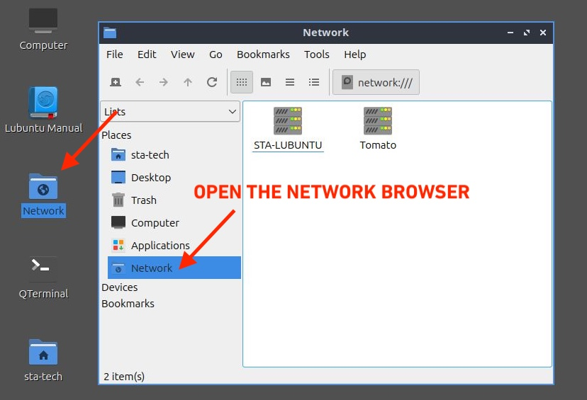
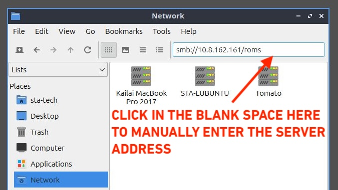
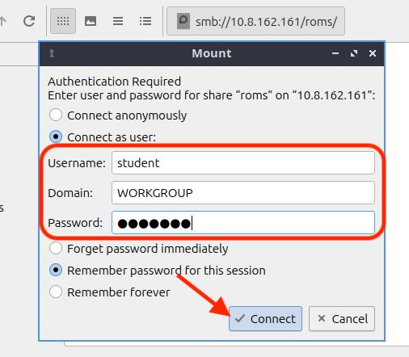
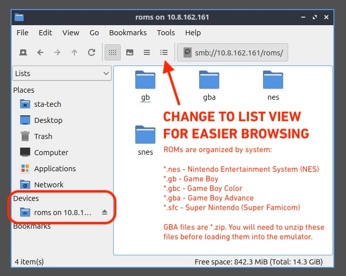

# Tech Supplement: Emulation Setup

This document covers setup details that will come up during the project. It will be updated as new questions come in.

## Contents

- [Getting ROMs: Classroom File Server](#getting-roms-classroom-file-server)
- [Getting ROMs: Google Drive](#getting-roms-google-drive)
- [ROM File Extensions](#rom-file-extensions)
- [Unzipping GBA ROMs](#unzipping-gba-roms)
- [Super Game Boy Enhanced ROMs](#super-game-boy-enhanced-roms)
- [Controllers](#controllers)
  - [Snes9x: Controller Not Responding](#snes9x-controller-not-responding)
  - [Bluetooth Pairing (Advanced)](#bluetooth-pairing-advanced)
  - [Xbox Controllers](#xbox-controllers)

---

## Getting ROMs: Classroom File Server

The classroom file server hosts ROM collections for NES, Game Boy, GBA, and SNES. The server's IP address is written on the board and may change between classes.

Two ways to connect: GUI (easier) or terminal.

### Method 1: Network Browser

**Step 1.** Open the **Network** icon from the desktop.



**Step 2.** Click in the blank grey space at the top of the window to activate the address bar. Type the `smb://` address shown on the board, including the `/roms` share name.



> [!NOTE]
> The IP address shown here is an example. Use the address on the board — it will likely be different each class.

**Step 3.** When the Mount dialog appears, select **Connect as user** and enter the credentials. Leave Domain as `WORKGROUP`. Click **Connect**.

- **Username:** `student`
- **Password:** `student`



**Step 4.** The `roms` drive appears under **Devices** in the sidebar. Switch to **List View** for easier browsing. Copy the ROMs you want to your local machine before opening them in an emulator.



---

### Method 2: Terminal

Use this method if the GUI is not working, or if you prefer the command line.

**First time only — install the CIFS utility:**

```bash
sudo apt install cifs-utils
```

> [!IMPORTANT]
> If `apt` gives an error, you may not be authenticated on the school network. Open a browser and go to `http://connectme.ycdsb.ca` to log in first.

**First time only — create the mount point:**

```bash
sudo mkdir -p /mnt/roms
```

**Each session — mount the share** (use the IP address from the board):

```bash
sudo mount -t cifs //10.8.x.x/roms /mnt/roms -o username=student,ro
```

Enter `student` when prompted for a password.

ROMs are now available at `/mnt/roms`. You can browse them from the terminal with `ls /mnt/roms` or open them directly from an emulator's File > Open dialog.

> [!TIP]
> Only the mount command needs to be repeated each session. The `cifs-utils` install and `mkdir` steps are one-time only.

---

## Getting ROMs: Google Drive

A ROM collection is also available on the [classroom Google Drive share](https://drive.google.com/drive/folders/1CmMt-jrd8PWXR8gnmJWKtfcBfpMcjUl4). Download files directly to your machine.

---

## ROM File Extensions

| Extension | System |
|-----------|--------|
| `.nes` | Nintendo Entertainment System (NES) |
| `.gb` | Game Boy |
| `.gbc` | Game Boy Color |
| `.gba` | Game Boy Advance |
| `.sfc` | Super Nintendo / Super Famicom |

---

## Unzipping GBA ROMs

GBA ROMs on the class share are distributed as `.zip` files. You need to extract them before loading them into mGBA.

Right-click the `.zip` file in the file manager and choose **Extract Here**, or from the terminal:

```bash
unzip "ROM Name.zip"
```

This produces a `.gba` file in the same folder. Open that file in mGBA.

---

## Super Game Boy Enhanced ROMs

The Super Game Boy was a cartridge adapter released in 1994 that plugged into a Super Nintendo, letting you play Game Boy games on a TV. It was a bridge between two separate consoles, not a standalone system, and some games included optional SGB-specific features like fancy colour palettes and custom borders.

ROMs labelled **"Super Game Boy Enhanced"** contain those extra features, but they were designed for SGB hardware. When mGBA opens one of these ROMs, you'll be looking at an enhanced 1994 version of the game, not what it looked like on 1989hardware.

To lock mGBA to standard Game Boy mode for these ROMs:

**mGBA → Tools → Settings → Game Boy**

Change **SGB Compatible** to **Game Boy**.

The game will run as a normal Game Boy title without any SGB-specific behaviour.

---

## Controllers

The simplest option is a USB gamepad. The classroom has Logitech F310 controllers available. Before plugging one in, check the small switch on the back and set it to **D mode**. X mode uses an Xbox-compatible protocol that does not work reliably on Linux. With the switch in D mode, plug in the controller, open your emulator, and configure button mapping under the emulator's settings or preferences menu. Keyboard controls also work in all three emulators if you prefer.

### Snes9x: Controller Not Responding

Snes9x is installed via snap, which sandboxes the application and blocks access to joystick devices by default. If your controller is not recognised in Snes9x's joypad configuration, run this once from the terminal:

```bash
sudo snap connect snes9x-gtk:joystick
```

Then restart Snes9x. Your controller should now appear and buttons can be mapped normally.

### Bluetooth Pairing (Advanced)

Bluetooth pairing requires a few extra terminal steps. The classroom Logitech USB controllers are easier. Come back to this once your project is set up and running.

The steps below are confirmed working for PS4 DualShock 4 and PS5 DualSense. Xbox controllers are a separate story — see below.

#### PS4 DualShock 4 / PS5 DualSense

**Step 1. Load the required kernel module:**

```bash
sudo modprobe joydev
```

To make this persist across reboots so you don't have to repeat it next session:

```bash
echo "joydev" | sudo tee -a /etc/modules
```

**Step 2. Put the controller in pairing mode:**

- **DualShock 4:** Hold **Share + PS button** until the lightbar flashes rapidly
- **DualSense:** Hold **Create + PS button** until the lightbar flashes

**Step 3. Pair in Bluetooth Devices:**

Open **Bluetooth Devices** from the system tray. Click **Search**, find **Wireless Controller**, and connect. If it shows as connected but the controller is still not responding, fully power off the controller by holding the PS button for 10 seconds, then reconnect.

**Step 4. Verify:**

```bash
ls /dev/input/
```

`js0` should appear. Test it:

```bash
jstest /dev/input/js0
```

Press buttons and confirm the output changes. Then open your emulator and map the controller under its settings menu.

> [!NOTE]
> If using Snes9x, also run `sudo snap connect snes9x-gtk:joystick` and restart it. See the section above.

#### Xbox Controllers

Xbox controllers are not reliably supported on Linux. The USB driver has known compatibility issues with many Xbox One and Series models, and Bluetooth requires a third-party driver to work at all. If you want to try, you are on your own. A PlayStation controller or generic USB gamepad will be much less frustrating.
