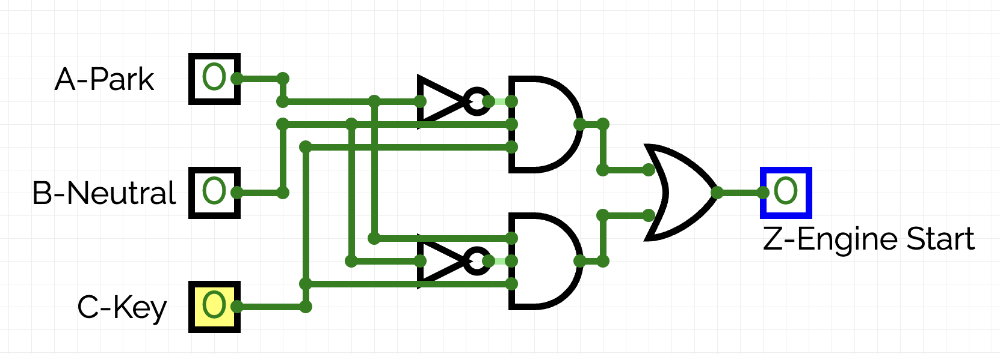
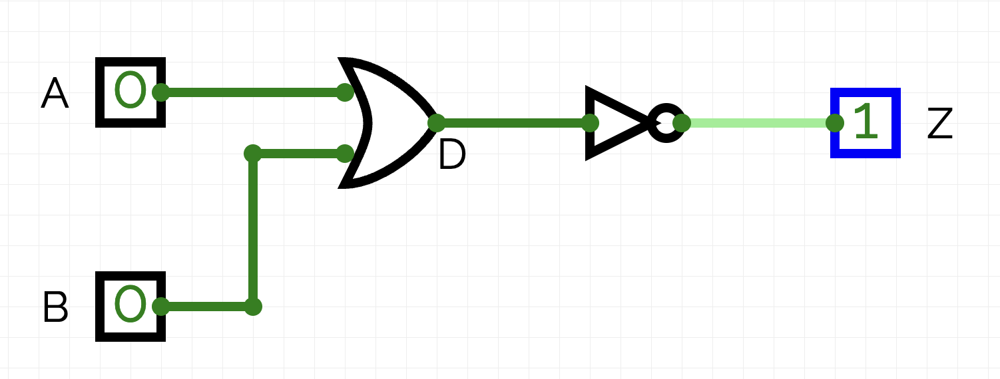
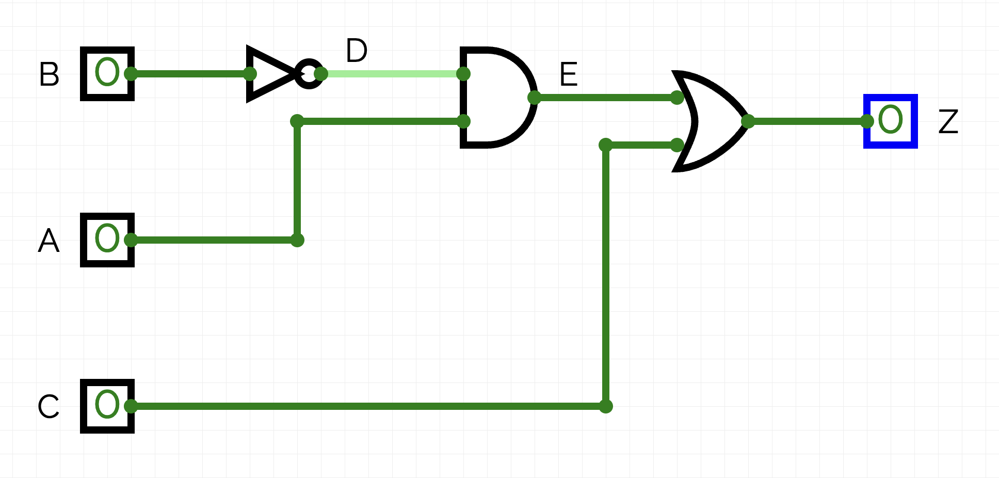
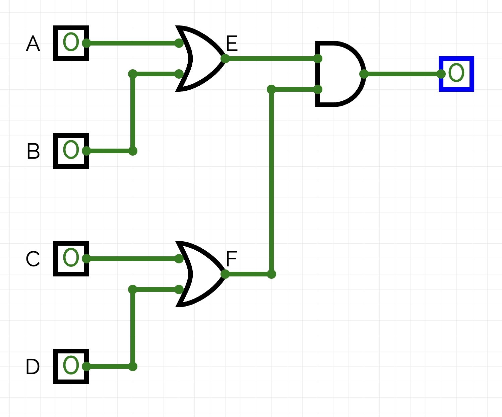
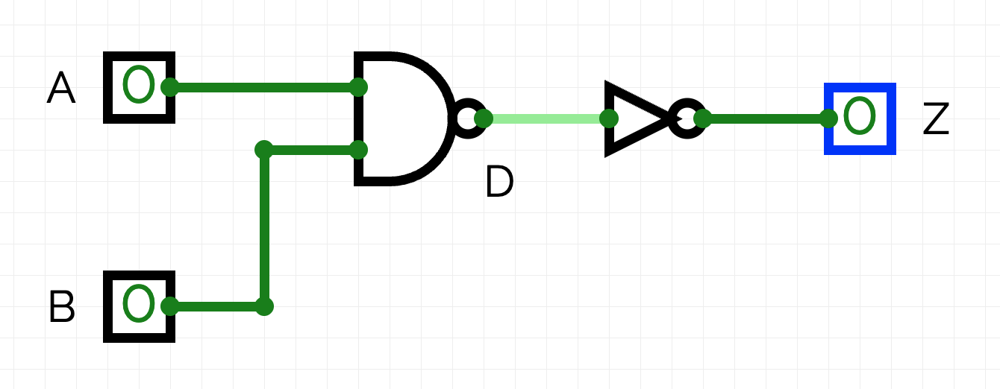
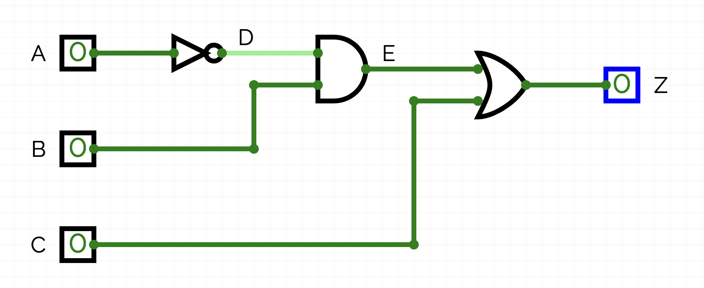
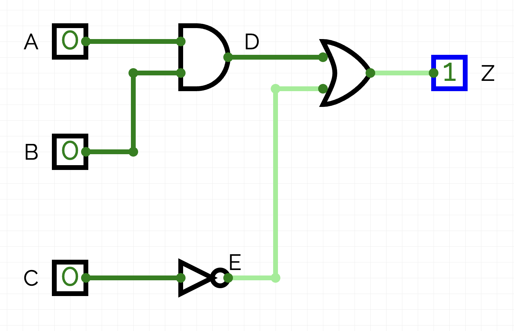
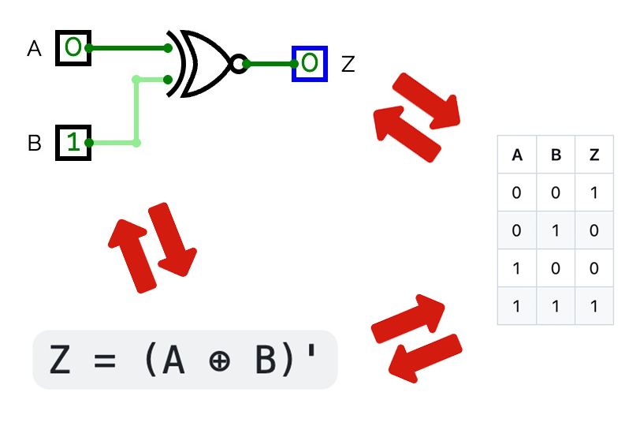

# Combinational Logic

In Grade 11 you learned the seven basic logic gates: AND, OR, XOR, NOT, NAND, NOR, XNOR. You memorized their truth tables, symbols, and equations. This unit builds on that foundation. You will learn how to combine those gates into more complex circuits, and how to move fluently between four different representations of the same logic.

This note covers:

- The four representations of logic: truth table, circuit diagram, Boolean equation, and description
- How to convert between any two representations
- Worked examples for every conversion

<br>

## 1. The Four Representations

Any logical relationship between inputs and outputs can be described in four equivalent ways:

| Representation | What it shows |
|---|---|
| **Truth table** | Every possible combination of inputs and the output each produces |
| **Circuit diagram** | The physical arrangement of logic gates |
| **Boolean equation** | An algebraic expression using AND (·), OR (+), NOT ('), XOR (⊕) |
| **Word description** | A plain-English statement of what the circuit does |

All four say the same thing. Being able to translate between them is the core skill of this unit.

> [!NOTE]
> **Notation used in these notes:**  
> - `A'` means NOT A (also written Ā in some textbooks)  
> - `AB` or `A · B` means A AND B  
> - `A + B` means A OR B  
> - `A ⊕ B` means A XOR B  
> - Parentheses group terms, just like in regular algebra

<br>

## 2. CircuitVerse

The tool used for building and testing circuits in this unit is **CircuitVerse**, a free browser-based logic simulator. You do not need to install anything.

Access it at [circuitverse.org](https://circuitverse.org) and click on  **Simulator** (top menubar, left side) to open the editor. You can add inputs (switches), gates, and outputs (lights/probes) from the panel on the left.

Build the circuit, toggle the inputs, and verify that the outputs match the truth table you expect. Since YCDSB has blocked the ability to sign-in with the Google account, you will need to export (download) and import (upload) your project as `.cv` files.

<br>

## 3. Truth Table → Circuit Diagram

A circuit can be built directly from a truth table using a method called **Sum of Products (SOP)**. The idea is that each row where the output is 1 becomes one AND gate, and all those AND gates feed into a final OR gate.

### Steps

1. Highlight every row where the output Z is **1**
2. For each highlighted row, build an AND gate that produces 1 only for that specific combination of inputs:
   - If an input is **1** in that row, connect it directly to the AND gate
   - If an input is **0** in that row, connect it through a NOT gate first
3. Connect all the AND gates to a final OR gate
4. The output of the OR gate is Z

### Example: Car Starter Circuit

A car engine should start only when the key is turned AND the car is in either Park or Neutral (but not both — that is an invalid state).

| A (Park) | B (Neutral) | C (Key) | Z (Starts) |
|----------|-------------|---------|------------|
| 0 | 0 | 0 | 0 |
| 0 | 0 | 1 | 0 |
| 0 | 1 | 0 | 0 |
| **0** | **1** | **1** | **1** |
| 1 | 0 | 0 | 0 |
| **1** | **0** | **1** | **1** |
| 1 | 1 | 0 | 0 |
| 1 | 1 | 1 | 0 |

Two rows have Z = 1:

- Row 4: A=0, B=1, C=1 → AND gate with inputs A' (NOT A), B, C
- Row 6: A=1, B=0, C=1 → AND gate with inputs A, B' (NOT B), C

The circuit is: two AND gates, each connected to a final OR gate giving Z.



> [!TIP]
> Check your work by tracing each highlighted row through the circuit. The AND gate for that row should be the only one that outputs 1 for that input combination.

<br>

## 4. Truth Table → Equation

The SOP method produces an equation in the same way it produces a circuit. Instead of drawing gates, you write the logic.

### Steps

1. Highlight every row where Z is **1**
2. For each highlighted row, write an AND term (called a **minterm**):
   - Input is 1 → write the variable as-is (e.g., `A`)
   - Input is 0 → write the variable with a NOT (e.g., `A'`)
   - AND all the terms in that row together
3. OR all the minterms together to produce the final equation

### Example: Car Starter Circuit (continued)

- Row 4 (A=0, B=1, C=1): minterm = `A' · B · C`
- Row 6 (A=1, B=0, C=1): minterm = `A · B' · C`

**Equation:**
```
Z = A'·B·C + A·B'·C
```

This equation reads: "Z is true when the key is on AND the car is in neutral (but not park), OR when the key is on AND the car is in park (but not neutral)."

> [!NOTE]
> The SOP equation is correct but not necessarily the simplest form. Boolean algebra simplification (covered in the next lesson) can often reduce the number of gates significantly.

<br>

## 5. Equation → Circuit Diagram

Given a Boolean equation, you build the circuit by working from the inside out, i.e., innermost brackets first.

### Steps

1. Identify all inputs and the output
2. Starting with the **innermost brackets**, draw the gates for that sub-expression
3. Work outward, connecting previous sub-circuits as inputs to the next gate
4. Continue until the entire equation is built

### Example 1

```
Z = (A + B)'
```

- Inner: `A + B` → OR gate with inputs A, B — label output **D**
- Outer: `D'` → NOT gate — output is Z

This is a NOR gate, equivalent to a NOT after an OR.

<details>
<summary>Solution — click to reveal</summary>



</details>

### Example 2

```
Z = (A · B') + C
```

- `B'` → NOT gate on input B — label output **D**
- `A · B'` → AND gate with inputs A and D — label output **E**
- `E + C` → OR gate with inputs E and C — output is Z

<details>
<summary>Solution — click to reveal</summary>



</details>

### Example 3

```
Z = (A + B) · (C + D)
```

- `A + B` → OR gate — label output **E**
- `C + D` → OR gate — label output **F**
- `E · F` → AND gate — output is Z

<details>
<summary>Solution — click to reveal</summary>



</details>

> [!TIP]
> Use variable labels (like D, E, F) to name the outputs of intermediate gates. This makes both the drawing and the conversion back to equations much easier to track.

<br>

## 6. Circuit Diagram → Equation

Reading a circuit and writing its equation requires working from **left to right**, from inputs toward the output.

### Steps

1. Identify all inputs and the output
2. Starting at the leftmost (input) side, write the equation for the first layer of gates
3. Label intermediate outputs (D, E, F, ...) as you move right
4. Connect intermediate labels into the next layer's equation
5. Continue until you reach the output Z

### Example 1



Starting from the left:

```
D = (A · B)'   ← NAND gate
Z = D'         ← NOT gate

Substitute: Z = ((A · B)')' = A · B   ← double negation cancels
```

### Example 2



Starting from the left:

```
D = A'
E = A' · B
Z = A'B + C
```

<br>

## 7. Circuit Diagram → Truth Table

A truth table can be filled in by tracing a circuit for every possible input combination. The key is to label each sub-circuit with an intermediate variable and add a column for it.

### Steps

1. Label the output of every intermediate gate (D, E, F, ...)
2. Create a truth table with all inputs, all intermediate labels, and the output Z
3. Fill in all input combinations (enumerate them systematically — see tip below)
4. For each row, evaluate each intermediate column from left to right
5. Fill in Z last, using the intermediate results

> [!TIP]
> **How to fill input columns without missing a combination:**  
> For `n` inputs, there are 2ⁿ rows. In the rightmost column, alternate 0 and 1 every row. In the next column to the left, alternate every 2 rows. In the next, every 4 rows, and so on. This produces every binary combination in order.

### Example



Label the output of each gate before filling in the table: D is the output of the AND gate, E is the output of the NOT gate.

```
Z = (A · B) + C'
```

| A | B | C | D = A·B | E = C' | Z = D+E |
|---|---|---|---------|--------|---------|
| 0 | 0 | 0 | 0 | 1 | 1 |
| 0 | 0 | 1 | 0 | 0 | 0 |
| 0 | 1 | 0 | 0 | 1 | 1 |
| 0 | 1 | 1 | 0 | 0 | 0 |
| 1 | 0 | 0 | 0 | 1 | 1 |
| 1 | 0 | 1 | 0 | 0 | 0 |
| 1 | 1 | 0 | 1 | 1 | 1 |
| 1 | 1 | 1 | 1 | 0 | 1 |

> [!NOTE]
> The intermediate columns are for your working — the final truth table only needs the inputs and Z. But showing your work is expected on assessments.

<br>

## 8. Equation → Truth Table

This works the same way as Circuit → Truth Table. Break the equation into sub-expressions, add a column for each one, and evaluate left to right.

### Steps

1. Identify all inputs and the output in the equation
2. Create a truth table and enumerate all input combinations
3. Identify each sub-expression in order of operations (inside brackets first)
4. Add a column for each sub-expression and label it
5. Evaluate each sub-expression column using results from previous columns
6. Fill in Z last

### Example

```
Z = (A' · B) + (A · B')
```

Sub-expressions: A', B', A'·B, A·B'

| A | B | A' | B' | D = A'·B | E = A·B' | Z = D+E |
|---|---|----|----|----------|----------|---------|
| 0 | 0 | 1 | 1 | 0 | 0 | 0 |
| 0 | 1 | 1 | 0 | 1 | 0 | 1 |
| 1 | 0 | 0 | 1 | 0 | 1 | 1 |
| 1 | 1 | 0 | 0 | 0 | 0 | 0 |

Notice this is the truth table for XOR. The equation `(A'·B) + (A·B')` is equivalent to `A ⊕ B` — a good example of why simplification matters.

<br>

## 9. Summary: The Conversion Map



Every conversion is possible in both directions. The SOP method gets you from a truth table to an equation or circuit. Tracing gates gets you from a circuit to an equation or truth table. Sub-expression columns get you from an equation to a truth table.

<br>

## 10. Key Terms

| Term | Definition |
|---|---|
| **Combinational logic** | A circuit whose output depends only on the current inputs, not past state |
| **Truth table** | A table listing every input combination and the corresponding output |
| **Boolean equation** | An algebraic expression representing logic using AND, OR, NOT, XOR |
| **Sum of Products (SOP)** | A canonical form: one AND term per row where Z=1, all OR'd together |
| **Minterm** | A single AND term in a SOP expression, representing one row of a truth table |
| **Complement** | The logical NOT of a variable; A' is the complement of A |
| **Intermediate variable** | A label (D, E, F...) assigned to the output of an internal gate for tracking |
