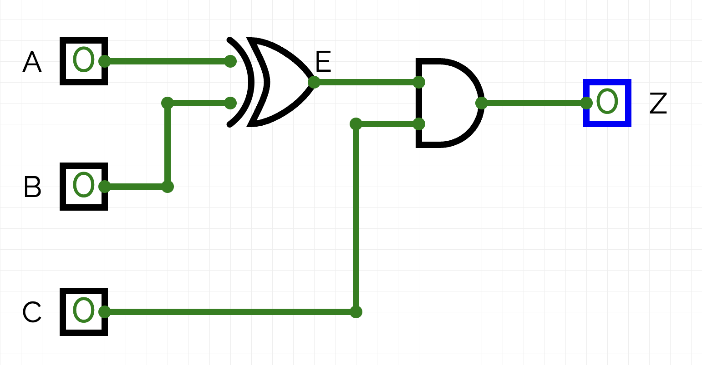

# Boolean Algebra Simplification

The SOP method from the previous lesson produces a correct circuit, but not necessarily an efficient one. A truth table with many 1-output rows can generate a circuit with dozens of gates. Boolean algebra lets you simplify those equations — and therefore the circuits — by applying algebraic identities.

This note covers:

- Why simplification matters
- The Boolean identities and laws you can use
- How to simplify step-by-step with worked examples
- The practical benefits of a reduced circuit

<br>

## 1. Why Simplification Matters

Consider two circuits that produce identical outputs for every possible input. They are logically equivalent. But one might need 10 gates and the other only 4.

For the engineer, fewer gates means:

- **Cheaper:** fewer components to purchase
- **Smaller:** the physical circuit takes up less space
- **Faster:** signals pass through fewer layers of gates
- **Cooler:** fewer gates generating less heat
- **More reliable:** fewer components that can fail

Every circuit manufactured at scale — a CPU, a graphics card, a microcontroller — was optimized using techniques like Boolean simplification. The principles here are the same ones used in industrial chip design.

<br>

## 2. Boolean Identities and Laws

The following identities hold for any Boolean variables A and B. You can apply any of these at any step of a simplification.

### Identity Laws
```
A + 0 = A
A · 1 = A
```

### Null (Domination) Laws
```
A + 1 = 1
A · 0 = 0
```

### Idempotent Laws
```
A + A = A
A · A = A
```

### Complement Laws
```
A + A' = 1
A · A' = 0
```

### Double Negation
```
(A')' = A
```

### Commutative Laws
```
A + B = B + A
A · B = B · A
```

### Associative Laws
```
(A + B) + C = A + (B + C)
(A · B) · C = A · (B · C)
```

### Distributive Laws
```
A · (B + C) = AB + AC          ← AND distributes over OR
A + (B · C) = (A + B)(A + C)   ← OR distributes over AND
```

### Absorption Laws
```
A + AB = A
A · (A + B) = A
```

### De Morgan's Laws
```
(A · B)' = A' + B'
(A + B)' = A' · B'
```

De Morgan's laws are especially important. They let you convert between NAND and NOR representations, and simplify expressions that involve NOT over a group.

### XOR Identity
```
A'B + AB' = A ⊕ B
```

This one is worth recognizing. If you see two terms where one variable is inverted in each, and they differ by which variable is complemented, that is XOR in disguise.

> [!NOTE]
> These identities work like regular algebra in most respects — but not all. `A² = A` in Boolean algebra (idempotent law), which has no parallel in regular algebra. Similarly, `A + 1 = 1`, not `A + 1 = A + 1`.

<br>

## 3. Approach to Simplification

There is no single algorithm that always finds the simplest form. Simplification is a skill developed through practice. Some general strategies:

1. **Factor** common terms out of multiple AND expressions using the distributive law (reverse direction)
2. **Look for complements** — `A + A'` becomes 1; `A · A'` becomes 0
3. **Apply absorption** — if you see `A + AB`, that simplifies to just `A`
4. **Recognize XOR** — `A'B + AB'` collapses to `A ⊕ B`
5. **Apply De Morgan's** to simplify NOT expressions over groups

When you use a law, name it. This makes your work readable and verifiable.

<br>

## 4. Worked Example 1: Car Starter Circuit

From the previous lesson, the car starter circuit (A=Park, B=Neutral, C=Key) produced this equation:

```
Z = A'·B·C + A·B'·C
```

Count the gates before simplification: 2 NOT gates (A', B'), 2 three-input AND gates, 1 OR gate = **5 gates**.

**Step 1 — Factor out C:**
```
Z = C · (A'B + AB')
```
*Distributive law (reverse)*

**Step 2 — Recognize XOR:**
```
Z = C · (A ⊕ B)
```
*XOR identity: A'B + AB' = A ⊕ B*

**Result:** `Z = C · (A ⊕ B)`

In plain English: the engine starts when the Key (C) is on AND Park XOR Neutral — exactly one of the two gear positions is selected.

Count the gates after simplification: 1 XOR gate, 1 AND gate = **2 gates**.

That is a 60% reduction in gate count from the same truth table.

**Before** (5 gates — from note 02):


**After** (2 gates):



> [!TIP]
> Verify simplifications by building both the original and simplified circuits in CircuitVerse and confirming their truth tables match. If they match for all input combinations, the simplification is valid.

<br>

## 5. Worked Example 2: Three-Input OR

Starting equation:
```
Z = A'·B'·C' + A'·B'·C + A'·B·C' + A'·B·C + A·B'·C
```

This has 5 minterms.

**Step 1 — Factor A' from the first four terms:**
```
Z = A'·(B'C' + B'C + BC' + BC) + A·B'·C
```

**Step 2 — Factor B' from the first two inner terms, and B from the last two:**
```
Z = A'·(B'(C' + C) + B(C' + C)) + A·B'·C
```

**Step 3 — Apply complement law, C' + C = 1:**
```
Z = A'·(B'·1 + B·1) + A·B'·C
  = A'·(B' + B) + A·B'·C
```

**Step 4 — Apply complement law, B' + B = 1:**
```
Z = A'·1 + A·B'·C
  = A' + A·B'·C
```
*Identity law*

**Step 5 — Apply absorption-like reasoning (A' + A = 1, partial coverage):**

Use the distributive law: `A' + AB'C = (A' + A)(A' + B'C) = 1 · (A' + B'C) = A' + B'C`

```
Z = A' + B'C
```

Verification: build both forms in CircuitVerse and confirm the truth tables match.

<br>

## 6. Worked Example 3: De Morgan's in Action

Starting equation:
```
Z = (A · B)'
```

**Apply De Morgan's Law:**
```
Z = A' + B'
```

These are equivalent. The NAND gate is equivalent to NOT-AND, which is also OR with inverted inputs.

Starting from the other direction:
```
Z = (A + B)'
```

**Apply De Morgan's Law:**
```
Z = A' · B'
```

The NOR gate is equivalent to NOT-OR, which is also AND with inverted inputs. This is why NAND and NOR are called **universal gates** — any logic circuit can be built using only NANDs, or only NORs.

<br>

## 7. Counting Gates

When comparing a circuit before and after simplification, count individual gate operations:

| Gate | Counts as |
|---|---|
| NOT (on one input) | 1 gate |
| AND, OR, NAND, NOR, XOR (any number of inputs) | 1 gate |
| Combined (e.g., a NOT feeding into an AND) | 2 gates |

Report the count before simplification and after, and identify how many laws you applied.

<br>

## 8. Key Terms

| Term | Definition |
|---|---|
| **Boolean algebra** | An algebraic system with two values (0 and 1) and operations AND, OR, NOT |
| **Identity** | An algebraic rule that holds for all possible variable values |
| **Complement** | The NOT of a variable; A and A' are complements |
| **De Morgan's Laws** | Rules for distributing NOT over AND or OR, swapping the operation |
| **Universal gate** | A gate type (NAND or NOR) from which any other gate can be built |
| **Sum of Products** | A canonical unsimplified form; simplification reduces it |
| **Factoring** | Applying the distributive law in reverse to pull a common term out |
