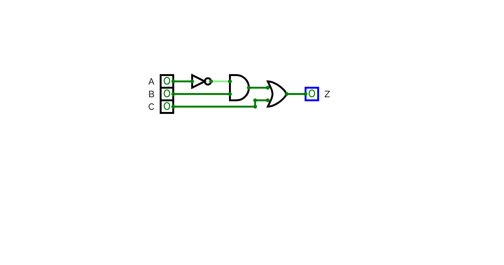

# Unit 3: Digital Logic — Unit Test Review

Work through the sections in order. Show all working for Thinking and Application questions. Name every Boolean law you apply in simplifications.

---

## Section 1: Knowledge

**K1.** State whether each sentence is True or False.

a) XOR outputs 1 when both inputs are the same value.

b) NAND and NOR are both universal gates.

c) In a ripple carry adder, the carry out of each full adder connects to the carry in of the next.

d) Moore's Law states that the number of transistors on a chip doubles approximately every two years.

<details>
<summary>Solutions — click to reveal</summary>

a) **False.** XOR outputs 1 when inputs are *different*. (XNOR outputs 1 when they are the same.)

b) **True.** Both NAND and NOR are universal gates — any logic circuit can be built using only one of these gate types.

c) **True.** This is the defining structure of a ripple carry adder — carries propagate bit by bit from LSB to MSB.

d) **True.** Moore's Law (1965) observed that transistor density doubles roughly every two years.

</details>

---

**K2.** Match each Boolean law to its expression. Write the law name beside each expression.

Laws: **Absorption · Complement · De Morgan's · Idempotent**

| Expression | Law Name |
|---|---|
| `A · A' = 0` | |
| `A + AB = A` | |
| `(A · B)' = A' + B'` | |
| `A + A = A` | |

<details>
<summary>Solutions — click to reveal</summary>

| Expression | Law Name |
|---|---|
| `A · A' = 0` | **Complement** |
| `A + AB = A` | **Absorption** |
| `(A · B)' = A' + B'` | **De Morgan's** |
| `A + A = A` | **Idempotent** |

</details>

---

**K3.** Short answer.

a) In the 4-bit ALU built in this unit, which 2-bit control signal selects the **AND** operation?

b) The carry out produced when a 4-bit addition result exceeds 15 is called what?

c) What does the word "half" mean in the name "half adder" — what is it missing compared to a full adder?

<details>
<summary>Solutions — click to reveal</summary>

a) Control `10` selects AND.

| Control | Operation |
|---------|-----------|
| 00 | ADD |
| 01 | SUB |
| 10 | AND |
| 11 | LST |

b) **Overflow.** (Specifically, the carry out of the most significant full adder.)

c) A half adder cannot accept a **carry in** from a previous bit position. It can only add two bits; it has no third input for a carry coming in from a less significant column.

</details>

---

## Section 2: Communication

**C1. Circuit → Equation and Description**

The following circuit has three inputs (A, B, C).



Label the output of each gate using intermediate variables (D, E) as you work toward the output.

a) Write the Boolean equation for Z.

b) Label each input with a realistic real-world variable (e.g., "A = motion sensor triggered") and write one sentence in plain English describing when Z outputs 1.

<details>
<summary>Solutions — click to reveal</summary>

a) Working left to right through each gate:
- D = A'
- E = D · B = A'·B
- Z = E + C = **A'·B + C**

b) Accept any reasonable real-world assignment. Example:
- A = security system is active, B = motion detected, C = emergency button pressed
- *"The alarm sounds when motion is detected and the security system is not active, or when the emergency button is pressed."*

Gate count: 1 NOT + 1 AND + 1 OR = 3 gates.

</details>

---

**C2. Equation → Plain English**

In the car starter circuit: A = Park selected, B = Neutral selected, C = Key turned.

The circuit's equation is:

```
Z = C · (A ⊕ B)
```

In plain English, describe the exact conditions under which the engine starts (Z = 1). Your answer should be one or two complete sentences and must not use any symbols or gate names.

<details>
<summary>Solution — click to reveal</summary>

The engine starts when the key is turned AND exactly one of Park or Neutral is selected — but not both and not neither. Selecting both gear positions at once, or having neither selected, will prevent the engine from starting even if the key is turned.

</details>

---

**C3. Plain English → Equation and Truth Table**

A home security buzzer (Z) works as follows:

> *"The buzzer sounds when someone rings the doorbell AND the homeowner is not home. The buzzer also sounds whenever the intruder sensor is triggered, regardless of anything else."*

Let: A = doorbell pressed, B = homeowner is home, C = intruder sensor triggered.

a) Write the Boolean equation for Z.

b) Build the complete truth table for Z (8 rows).

<details>
<summary>Solutions — click to reveal</summary>

a) Breaking down the description:
- "doorbell AND homeowner NOT home" → A · B'
- "intruder sensor triggered" → C
- "OR" connecting both conditions

```
Z = A·B' + C
```

b)

| A | B | C | A·B' | Z = A·B' + C |
|---|---|---|------|--------------|
| 0 | 0 | 0 | 0 | 0 |
| 0 | 0 | 1 | 0 | 1 |
| 0 | 1 | 0 | 0 | 0 |
| 0 | 1 | 1 | 0 | 1 |
| 1 | 0 | 0 | 1 | 1 |
| 1 | 0 | 1 | 1 | 1 |
| 1 | 1 | 0 | 0 | 0 |
| 1 | 1 | 1 | 0 | 1 |

</details>

---

**C4. Truth Table → Plain English**

A three-input circuit uses: A = door sensor triggered, B = motion sensor triggered, C = alarm system is armed.

| A | B | C | Z |
|---|---|---|---|
| 0 | 0 | 0 | 0 |
| 0 | 0 | 1 | 0 |
| 0 | 1 | 0 | 0 |
| 0 | 1 | 1 | 1 |
| 1 | 0 | 0 | 0 |
| 1 | 0 | 1 | 1 |
| 1 | 1 | 0 | 0 |
| 1 | 1 | 1 | 1 |

In one or two sentences, describe in plain English when the alarm (Z) goes off. You do not need to write or simplify the equation — just read the pattern from the table.

<details>
<summary>Solution — click to reveal</summary>

Looking at every row where Z = 1: C is always 1, and at least one of A or B is also 1. When C = 0, Z is always 0 regardless of the sensors.

The alarm goes off when the system is armed (C = 1) and at least one sensor — either the door sensor or the motion sensor — has been triggered.

*(The equation is Z = C · (A + B), but you were not required to derive it here.)*

</details>

---

## Section 3: Thinking

**T1. Truth Table → SOP → Simplify**

The following circuit is described only by its truth table:

| A | B | C | Z |
|---|---|---|---|
| 0 | 0 | 0 | 0 |
| 0 | 0 | 1 | 0 |
| 0 | 1 | 0 | 0 |
| 0 | 1 | 1 | 1 |
| 1 | 0 | 0 | 0 |
| 1 | 0 | 1 | 1 |
| 1 | 1 | 0 | 1 |
| 1 | 1 | 1 | 1 |

a) Write the SOP (Sum of Products) equation directly from the truth table. How many gates does this unsimplified circuit require?

b) Simplify the SOP equation as far as you can. Name every law you use at every step.

c) How many gates does the simplified circuit require?

<details>
<summary>Solutions — click to reveal</summary>

a) Rows where Z = 1: `011`, `101`, `110`, `111`

```
Z = A'·B·C + A·B'·C + A·B·C' + A·B·C
```

Gate count (unsimplified): 3 NOT gates + 4 three-input AND gates + 1 four-input OR gate = **8 gates**

b) The key move is to introduce extra copies of `A·B·C` using the Idempotent Law, letting it pair with each of the other three terms.

```
Z = A'·B·C + A·B'·C + A·B·C' + A·B·C
```

Duplicate `A·B·C` twice — **Idempotent** (adding extra copies of a term doesn't change the expression):

```
Z = (A'·B·C + A·B·C) + (A·B'·C + A·B·C) + (A·B·C' + A·B·C)
```

Factor each pair — **Distributive** (reverse):

```
Z = B·C·(A' + A)  +  A·C·(B' + B)  +  A·B·(C' + C)
```

Apply **Complement** (X' + X = 1) to each bracket:

```
Z = B·C·1  +  A·C·1  +  A·B·1
```

Apply **Identity** (X · 1 = X):

```
Z = BC + AC + AB
```

c) Gate count (simplified): 3 two-input AND gates + 1 three-input OR gate = **4 gates** (saving 4 gates)

*This is the majority circuit — it outputs 1 whenever at least two of the three inputs are 1.*

</details>

---

**T2. Simplify with Laws**

Simplify the following expression. Name the law applied at each step. Count gates before and after.

```
Z = A·B'·C + A'·B·C + A·B·C
```

<details>
<summary>Solution — click to reveal</summary>

Gate count before: 2 NOT gates + 3 three-input AND gates + 1 OR gate = **6 gates**

**Step 1:** Factor C from all three terms — **Distributive** (reverse):
```
Z = C · (A·B' + A'·B + A·B)
```

**Step 2:** Factor A from the first and third terms inside the bracket — **Distributive** (reverse):
```
Z = C · (A·(B' + B) + A'·B)
```

**Step 3:** B' + B = 1 — **Complement**:
```
Z = C · (A·1 + A'·B)
```

**Step 4:** A·1 = A — **Identity**:
```
Z = C · (A + A'·B)
```

**Step 5:** Expand `A + A'·B` using **Distributive** (OR over AND):
```
A + A'·B = (A + A') · (A + B)
```

**Step 6:** A + A' = 1 — **Complement**; then 1·(A + B) = A + B — **Identity**:
```
Z = C · (A + B)
```

Gate count after: 1 OR gate (A + B) + 1 AND gate (with C) = **2 gates** (saving 4 gates)

</details>

---

**T3. Equation → Truth Table**

Fill in the complete truth table for this equation, using intermediate columns to show your working.

```
Z = (A + B') · C
```

Your table must include columns for each sub-expression: `B'`, `A + B'`, and `Z`.

<details>
<summary>Solution — click to reveal</summary>

| A | B | C | B' | A + B' | Z = (A + B')·C |
|---|---|---|----|--------|----------------|
| 0 | 0 | 0 | 1  | 1      | 0 |
| 0 | 0 | 1 | 1  | 1      | 1 |
| 0 | 1 | 0 | 0  | 0      | 0 |
| 0 | 1 | 1 | 0  | 0      | 0 |
| 1 | 0 | 0 | 1  | 1      | 0 |
| 1 | 0 | 1 | 1  | 1      | 1 |
| 1 | 1 | 0 | 0  | 1      | 0 |
| 1 | 1 | 1 | 0  | 1      | 1 |

Z = 1 for rows: `001`, `101`, `111`

Watch out for row `110` (A=1, B=1, C=0): B' = 0, but A = 1, so A + B' = 1. Z is still 0 because C = 0. The AND with C at the end gates the whole expression.

</details>

---

## Section 4: Application

**A1. Half Adder**

A half adder has inputs A = 1 and B = 1.

a) What is the Sum output (Z)?

b) What is the Carry Out output (Y)?

c) Which gate produces Z, and which gate produces Y? Write the equation for each.

<details>
<summary>Solutions — click to reveal</summary>

a) Z (Sum) = **0**

b) Y (Carry Out) = **1**

c) Sum uses **XOR**: `Z = A ⊕ B` → 1 ⊕ 1 = 0

Carry uses **AND**: `Y = A · B` → 1 · 1 = 1

</details>

---

**A2. Full Adder**

A full adder has inputs A = 1, B = 1, Cin = 1.

a) Use the full adder equations below to compute Z (Sum) and Cout step by step. Show each sub-expression evaluated.

```
Z    = A ⊕ B ⊕ Cin
Cout = AB + ACin + BCin
```

b) Check your answer: what is 1 + 1 + 1 in binary?

<details>
<summary>Solutions — click to reveal</summary>

a)
```
Z = A ⊕ B ⊕ Cin
  = 1 ⊕ 1 ⊕ 1
  = 0 ⊕ 1          (evaluate left to right: 1 ⊕ 1 = 0)
  = 1

Cout = AB + ACin + BCin
     = (1·1) + (1·1) + (1·1)
     = 1 + 1 + 1
     = 1
```

**Z = 1, Cout = 1**

b) 1 + 1 + 1 = 11₂ — sum bit is 1, carry bit is 1. ✓

</details>

---

**A3. Binary Addition and Overflow**

Add the following two 4-bit binary values using the column-by-column method. Show all carries.

```
  1 0 1 1
+ 0 1 1 0
```

a) What is the 4-bit result?

b) Is there an overflow? How do you know?

c) What decimal values are being added, and what is their decimal sum? Does this match your binary result?

<details>
<summary>Solutions — click to reveal</summary>

```
  Carries:  1 1 1
    1 0 1 1    (11)
  + 0 1 1 0    ( 6)
  ─────────
    0 0 0 1   + carry out = 1
```

Column by column (right to left):
- Col 0: 1 + 0 = 1, carry 0
- Col 1: 1 + 1 = 0, carry 1
- Col 2: 0 + 1 + carry(1) = 0, carry 1
- Col 3: 1 + 0 + carry(1) = 0, carry 1

a) 4-bit result: **`0001`**

b) **Yes, there is overflow.** The carry out of the most significant (leftmost) full adder is 1, signalling that the true result does not fit in 4 bits.

c) 1011₂ = 11, 0110₂ = 6. 11 + 6 = **17**. Four bits can only represent 0–15, so 17 overflows. The 4-bit result `0001` = 1, which equals 17 − 16 — consistent with overflow wrapping behaviour.

</details>

---

**A4. ALU Trace — LST Operation**

The ALU receives these two 4-bit inputs and a control signal:

- A = `0101`
- B = `1001`
- Control = `11`

a) What operation does control signal `11` select?

b) Convert A and B to decimal.

c) What will the ALU output for Z? Write your answer in both binary and decimal.

d) Explain briefly how the LST unit determines its output.

<details>
<summary>Solutions — click to reveal</summary>

a) Control `11` selects **LST (Less Than)**.

b) A = `0101` = 4 + 1 = **5**. B = `1001` = 8 + 1 = **9**.

c) Since 5 < 9, the LST output is **`0001`** (decimal **1**).

d) The LST unit internally performs a 4-bit subtraction (A − B). If the final full subtractor's borrow out is 1 — meaning A was smaller than B and the circuit had to borrow — then the output is `0001`. The borrow-out bit drives the least significant output bit (Z1 = Bout); the remaining three output bits (Z2, Z3, Z4) are fixed at 0.

</details>

---

**A5. MUX Analysis**

A 2-in-1-out multiplexer has the following equation:

```
Z = A·C' + B·C
```

a) Evaluate the output Z when A = 1, B = 0, C = 1. Show your working.

b) In plain English, what does this MUX do when C = 0? When C = 1?

c) In the 4-bit ALU, this MUX appears many times. What does the control input C represent in the ALU context, and what is it selecting between?

<details>
<summary>Solutions — click to reveal</summary>

a)
```
Z = A·C' + B·C
  = 1·(1)' + 0·1
  = 1·0 + 0
  = 0
```

**Z = 0.** C = 1 selects input B, and B = 0, so the output is 0.

b) When C = 0: Z = A·1 + B·0 = A. The output passes through input A — A is selected.

When C = 1: Z = A·0 + B·1 = B. The output passes through input B — B is selected.

c) In the ALU, the control input (a 2-bit signal for the full 4-in-1 MUX) is the **ALU control signal**. It selects which operation's result — ADD, SUB, AND, or LST — is routed to the final output Z. All four units compute their results simultaneously; the MUX chooses which one gets through.

</details>

---
