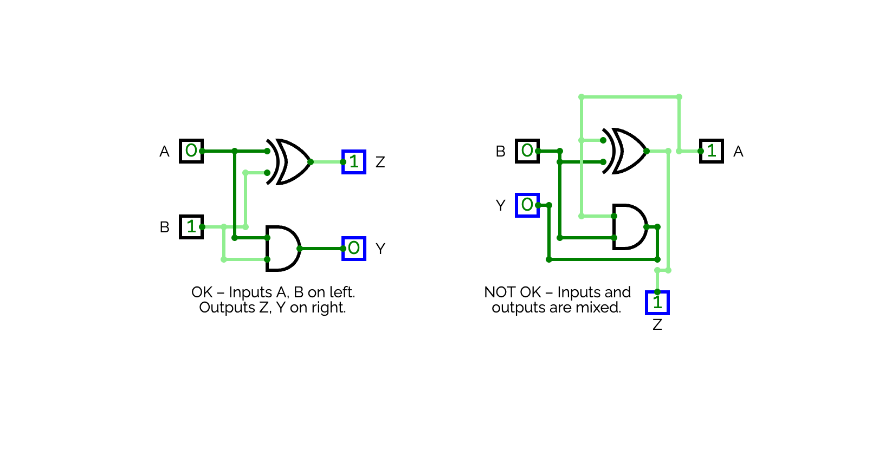
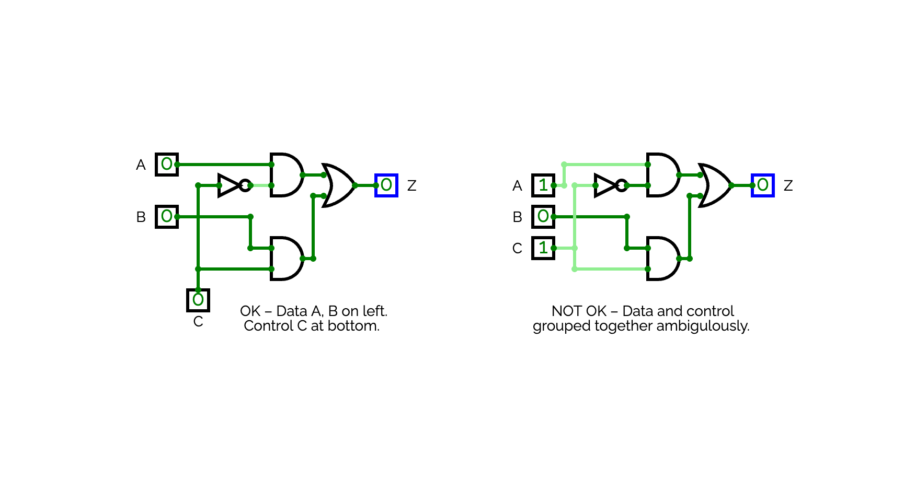
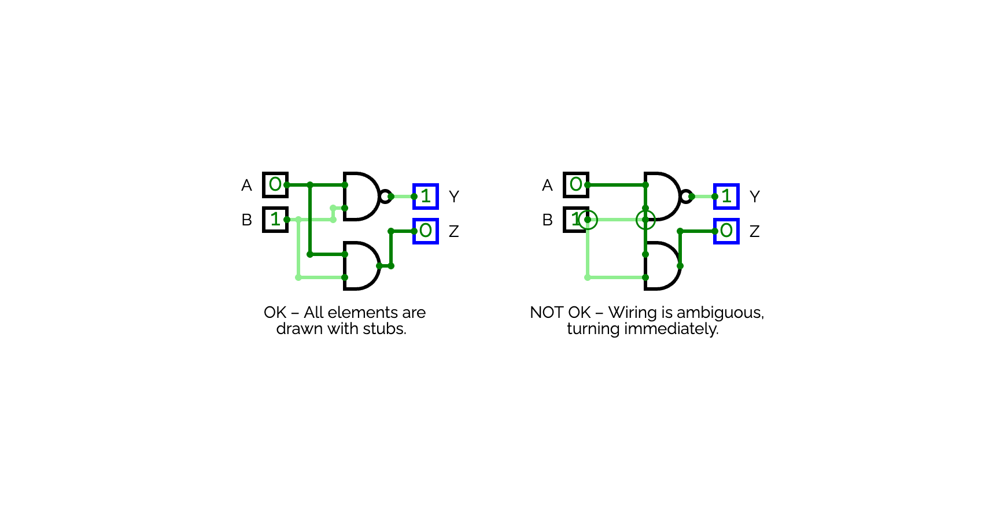
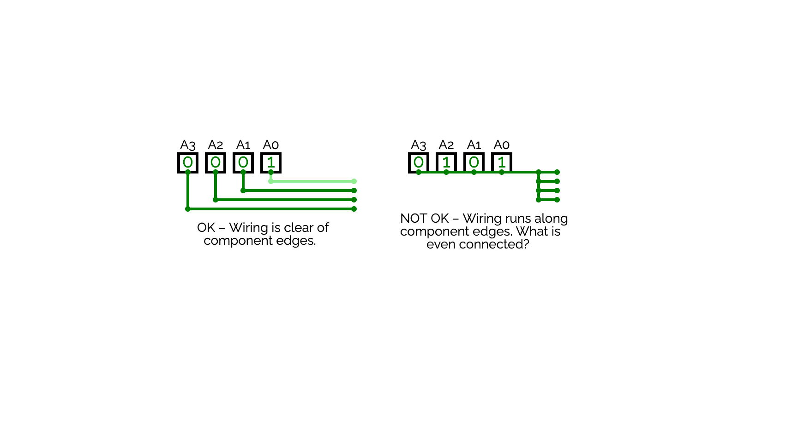
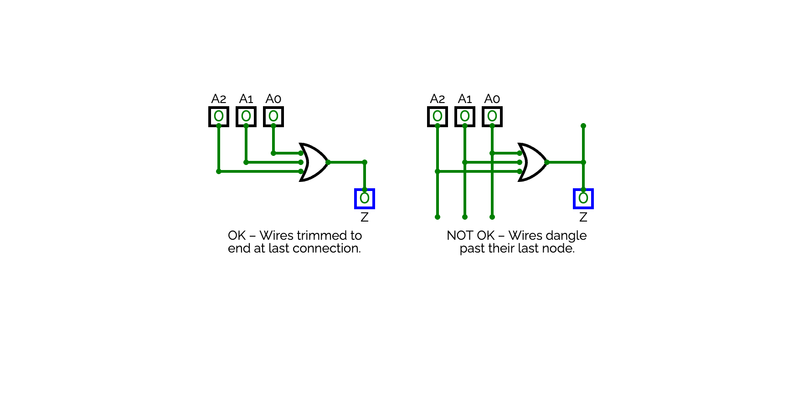
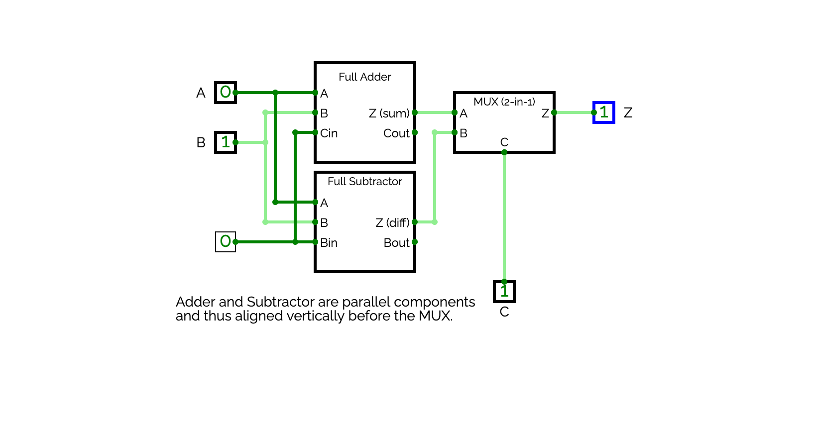

# Schematic Drawing Conventions

Good circuit diagrams follow conventions that make them readable to anyone — not just the person who drew them. These aren't arbitrary rules, rather, each one exists because it reduces confusion and makes errors easier to spot.

## 1. Signal flows left to right

Data inputs go on the left. Outputs go on the right. Signal travels left → right through the circuit.

This matches how we read and how circuit diagrams appear in textbooks and datasheets. A reader should be able to follow a signal from input to output without backtracking.

## 2. Separate data from control

Data signals (operands, values being computed) enter from the left or top. Control signals (operation selectors, enable lines) enter from the bottom or top — but kept visually separate from data.

Grouping like signals together and separating unlike signals makes the purpose of each wire obvious at a glance.

## 3. Use stubs on gate pins

A wire leaving a gate pin should travel a short distance **in the direction the pin faces** before making any turn. This short segment is called a stub.

Without a stub, a wire that turns immediately at a pin can look like it connects to the gate body rather than the pin — making it ambiguous and hard to trace.

## 4. Don't run wires along component boundaries

A wire that runs flush against the edge of a gate symbol or component box is visually ambiguous — it looks like it might be part of the component outline rather than a signal wire. Keep wires clear of component bodies by routing around them with some spacing.

## 5. Wires end at their last connection

A wire should terminate at its last junction or pin — not extend beyond it. Dead-end wire stubs that go nowhere suggest an incomplete connection and are a common source of debugging confusion.

## 6. Align parallel components

Functional units at the same level of the circuit (e.g., four operation blocks feeding a MUX) should be vertically or horizontally aligned. Aligned components make the structure of the circuit clear and the routing symmetrical.

## 7. Label everything

Every input and output pin should be named. Use consistent naming across tabs — if a signal is called `Cout` inside the adder subcircuit, the pin on the subcircuit block should also be called `Cout`, not `C` or `carry`.

Labels are not just for the reader — they are how you catch wiring errors. An unlabelled wire is an untested assumption.

These conventions are followed in professional design tools and in published datasheets. A schematic that follows them can be read and verified by someone who has never seen it before. This is the standard to which a professional circuit diagram is held.
