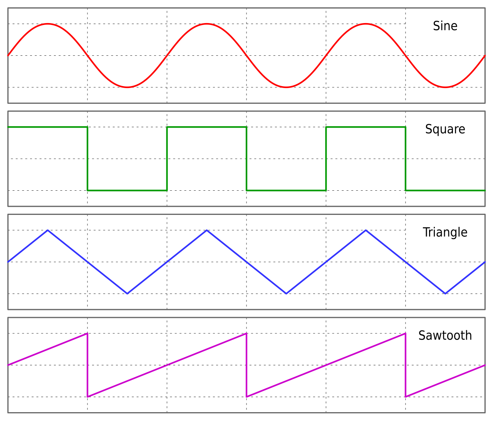
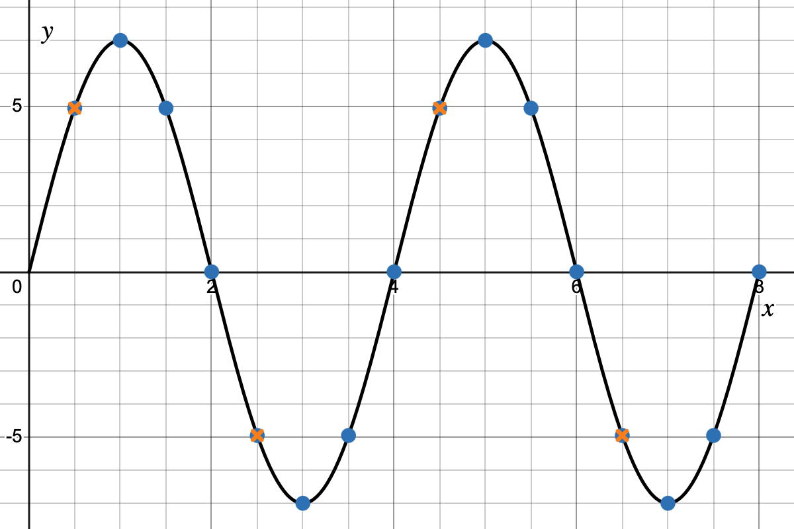
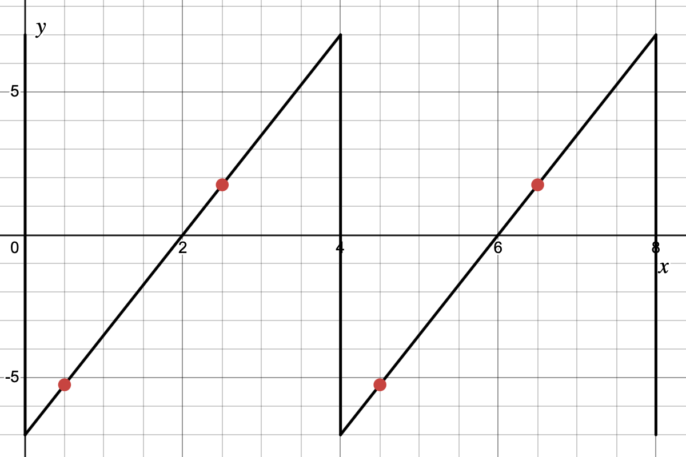

# Analog and Digital Signals

In Unit 3 you built circuits that work entirely in binary. Every wire carries either a 1 or a 0. That is the language of digital logic, and it is the language of every CPU ever made.

But the physical world does not speak binary. Temperature rises continuously. Sound pressure oscillates in smooth curves. Light intensity varies across an infinite spectrum. If computers only understand 1s and 0s, how do they interact with a world that has no such limitation?

The answer is conversion, and understanding how that conversion works is essential to every sensor, microphone, camera, and touchscreen that has ever existed.

This note covers:

- What makes a signal analog or digital
- How analog signals are captured as binary data (ADC)
- How binary data is converted back to analog output (DAC)
- The trade-offs engineers make when designing these systems

 

## 1. Analog Signals

An **analog signal** is one that can take any value within a continuous range. There is no minimum step size — between any two values, there are infinitely more values in between.

In electronics, we represent physical quantities as **voltage**. A sensor converts a physical measurement (temperature, pressure, position, sound) into a varying voltage. That voltage is the analog signal the circuit reads.

A graph of an analog signal plots **amplitude** (voltage) on the y-axis against **time** on the x-axis. The result is a continuous curve. There are no gaps or jumps.

You should recognize this shape from mathematics. A sine wave, which you have studied in trigonometry, is a perfect model of an analog signal: it oscillates smoothly between a maximum and minimum value, passing through every value in between.

In music, a synthesizer keyboard can generate sine waves and many other types of waves:

In class, you'll have heard these four basic synthesizer waveforms: sine, square, triangle, and sawtooth. Each represent a different *shape* of voltage oscillation over time. The shape determines the sound: smoother waveforms produce purer tones; sharper edges produce harsher, buzzier sounds. A sine wave has one pure frequency and sounds clean. A sawtooth wave has many frequencies layered together and sounds harsh and bright.

> [!NOTE]
> The reason different wave shapes sound different is that they contain different mixtures of frequencies. A sine wave is a single pure frequency. A sawtooth contains the fundamental frequency plus many additional **harmonics** (integer multiples of the base frequency). The study of signals broken down by their frequency content is called **Fourier analysis** — one of the most important ideas in signal processing and electrical engineering. It is beyond the scope of this course, but worth knowing exists.

 

## 2. Digital Signals

A **digital signal** has only two valid states: **HIGH** (typically 5V or 3.3V) and **LOW** (0V). There is no in-between.

Every wire in your Unit 3 logic gate circuits carried a digital signal — either a 1 or a 0. A digital output sits at one of two voltages: **HIGH** (typically 5V or 3.3V) or **LOW** (0V). There is nothing in between.

Look at the square wave in the diagram above. It spends all its time at the top or the bottom, switching instantly between them — that shape is a digital signal. Everything in your logic gate circuits, and everything the devices you will build this unit output digitally, looks like this on an oscilloscope.

> [!TIP]
> This is why digital systems are robust. An analog signal picks up noise from the environment — small fluctuations that change its value. A digital system does not care about those fluctuations as long as it can still tell HIGH from LOW. Even a noisy HIGH is unambiguously a 1.

 

## 3. Analog-to-Digital Conversion (ADC)

An **ADC (Analog-to-Digital Converter)** is a circuit that samples a continuously varying voltage and encodes it as a binary number. Two parameters define the quality of that conversion.

 

### 3.1 Sample Rate

The ADC cannot watch a signal continuously. Instead, it takes **snapshots** at regular intervals. The **sample rate** is how many snapshots it takes per second, measured in **Hz** (samples per second).

Between snapshots, the ADC knows nothing. A signal can rise, fall, and return to its previous value in between two samples, and the ADC will never know it happened. A higher sample rate captures more of the signal's behaviour over time.

Consider this sine wave being sampled:

The blue dots represent sampling the signal with more snapshots per second. The orange "X" points represent sampling the signal with fewer — you can see this case misses the peaks and details of the wave.

 

### 3.2 Bit Depth

Each snapshot measures a voltage, but that voltage must be rounded to the nearest representable level before it can be stored as binary. The **bit depth** determines how many levels are available.

With *n* bits, you have **2ⁿ** possible levels.

| Bit Depth | Levels | Smallest step (over a ±7V range) |
|-----------|--------|-----------------------------------|
| 2-bit | 4 | 3.5V |
| 4-bit | 16 | ~0.9V |
| 8-bit | 256 | ~0.05V |
| 16-bit | 65,536 | ~0.0002V |

A higher bit depth means each sample is rounded to a finer level, thus, closer to the true voltage. The difference between the true voltage and the rounded level is called **quantization error**. It is always present, but a higher bit depth makes it smaller.

 

### 3.3 Encoding Samples: Sign-Magnitude Binary

For a signal that goes both positive and negative, one common approach is **sign-magnitude** representation: dedicate one bit to the sign, and the remaining bits to the magnitude (absolute value).

With 4 bits (1 sign bit + 3 value bits), you can represent values from −7 to +7:

| Value | Sign bit | Value bits | Full binary |
|-------|----------|-----------|-------------|
| +7 | 0 | 111 | `0111` |
| +6 | 0 | 110 | `0110` |
| +5 | 0 | 101 | `0101` |
| +4 | 0 | 100 | `0100` |
| +3 | 0 | 011 | `0011` |
| +2 | 0 | 010 | `0010` |
| +1 | 0 | 001 | `0001` |
| 0 | 0 | 000 | `0000` |
| −1 | 1 | 001 | `1001` |
| −2 | 1 | 010 | `1010` |
| −3 | 1 | 011 | `1011` |
| −4 | 1 | 100 | `1100` |
| −5 | 1 | 101 | `1101` |
| −6 | 1 | 110 | `1110` |
| −7 | 1 | 111 | `1111` |

Sign bit `0` = positive. Sign bit `1` = negative. The magnitude is encoded in the remaining three bits exactly as unsigned binary.

> [!NOTE]
> Sign-magnitude is intuitive, but it is **not** how real computers actually represent negative numbers. Real processors use a system called **two's complement**, which is designed so that the same addition circuits work correctly for both positive and negative numbers. You can explore it here: [Two's complement — Wikipedia](https://en.wikipedia.org/wiki/Two%27s_complement). For the purposes of this course, sign-magnitude is a valid and readable representation.

 

### 3.4 A Worked Example

Suppose an ADC is sampling an audio signal with the following configuration:
- Voltage range: −7V to +7V
- Sample rate: one sample per second
- Bit depth: 4 bits (1 sign + 3 value)

Three samples come in:

| Sample | Time | True voltage | Rounded | Binary |
|--------|------|-------------|---------|--------|
| 1 | 1 s | +5.3V | +5 | `0101` |
| 2 | 2 s | +1.7V | +2 | `0010` |
| 3 | 3 s | −3.2V | −3 | `1011` |

The quantization error on sample 1 is 0.3V — the true value was +5.3V but the best available level was +5V. That rounding error is unavoidable. More bit depth would narrow the gap.

 

## 4. Activity: Sample the Wave

Use the printed graph handout for this activity. The graph shows a signal plotted from t = 0 to t = 8, with dashed vertical lines at every 0.5 seconds and integer gridlines on the y-axis (−7 to +7).

For each sample: follow the dashed vertical line to where it meets the curve, read the y-value (voltage), round to the nearest integer, then encode in 4-bit sign-magnitude binary using the reference table in §3.3.

### Part A — Fine sampling

Sample at **t = 1, 2, 3, 4, 5, 6, 7, 8**.

| Sample | Time (s) | Voltage (from graph) | Rounded | Binary |
|--------|----------|---------------------|---------|--------|
| 1 | 1 | | | |
| 2 | 2 | | | |
| 3 | 3 | | | |
| 4 | 4 | | | |
| 5 | 5 | | | |
| 6 | 6 | | | |
| 7 | 7 | | | |
| 8 | 8 | | | |

### Part B — Coarse reconstruction

Imagine the ADC only recorded samples at **t = 2, 4, 6, 8** — one sample every 2 seconds instead of every 1 second. You already have those four values from Part A.

On the printed graph, mark those four points and connect them with straight line segments. This is what a DAC would reconstruct if that coarse data was all it had.

**Discussion:**
- Where does the reconstruction go most wrong compared to the original wave?
- What features of the signal did the lower sample rate fail to capture?

### Part C — The sawtooth problem (extension/discussion)

Look at the sawtooth wave above. The red dots show samples taken at the same rate as Part B.

1. Where does coarse sampling cause the biggest errors on a sawtooth? Why?
2. What would happen if your sample interval matched the period of the wave exactly — and every sample landed at the same point in the cycle?

 

## 5. Trade-offs

Higher sample rate and higher bit depth both improve quality. Neither is free.

| Cost | Why it matters |
|------|---------------|
| Storage | More samples × more bits per sample = more data generated per second |
| Processing power | More data requires more computation to handle in real time |
| Energy | Faster sampling draws more power |
| Diminishing returns | Past a certain point, finer resolution exceeds what the application requires |

**Real-world specifications:**

| Application | Sample Rate | Bit Depth | Notes |
|-------------|-------------|-----------|-------|
| Audio CD | 44,100 Hz | 16-bit | Human hearing reaches ~20 kHz; the 44.1 kHz rate provides the necessary safety margin |
| Studio recording | 96,000 Hz | 24-bit | Headroom for editing; most people cannot hear the difference on playback |
| Streaming audio | 48,000 Hz | 16–24 bit | Standard for broadcast and online distribution |
| Gaming mouse | 1,000 Hz | 8–12 bit | 1000 position updates per second; beyond this, physical latency dominates |
| Phone camera | 30–240 Hz (video frames) | 8–10 bit per channel | Each pixel is an ADC reading; more frames per second = more data |
| Digital thermometer | 1–4 Hz | 10–12 bit | Body temperature changes slowly; fast sampling adds data with no benefit |

Notice that a thermometer does not need 44,100 samples per second. Human body temperature does not change at audio frequencies. The right sample rate and bit depth depend entirely on the signal being measured.

> [!TIP]
> As a future engineer, you may be asked to design the sensing system for a new device. The correct answer is never "use the maximum values." It is: **what does this signal actually require?** Choosing appropriate specifications is a real engineering decision with real cost implications.

 

## 6. Digital-to-Analog Conversion (DAC)

The reverse process exists as well. A **DAC (Digital-to-Analog Converter)** reads a sequence of binary values and outputs a corresponding continuously varying voltage, which can then drive a physical output device.

When a music app plays a track, it reads 44,100 binary samples per second and feeds them through a DAC, which reconstructs the audio waveform and drives your headphone speakers.

Other examples:
- A display driver converts pixel colour values (binary) into the precise voltages that set each pixel's brightness
- A servo motor controller converts a position value (binary) into the voltage that drives the motor to that angle

> [!NOTE]
> In a few lessons you will encounter **PWM (Pulse Width Modulation)** — a technique that uses a digital signal (a square wave switching HIGH and LOW at high speed) to simulate an analog output. By varying the proportion of time the signal spends HIGH versus LOW, you can control motor speed or LED brightness. PWM is not a true DAC — the signal never actually takes a value between HIGH and LOW — but it achieves similar results for many applications. We will cover it in detail in Lab 4.

 

## 7. Key Terms

| Term | Definition |
|------|-----------|
| **Analog signal** | A signal that varies continuously and can take any value within a range |
| **Digital signal** | A signal with only two valid states: HIGH (1) and LOW (0) |
| **ADC** | Analog-to-Digital Converter — circuit that samples an analog voltage and encodes it as binary |
| **DAC** | Digital-to-Analog Converter — circuit that converts binary values back to a continuously varying voltage |
| **Sample rate** | How many times per second the ADC takes a measurement, in Hz |
| **Bit depth** | Number of bits used to encode each sample; determines how many voltage levels are available |
| **Quantization** | Rounding a sampled voltage to the nearest representable level |
| **Quantization error** | The difference between the true voltage and the rounded (quantized) value |
| **Sign-magnitude** | A binary representation where one bit indicates the sign and remaining bits encode the magnitude |
| **PWM** | Pulse Width Modulation — a digital signal technique that simulates analog output by varying duty cycle |

 

## 8. Explore

These browser-based tools let you hear and see the waveforms from today's lesson.

**[ToneSynth](https://tonesynth.com)** — Simple tone generator. Select sine, square, sawtooth, or triangle wave and hit play. Default pitch is A440 (440 Hz). Compare how the four wave shapes sound.

**[WebSynth Studio](https://szabadkai.github.io/synth-demo/)** — Two-oscillator synthesizer with a live oscilloscope display. Play notes using the home row keys on your keyboard. Try:
- Switching the oscillator waveform between sine, triangle, and sawtooth and watching the shape change in the scope
- Playing higher notes and observing how the period of the wave shrinks (higher frequency = shorter period)
- Applying the **low-pass filter** and watching the sawtooth's sharp edges smooth out — the filter is removing the high-frequency harmonics that give it its harsh character
