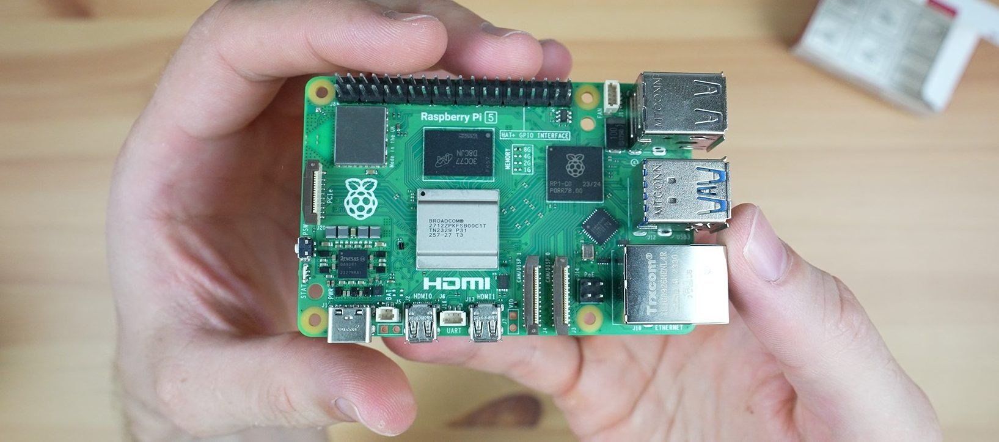
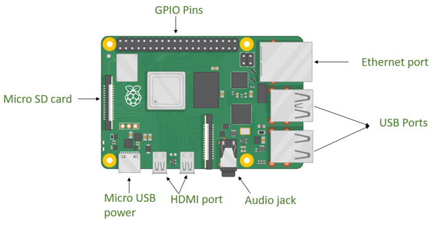

# Python for GPIO



A **Raspberry Pi** is a complete computer on a single circuit board — about the size of a deck of cards. It has a CPU, RAM, Wi-Fi, USB ports, and an HDMI output, and it runs Linux. While it's possible to connect a monitor and keyboard to one and interact with it like a desktop computer, you're more likely to find them running "headless" (i.e., without a monitor) in embedded systems. We'll be controlling ours in the terminal using `ssh`. 

What makes the RPi different from a regular computer is the **40-pin GPIO header** — the two rows of metal pins along the top edge of the board.



**GPIO** stands for *General Purpose Input/Output*. Each pin can be individually configured in software to either send a voltage signal (output) or read one (input). This is the bridge between your code and the physical world: an LED wired to an output pin turns on when your script sets it HIGH; a button wired to an input pin lets your script detect a press. In this unit, those pins will drive motors, read sensors, and ultimately control an autonomous robot.

<br>

In Unit 3 you designed circuits in logic gates. In Unit 4 you control circuits with code. The bridge between them is a Python script running on a Raspberry Pi, sending electrical signals through GPIO pins.

This note teaches you the Python you need to write those scripts, starting from the ground up. If you have prior Python experience, most of §2 will be review; skip ahead to §4 when you are comfortable. If you have ICS3U Java but no Python, the language is similar in logic but different in syntax. (You'll see the differences called out explicitly in this note.) If this is your first time programming, work through every section in order.

**By the end of Day 3, you will be able to read and write a complete GPIO script from scratch.**

<br>

## 1. Why Python?

Raspberry Pi runs a full Linux operating system. Python is the standard language for RPi GPIO programming because:

- The official RPi GPIO library (`RPi.GPIO`) is written for Python
- Python is pre-installed on Raspberry Pi OS, so no setup is required
- The syntax (i.e. code) is easily-readable: a GPIO script reads almost like a list of instructions

> [!NOTE]
> If you have Java experience from ICS3U: Python uses the same concepts — variables, loops, conditionals, functions — but with a different syntax. The most important differences are: no curly braces (rather, indentation controls structure), no semicolons, no type declarations, and `True`/`False` are capitalized. These are noted here throughout.

<br>

## 2. Python Essentials

### 2.1 Variables

A **variable** is a named container for a value. In Python, you create a variable by assigning a value to a name. No type declaration is required.

```python
LED_PIN = 18          # stores the integer 18
DELAY = 0.5           # stores the float 0.5
is_running = True     # stores the boolean True
message = "ready"     # stores the string "ready"
```

Python infers the type from the value. The variable `LED_PIN` holds an integer; `DELAY` holds a decimal number; `is_running` holds a boolean.

> [!NOTE]
> **Java comparison:** In Java you would write `int LED_PIN = 18;`. Python drops the type (`int`) and the semicolon. The name `LED_PIN` in all-caps is a Python convention for a constant — a value you do not intend to change.

**Why it matters for GPIO:** Pin numbers are integers. Delays between actions are floats. Sensor readings are booleans (HIGH or LOW). Every line of a GPIO script works with variables like these.

You can also reassign a variable at any time:

```python
speed = 50
speed = 75      # speed is now 75
```

And perform arithmetic:

```python
half_delay = DELAY / 2          # 0.25
total_pins = LED_PIN + 1        # 19
```

<br>

### 2.2 Loops

A **loop** repeats a block of code. The two loops you need for GPIO are `while` and `for`.

#### while loop

A `while` loop runs as long as a condition is `True`.

```python
count = 0
while count < 5:
    print(count)
    count = count + 1
```

This prints 0, 1, 2, 3, 4 — then stops when `count` reaches 5.

> [!NOTE]
> **Java comparison:** Identical logic. Python uses a colon `:` after the condition and uses indentation instead of curly braces `{}` to define the body. Indentation is mandatory — it is how Python knows what is inside the loop.

**`while True` — the infinite loop**

GPIO scripts almost always run forever, waiting for sensor input and responding to it. The standard pattern is `while True:`:

```python
while True:
    # this runs forever until you press Ctrl+C
    print("checking sensors...")
```

`True` is always true, so the loop never exits on its own. You stop the script by pressing **Ctrl+C**, which sends an interrupt signal to Python.

#### for loop

A `for` loop runs a block of code a set number of times, or over a sequence.

```python
for i in range(3):
    print("blink", i)
```

`range(3)` produces the sequence 0, 1, 2. The loop runs three times, with `i` taking each value in turn. This prints:

```
blink 0
blink 1
blink 2
```

`for` loops are useful when you want to repeat an action a known number of times — for example, blinking an LED three times before entering the main loop.

<br>

### 2.3 Conditionals

A **conditional** runs different code depending on whether a condition is true or false.

```python
if temperature > 30:
    print("too hot")
elif temperature > 20:
    print("comfortable")
else:
    print("too cold")
```

> [!NOTE]
> **Java comparison:** Same logic. Python uses `elif` instead of `else if`. No parentheses required around the condition (though they are allowed). Colon `:` ends each clause; indentation defines the body.

**Why it matters for GPIO:** Every sensor response is a conditional. A button input is either HIGH or LOW. A temperature reading is above or below a threshold. The entire logic of an autonomous robot is built from conditions.

```python
button_state = GPIO.input(BUTTON_PIN)

if button_state == True:
    print("button pressed — stop!")
else:
    print("no input — keep moving")
```

**Comparison operators:**

| Operator | Meaning |
|----------|---------|
| `==` | equal to |
| `!=` | not equal to |
| `>` | greater than |
| `<` | less than |
| `>=` | greater than or equal |
| `<=` | less than or equal |

**Logical operators:**

```python
if speed > 0 and not obstacle_detected:
    print("moving forward")

if button_a or button_b:
    print("at least one button pressed")
```

<br>

---

## Day 2 Practice

These exercises use only what you've covered today — variables, loops, and conditionals. No GPIO library needed. Work in a new file called `practice.py` in your `gpio` folder.

### Part A — Blink simulator (everyone)

Write a script that simulates an LED blinking using only `print` statements:

1. Define `BLINK_COUNT = 5`
2. Use a `for` loop to blink that many times
3. Each iteration: print `"LED ON"` then `"LED OFF"`
4. After the loop ends, print `"Done blinking."`

Run it with `python3 practice.py` and confirm the output looks right.

Then modify it:
- Change `BLINK_COUNT` to 3
- Add a conditional inside the loop: if it is the **last** blink (`i == BLINK_COUNT - 1`), also print `"Last blink!"` after `"LED OFF"`

### Part B — Two speeds (extension)

Extend your script to blink in two phases: 3 fast blinks, then 3 slow blinks. Use two separate `for` loops. Label the output so it's clear which phase is which: `"FAST ON"` / `"FAST OFF"` for the first loop, `"SLOW ON"` / `"SLOW OFF"` for the second.

Then add a conditional inside the slow loop: if the loop counter is even, also print `"  (even blink)"`.

### Part C — Reach ahead (for students with programming experience)

Look ahead at §3 (Functions) — that is tomorrow's content, but the concept may be familiar. Write a function `blink(label, count)` that prints `[label] ON` and `[label] OFF` the given number of times. Then rewrite your two-phase script to call `blink("FAST", 3)` and `blink("SLOW", 3)` instead of using two separate loops.

---

**— Day 2 / Day 3 boundary —**

> §2 is Python fundamentals — variables, loops, conditionals. From here: how GPIO scripts are actually structured, and how to write one from scratch.

---

<br>

## 3. Functions

A **function** is a named block of code you can call by name. In Python, you define one with `def`:

```python
def blink(pin, times):
    for i in range(times):
        GPIO.output(pin, True)
        time.sleep(0.2)
        GPIO.output(pin, False)
        time.sleep(0.2)
```

You call it like this:

```python
blink(LED_PIN, 3)       # blinks LED_PIN three times
```

Functions let you name a procedure and reuse it. Your GPIO scripts will naturally group into: setup, main loop, and cleanup — putting each in a function keeps the code readable. This is covered in Part D of the §8 Practice section.

> [!NOTE]
> **Java comparison:** Same concept; Python uses `def` instead of a return-type keyword. Python does not require a return type declaration. The function body is indented, not in curly braces.

<br>

## 4. Modules and Imports

Python code is organized into **modules** — files of reusable code. You bring a module into your script with `import`.

```python
import time
```

After this line, you can use everything in the `time` module by prefixing its name:

```python
time.sleep(1)       # pauses the script for 1 second
time.sleep(0.5)     # pauses for half a second
```

`time.sleep()` is the most common function in GPIO scripts — it controls how long an LED stays on or off, how long a motor runs before checking for input, and so on.

**Importing with an alias**

When a module name is long, you can give it a shorter alias:

```python
import RPi.GPIO as GPIO
```

Now `RPi.GPIO` is accessible as `GPIO` — every call in your script uses the short form:

```python
GPIO.setmode(GPIO.BCM)
GPIO.setup(18, GPIO.OUT)
```

Without the alias, you would have to write `RPi.GPIO.setmode(RPi.GPIO.BCM)` every time.

**Why this matters:** Every GPIO script begins with exactly these two imports:

```python
import RPi.GPIO as GPIO
import time
```

These two lines load the GPIO library and the timing library. Nothing else works without them.

<br>

## 5. Handling Interruptions: `try` / `finally`

GPIO scripts run in an infinite loop. The only normal way to stop one is to press **Ctrl+C**, which causes Python to raise a `KeyboardInterrupt` exception.

If your script is interrupted mid-execution, GPIO pins may be left in an active state — an LED stays on, a motor keeps spinning. To prevent this, you need cleanup code that runs no matter how the script ends.

Python's `try / finally` block handles this:

```python
try:
    # main code runs here
    while True:
        GPIO.output(LED_PIN, True)
        time.sleep(0.5)
        GPIO.output(LED_PIN, False)
        time.sleep(0.5)

finally:
    GPIO.cleanup()
    print("GPIO cleaned up.")
```

**How it works:**

- The `try` block contains your normal script code.
- If the script is interrupted (Ctrl+C, error, or any other cause), Python jumps immediately to the `finally` block.
- `GPIO.cleanup()` resets all GPIO pins to their default state — LEDs off, motors stopped.
- The `finally` block runs no matter what. It is guaranteed.

> [!TIP]
> Forgetting `GPIO.cleanup()` is the single most common beginner mistake in GPIO programming. A script that exits without cleanup leaves pins in their last state. If you run the script again, it may fail because a pin is already configured. Always wrap your main loop in `try / finally`.

<br>

## 6. A Complete GPIO Script

Here is the full structure of a GPIO script that blinks an LED. Every line is annotated.

```python
import RPi.GPIO as GPIO     # load the GPIO library, call it GPIO
import time                  # load the time library

LED_PIN = 18                 # BCM pin number for the LED

GPIO.setmode(GPIO.BCM)       # use BCM pin numbering (not BOARD)
GPIO.setup(LED_PIN, GPIO.OUT)  # configure pin 18 as an output

try:
    while True:                          # loop forever
        GPIO.output(LED_PIN, GPIO.HIGH)  # turn LED on
        time.sleep(0.5)                  # wait 0.5 seconds
        GPIO.output(LED_PIN, GPIO.LOW)   # turn LED off
        time.sleep(0.5)                  # wait 0.5 seconds

finally:
    GPIO.cleanup()                       # reset all GPIO pins
    print("Done.")
```

**Reading this script top to bottom:**

1. **Import** — load the libraries we need.
2. **Constants** — store the pin number in a named variable. If the pin ever changes, we update one line instead of searching the whole file.
3. **setmode** — tell the GPIO library we are using BCM pin numbers (see §5.1 below).
4. **setup** — configure pin 18 as an output (it will send signals, not receive them).
5. **try / while True** — the main loop. Turn the LED on, wait, turn it off, wait. Repeat forever.
6. **finally / cleanup** — runs when the script ends. Resets the pins.

<br>

### 6.1 BCM vs BOARD Pin Numbering

The Raspberry Pi has two ways to refer to GPIO pins:

| Mode | Meaning | Example |
|------|---------|---------|
| `GPIO.BCM` | Broadcom chip pin numbers — the numbers printed on GPIO reference cards | Pin 18 |
| `GPIO.BOARD` | Physical position on the 40-pin header, numbered 1–40 | Pin 12 |

BCM and BOARD refer to the same physical pins, just with different numbers. **Always use BCM** — it is the standard for GPIO scripts and matches all reference diagrams. `GPIO.setmode(GPIO.BCM)` must be the first GPIO call in every script.

<br>

### 6.2 GPIO Vocabulary

| Call | What it does |
|------|-------------|
| `GPIO.setmode(GPIO.BCM)` | Sets pin numbering scheme — must come first |
| `GPIO.setup(pin, GPIO.OUT)` | Configures a pin as output (sends signals) |
| `GPIO.setup(pin, GPIO.IN)` | Configures a pin as input (receives signals) |
| `GPIO.output(pin, GPIO.HIGH)` | Sets an output pin HIGH (3.3V) |
| `GPIO.output(pin, GPIO.LOW)` | Sets an output pin LOW (0V) |
| `GPIO.input(pin)` | Reads an input pin — returns `True` (HIGH) or `False` (LOW) |
| `GPIO.cleanup()` | Resets all pins — call this when the script ends |

`GPIO.HIGH` and `GPIO.LOW` are constants defined by the library. `GPIO.HIGH` equals `True`; `GPIO.LOW` equals `False`. Both work in `GPIO.output()`:

```python
GPIO.output(LED_PIN, GPIO.HIGH)   # explicit — preferred for readability
GPIO.output(LED_PIN, True)        # equivalent
```

<br>

## 7. Running on a Laptop (Without a Pi)

You do not need a Raspberry Pi to write and test GPIO scripts. For Days 2 and 3, you will run your scripts on a laptop using a **simulator module** that mimics the GPIO library.

Download `gpio_sim.py` and place it in the same folder as your script.

In your script, change the import line from:

```python
import RPi.GPIO as GPIO     # real Pi — use this on the Pi
```

to:

```python
import gpio_sim as GPIO     # simulator — use this on your laptop
```

Everything else stays identical. When you run the script, instead of controlling actual pins, the simulator prints what would happen:

```
[GPIO] setmode: BCM
[GPIO] setup: pin 18 → OUT
[GPIO] output: pin 18 → HIGH
[GPIO] output: pin 18 → LOW
[GPIO] output: pin 18 → HIGH
...
[GPIO] cleanup
```

**On Day 4 when you SSH into the Pi**, change the import back to `import RPi.GPIO as GPIO`. Your script runs identically on real hardware — because the simulator uses the same function names and behaviour as the real library.

> [!TIP]
> This one-line swap is intentional. It demonstrates something important: the rest of your code does not need to know or care whether it is talking to a real GPIO library or a simulator. This abstraction — writing code against an interface rather than a specific implementation — is a fundamental software engineering pattern.

**Setup on your laptop:**

On Lubuntu Chromebook:
```
python3 --version        # confirm Python 3 is installed
python3 blink.py         # run your script
```

On macOS:
```
python3 --version
python3 blink.py
```

That is all. No additional installs required.

<br>

## 8. Practice

### Part A — Read and trace (Day 3, everyone)

Read this script without running it. Trace through what happens step by step.

```python
import gpio_sim as GPIO
import time

LED_PIN = 18

GPIO.setmode(GPIO.BCM)
GPIO.setup(LED_PIN, GPIO.OUT)

try:
    for i in range(3):
        GPIO.output(LED_PIN, GPIO.HIGH)
        time.sleep(0.2)
        GPIO.output(LED_PIN, GPIO.LOW)
        time.sleep(0.2)

    while True:
        GPIO.output(LED_PIN, GPIO.HIGH)
        time.sleep(1.0)
        GPIO.output(LED_PIN, GPIO.LOW)
        time.sleep(1.0)

finally:
    GPIO.cleanup()
    print("Done.")
```

1. What does the LED do in the first second after the script starts?
2. How long does the `for` loop take to complete?
3. What happens immediately after the `for` loop finishes?
4. If you press Ctrl+C during the `for` loop, what lines print to the terminal?
5. If you press Ctrl+C during the `while True` loop, what lines print?
6. What is the difference in the LED's behaviour between the two loops?

<br>

### Part B — Write a script (everyone)

Write a script that:

1. Imports `gpio_sim` as `GPIO` and `time`
2. Defines constants: `LED_A = 18`, `LED_B = 23`, `DELAY = 0.3`
3. Sets up both pins as outputs
4. Runs a `while True:` loop that alternates: LED A on / LED B off, then LED A off / LED B on, with `DELAY` seconds between each
5. Wraps the loop in `try / finally` with `GPIO.cleanup()`

Run it with `python3 yourscript.py`. You should see the GPIO calls alternating in the terminal output.

<br>

### Part C — Conditional response (extension)

Add a simulated button input to your script from Part B. The `gpio_sim` module supports a simulated input — call `GPIO.input(BUTTON_PIN)` and it will return `False` by default.

Modify your script to:
1. Set up a third pin (`BUTTON_PIN = 25`) as an input
2. Inside the loop, read the button state with `GPIO.input(BUTTON_PIN)`
3. If the button is HIGH, print `"Button pressed!"` and stop alternating for one iteration
4. If the button is LOW, continue normally

> [!TIP]
> In `gpio_sim.py`, you can force `GPIO.input()` to return `True` by editing the `SIMULATED_INPUT` variable at the top of the file. Use this to test both branches of your conditional.

<br>

### Part D — Extend and challenge (for students with prior experience)

Reorganize your script using functions:

```python
def setup():
    ...

def main_loop():
    ...

def teardown():
    ...
```

Call them from the bottom of your script:

```python
setup()
try:
    main_loop()
finally:
    teardown()
```

Add a `blink_n(pin, n, delay)` function that blinks a single LED `n` times, then call it in your setup function as a "ready" signal before the main loop starts.

<br>

## 8. Key Terms

| Term | Definition |
|------|-----------|
| **GPIO** | General Purpose Input/Output — the pins on the Raspberry Pi that connect to external circuits |
| **BCM** | Broadcom — the pin numbering system used in GPIO scripts (matches GPIO reference cards) |
| **`import`** | Python keyword that loads an external module into your script |
| **`while True:`** | An infinite loop — the standard main loop pattern for GPIO scripts |
| **`try / finally`** | A structure that guarantees the `finally` block runs no matter how the `try` block ends |
| **`GPIO.cleanup()`** | Resets all GPIO pins to their default state — always call this when the script ends |
| **`GPIO.setmode()`** | Selects the pin numbering scheme — must be called first, always use `GPIO.BCM` |
| **`GPIO.setup()`** | Configures a pin as input or output before use |
| **`GPIO.output()`** | Sets an output pin HIGH or LOW |
| **`GPIO.input()`** | Reads an input pin and returns `True` (HIGH) or `False` (LOW) |
| **`time.sleep()`** | Pauses the script for a specified number of seconds |
