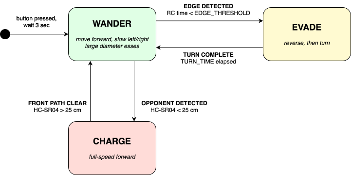

# Sumo Robot: [Robot Name]

**[Team Name]** — [Names]

> *What does your robot do and how does it compete? If you added any extensions beyond the guided build, mention them here. Write this after the rest of the document is done.*

---

## Design

### What the Robot Needs to Do

> *List what your robot needs to do to compete. Each item should be specific enough to test.*

### Success Criteria

> *For each requirement, describe a test you can run before competition day: what you measure, how many trials, on what surface, and what counts as passing. If you can only find out whether something works during a live round, it's not a criterion yet.*

| Requirement | How you tested it | Pass condition |
|-------------|------------------|----------------|
| | | |
| | | |
| | | |

### System Architecture

> *A diagram showing your robot's states and what causes each transition. Hand-drawn is fine. If you prefer a digital tool, [draw.io](https://app.diagrams.net/) is free and browser-based. Label the states and label the arrows with whatever sensor condition or threshold triggers the change. See [UML State Machine Diagrams](https://www.lucidchart.com/pages/tutorial/uml-state-machine-diagram) for conventions.*

> [!NOTE]
> **Example:** The diagram below shows what a state machine looks like for a minimum-viable sumo robot, with the HC-SR04 charge state shown as an extension. Your diagram will show your robot's actual states.
>
> 


*[Caption: Name each state and note what triggers each transition.]*

### Circuit Design

> *A schematic of your full circuit with every component labeled: resistor values, capacitor value, GPIO pin numbers, power and ground rails. A photo of your breadboard is not a schematic. Hand-drawn is fine. If you prefer a digital tool, [circuit-diagram.org/editor](https://www.circuit-diagram.org/editor/) is free and browser-based.*

> [!NOTE]
> **Example:** The diagram below shows the button and single-motor circuits from Labs 01–03 drawn as a schematic. Your schematic will cover your full robot circuit on a single diagram: two motors, photoresistor RC circuit, and any extensions.
>
> 


*[Caption: If you made a specific component choice that required a decision, note what you chose and why.]*

### Physical Layout

> *A top-down sketch of the chassis showing where each major component sits, with cable routing paths labeled. Draw it before or during the build. The point is to show you planned the layout, not just to document what ended up happening.*


*[Caption: Note any placement decisions made for a specific reason: cable run length, centre of mass, sensor clearance.]*

---

## Build

> *Tell the story of the build: what you planned, what you found out, what you changed. Photos of only the finished robot don't show that you built it. Take photos as you go.*

### Chassis

> *Describe how the chassis was assembled. If you modified or replaced the guided-build design, explain what changed and why. At least one photo here should show the robot before components were added.*


*[Caption: Show the chassis at a stage that no longer exists. Note what point in the build this was.]*


*[Caption: Show how a specific component is mounted and secured. Is it adjustable? Does it need to be?]*

### Wiring

> *Describe how wires are routed and secured, and any choices you made about keeping parts of the circuit separate. The final-state photo should show the wiring as submitted: no floating wires, ribbon cable folded, zip ties trimmed.*


*[Caption: Show the wiring at an earlier stage. Note what was working at this point and what hadn't been done yet.]*


*[Caption: Point out how wires are routed and secured. Note anything that changed from your wiring plan.]*

### Decisions Made During the Build

> *Document at least two decisions that came out of actually building and testing. What surprised you? What did you have to change after your first test run? These carry more weight than decisions you made in advance.*

### Calibration

> *Your edge detection threshold must be calibrated on the actual arena surface. Record your measurements. A threshold value in your code with no data behind it is a guess.*
>
> *At minimum, measure the arena surface, the boundary, and one other surface for comparison. Record mean RC time, a spread (range or standard deviation), and how many samples you took. Then explain how you got to your threshold from those numbers.*

| Surface | Mean RC time (s) | Range or std dev | Samples |
|---------|-----------------|------------------|---------|
| | | | |
| | | | |
| | | | |

**Chosen threshold:** `EDGE_THRESHOLD = ` — *[Explain how you got to this number from your measurements. How much room does it leave on each side?]*


*[Caption: The ring surface should be visible in the frame. This is how you show calibration happened on the arena, not on a table.]*


*[Caption: Actual readings from the ring surface and the boundary. This is what your threshold is based on.]*

---

## Code

> *Full source is in `src/`. Explain the key parts here; don't paste whole files. Someone reading this section should understand what your robot does and why the code is written the way it is.*

### Project Structure

```
src/
├── [filename].py     — [what this file does]
├── [filename].py     — [what this file does]
```

### [Name this section after the algorithm, e.g. Edge Detection]

> *Paste the relevant function, not the whole file. Then explain how it works and why you wrote it this way. Don't restate what the variable names already say. What did you have to decide, and what were you choosing between?*

```python
# paste snippet here
```

*[Explanation of the algorithm and the decisions behind it.]*

### [Name this section after the next key algorithm, e.g. Main Loop]

> *Same structure: snippet, then explanation. If your main loop is a state machine, show how the states are represented and what triggers each transition.*

```python
# paste snippet here
```

*[Explanation.]*

### GPIO Cleanup

> *Show your `try/finally` block and explain what it does. What happens to the GPIO pins if the program crashes without cleanup? Why does `finally` cover cases that `except KeyboardInterrupt` doesn't?*

```python
# paste your try/finally block here
```

*[Explanation.]*


*[Caption: Show the code running before competition day.]*

---

## Competition & Reflection

### Results

| Round | Placement | Bonus points | Round total |
|-------|-----------|-------------|-------------|
| Round 1 | | | |
| Round 2 | | | |
| Round 3 | | | |
| **Total** | | | |


*[Caption: Note which round and what was happening at this moment.]*

### What Worked

> *Explain why things worked, not just that they did. Which hardware or calibration decisions paid off? What from competition day confirms it?*

### What Failed

> *For each failure, describe what happened and trace it to the hardware or code. Don't stop at what happened — explain why. A reader who wasn't there should be able to follow the chain from symptom to root cause.*

### Next Iteration

> *At least two specific improvements tied to failures you described above. Each one should be concrete enough to actually build: what changes, and how does it address the problem?*
