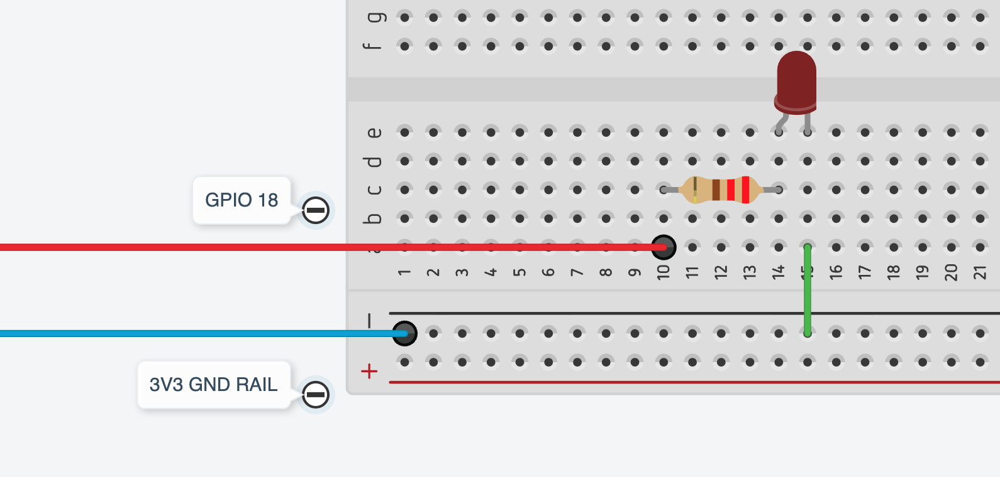

# Lab 1: LED Digital Output

**Day 5** — Wire a real LED circuit and run your blink script. This is the first time code you wrote produces something you can see and touch.

**Hardware:** RPi + CanaKit cobbler, breadboard, 1–2 LEDs, 220Ω resistor(s), M-F jumpers

---

## Circuit



```
BCM 18 (cobbler pin)  →  220Ω resistor  →  LED anode (longer leg)
                                             LED cathode (shorter leg)  →  blue rail (GND)
```

**Before wiring anything:** look up BCM 18 on your pinout reference. Find it on the cobbler label. Confirm the physical pin number with your partner before you place a single jumper.

> [!NOTE]
> The CanaKit cobbler routes ground to the blue (−) rails on both sides of the breadboard. You do not need a separate jumper back to a GND pin on the Pi — connect your LED cathode directly to either blue rail. Both are GND.

---

## Wiring Steps

Pi should be running with no script active, or powered off. GPIO pins in their default (LOW) state before wiring is good practice.

1. Locate **BCM 18** on the cobbler. Run a jumper from that pin to a free row on the breadboard.
2. Place a **220Ω resistor**: one leg in the same row as the jumper, other leg in a new row.
3. Place the **LED**: anode (longer leg) in the same row as the resistor's second leg, cathode (shorter leg) in a new row.
4. Run a jumper from the cathode row to the **blue rail** (either side — both are GND).

Double-check with your partner:
- Resistor present between GPIO pin and LED? ✓
- LED anode toward the resistor, cathode toward ground? ✓
- BCM 18 confirmed on pinout reference, not guessed? ✓

---

## Run Your Script

Confirm the import in your script is the real library, not the simulator:

```
head -2 ~/gpio/blink.py
```

Should show `import RPi.GPIO as GPIO`. If it still says `gpio_sim`, open with nano and fix it.

Run:

```
python3 ~/gpio/blink.py
```

The LED blinks. Press **Ctrl+C** to stop — the LED should go off (cleanup ran).

**If nothing happens:** see the troubleshooting table below before touching the wiring.

---

## Troubleshooting

| Symptom | Likely cause |
|---------|-------------|
| Script runs, LED does nothing | Wrong pin, or LED in backwards — check pinout, then swap LED direction |
| LED stays on permanently, doesn't blink | LED wired to the red (3V3/5V) rail instead of a GPIO pin |
| `ModuleNotFoundError: No module named 'gpio_sim'` | Import wasn't changed — open with nano, fix the import line |
| `ModuleNotFoundError: No module named 'RPi'` | RPi.GPIO not installed — confirm you're SSH'd into the Pi, not on your laptop |
| `RuntimeError: No access to /dev/gpiomem` | Not running as `pi` — check with `whoami` |
| LED very dim | Check for double-resistor, or LED wired backwards (dim instead of off) |

> [!TIP]
> The most common mistake is a backwards LED. If the script runs cleanly and the LED does nothing, swap the LED direction first — 9 times out of 10 that fixes it.

---

## Extensions

### A — Second LED, Alternating Blink

Wire a second LED on **BCM 23** (check pinout for physical pin). Same circuit: cobbler pin → 220Ω → LED anode → cathode → blue rail.

Modify your script to alternate — LED A on while LED B is off, then swap. Your Day 3 Part B script already does this with `gpio_sim`; the only change is the import.

---

### B — Modular Blink Function

Right now, your blink logic is written out inline wherever you need it. Refactor it into a reusable function that takes a pin, a number of blinks, and a delay as parameters.

Your function should work so that the main loop calls it cleanly — no GPIO calls visible at the top level. Once it works, add a startup sequence: a fast double-flash on both LEDs before the main loop begins, using the same function.

Think about: what should the default delay be if the caller doesn't specify one?

---

### C — Metronome: 4/4 Time (2 LEDs)

**Music background:** *Tempo* is the speed of music, measured in **BPM** (beats per minute). At 120 BPM, there are 2 beats every second. Most pop and rock music sits between 80–140 BPM.

**4/4 time** means there are 4 beats per bar. Beat 1 is the *downbeat* — the strong beat that feels like the beginning of the bar. Beats 2, 3, and 4 are the weaker beats. A drummer's kick drum usually lands on beat 1; the snare on beats 2 and 4.

---

Wire a red LED on **BCM 18** and a green LED on **BCM 23**. Write a metronome: red flashes on beat 1, green flashes on beats 2, 3, and 4. Each flash should be brief — the LED is off for most of each beat.

The key relationship to figure out: if you know the BPM, how long is one beat in seconds?

```python
BPM = 120
BEAT = ...   # derive this from BPM
FLASH = 0.05
```

Start at 120 BPM. Once it works, try 60 (slow) and 180 (fast). What goes wrong if BPM is high enough that `BEAT - FLASH` goes negative?

---

### D — Metronome: 4/4 Time (4 LEDs)

Wire four LEDs on **BCM 18, 23, 24, 25** — one per beat. Each LED flashes only on its assigned beat, in sequence.

The challenge: write this so that adding a 5th or 6th beat requires changing one line, not rewriting the loop. A list and a `for` loop are your tools.

Further challenge: make beat 1 flash twice as long as beats 2–4 to emphasise the downbeat. Then try introducing a rest — beat 3 goes dark entirely. How do you represent "no LED" in your list?

---

## Optional: Suppress the Ctrl+C Traceback

With a bare `try / finally`, pressing Ctrl+C prints a traceback after `Done.` — the cleanup still runs correctly, but the output is noisy. Add `except KeyboardInterrupt: pass` between the two blocks:

```python
try:
    while True:
        GPIO.output(LED_PIN, GPIO.HIGH)
        time.sleep(0.5)
        GPIO.output(LED_PIN, GPIO.LOW)
        time.sleep(0.5)

except KeyboardInterrupt:
    pass

finally:
    GPIO.cleanup()
    print("Done.")
```

Exit now prints only `Done.` — no traceback. `finally` still runs guaranteed.

---

## Lab Completion

Walk around check before the bell:

1. LED blinks in sync with the script ✓
2. Ctrl+C → LED goes off (`GPIO.cleanup()` ran) ✓

Extension credit: demonstrate any of A–D that you completed.
