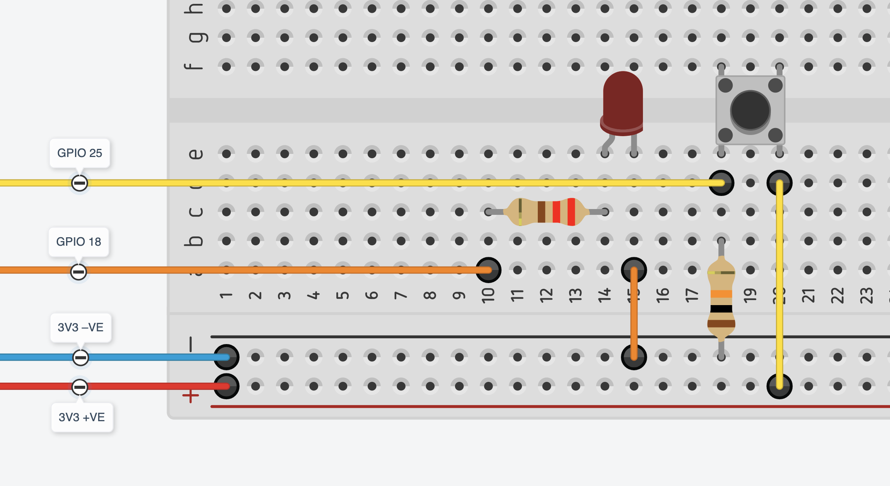
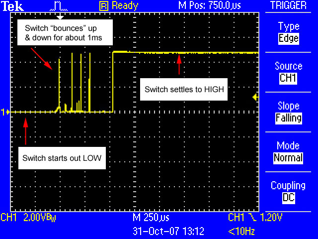

# Lab 02: Button — Digital Input

In Lab 01 you sent signals out through a GPIO pin. Today you read signals coming in.

A **button** is the simplest possible input device: one state when pressed, another state when released. Everything else in the CPT — an IR line sensor detecting the arena edge, an ultrasonic sensor detecting an opponent — follows the same circuit pattern and the same code pattern you'll write today.

**By the end of this lab you will have:** a button circuit wired to BCM 25, a polling loop that reads it, and code that uses the button to control the LED from Lab 01.

**Hardware required:** RPi, existing breadboard + LED circuit from Lab 01, 1× tactile button, 1× 10kΩ resistor (brown-black-orange), 2× additional M-F jumpers

---

## 1. The Floating Pin Problem

A GPIO input pin reads the voltage present at its connection. When nothing is wired to it, the pin is **floating** — not connected to 3.3V or to GND. A floating pin picks up stray electrical noise from nearby circuits, your body, and the power supply. It reads HIGH, or LOW, or fluctuates randomly between them. You cannot use a floating pin as a reliable input.

If you wire a button between the pin and 3.3V, the problem persists when the button is open. The connection to 3.3V is broken, so the pin is still floating.

The fix is a **pull-down resistor**.

---

## 2. Pull-Down Resistor

A pull-down resistor connects the input pin to GND through a high-resistance path:

```
3.3V (pin 1)  ──── [button] ──── BCM 25 (pin 22)
                                       │
                                    10 kΩ
                                       │
                                     GND (pin 20)
```

**Button open (not pressed):** The only connection from pin 25 is the 10kΩ resistor to GND. The resistor "pulls" the pin to 0V. GPIO reads `False`.

**Button pressed:** 3.3V connects directly to pin 25 through a short wire. 3.3V on the pin overpowers the weak pull-down signal — GPIO reads `True`.

One press changes the pin from 0V to 3.3V. Release returns it to 0V. Clean, reliable, every time.

**Why 10kΩ?** When the button is pressed, a small current flows from 3.3V through the resistor to GND: 3.3V ÷ 10,000Ω = 0.33mA. That's negligible heat and power. A lower resistor (say 100Ω) would draw 33mA continuously while the button is held — wasteful and stressing the voltage rail.

> [!NOTE]
> The RPi also has internal pull resistors (~50kΩ) that you can enable in software:
> ```python
> GPIO.setup(BUTTON_PIN, GPIO.IN, pull_up_down=GPIO.PUD_DOWN)
> ```
> This eliminates the need for an external 10kΩ. We use the external resistor in this lab so the concept is physically visible in your circuit. In the CPT, either approach works.

---

## 3. Wiring the Button Circuit

Leave your Lab 01 LED circuit intact. You will add the button alongside it.



**Pins used today:**

| Function | Cobbler label | BCM |
|----------|--------------|-----|
| LED (from Lab 01) | GPIO18 | 18 |
| Button input | GPIO25 | 25 |
| 3.3V supply | 3V3 | — |
| GND | GND (blue rail) | — |

Confirm BCM 25 on your pinout reference before wiring.

**Step-by-step:**

1. Place the tactile button spanning the breadboard's **centre channel** — it has four legs, two on each side. The button connects its two sides when pressed; legs on the same side are always connected internally.
2. Jumper: **3V3 on the cobbler** → row on one side of the button.
3. Jumper: row on the other side of the button → **GPIO25 on the cobbler**.
4. 10kΩ resistor: one leg in the **same row as the GPIO25 jumper**, other leg in a new row.
5. Jumper: that new row → **blue rail (GND)**.

> [!TIP]
> Identify the 10kΩ resistor by its colour bands: **brown – black – orange** (1 – 0 – ×1000 = 10,000Ω). The 220Ω resistors from Lab 01 are red – red – brown. They look similar in a bin — check the bands before wiring.

**Check your circuit before running any code:**
- With the button **not pressed**, the only electrical path from GPIO25 leads through 10kΩ to GND. Pin is LOW.
- With the button **pressed**, 3V3 connects directly to GPIO25. Pin goes HIGH.

> [!WARNING]
> Connect the button to **3V3 on the cobbler**, not 5V. GPIO input pins are rated for 3.3V logic. The cobbler labels the 3.3V and 5V pins clearly — check before wiring.

---

## 4. Reading the Button in Code

`GPIO.input()` reads the voltage on an input pin and returns `True` (HIGH) or `False` (LOW).

```python
state = GPIO.input(BUTTON_PIN)   # True when pressed, False when released
```

Setup for an input pin:

```python
GPIO.setup(BUTTON_PIN, GPIO.IN)
```

No `GPIO.HIGH` or `GPIO.LOW` in the setup call — unlike outputs, inputs have no initial state to set.

---

## Part A — Read and Print the Button State

Create a new file on the Pi:

```bash
nano ~/gpio/button.py
```

Write this script:

```python
import RPi.GPIO as GPIO
import time

BUTTON_PIN = 25

GPIO.setmode(GPIO.BCM)
GPIO.setup(BUTTON_PIN, GPIO.IN)

try:
    while True:
        state = GPIO.input(BUTTON_PIN)
        print("Button:", state)
        time.sleep(0.1)

finally:
    GPIO.cleanup()
    print("Done.")
```

Run it:

```bash
python3 ~/gpio/button.py
```

The terminal prints `Button: False` repeatedly. Press and hold the button. It should switch to `Button: True`. Release — it returns to `False`.

**If the button never shows `True`:** Check that the button is oriented correctly — the two sides of the centre channel must be connected by the button. Rotate it 90° if needed, and confirm the BCM 25 jumper is on the opposite side from 3.3V.

**If the button always shows `True`:** The 10kΩ pull-down is missing or wired incorrectly — check that one leg is in the BCM 25 row and the other connects to GND, not 3.3V.

**If the output is just noise (True/False flickering without touching the button):** The pin is floating — likely a loose jumper or the 10kΩ leg has slipped out of the row.

Once confirmed working, press Ctrl+C. Confirm `"Done."` prints — cleanup ran.

---

## 5. Debounce — Why Physical Buttons Are Noisy

When you press a physical button, the metal contacts do not make a single clean connection. They **bounce** — the contacts make and break contact several times in the first few milliseconds before settling. Your finger feels one press; the Pi can poll a pin thousands of times per second and sees multiple transitions.



**When does this matter?**

It depends on what you want the button to do:

| Button use | Bounce matters? |
|-----------|----------------|
| Is the button currently held down? | No — you're reading current state, not transitions |
| Count presses | Yes — one press may register as 3–5 |
| Toggle a state (press to turn on, press again to turn off) | Yes — one press toggles multiple times |

In Part B, you're reading whether the button is held right now — bounce doesn't matter. The `time.sleep(0.05)` polling interval is already longer than most bounce windows. In the extension, you'll see why it matters for toggles.

---

## Part B — Button Controls LED

Extend `button.py` to control your Lab 01 LED. Pressing the button turns the LED on; releasing it turns the LED off.

```python
import RPi.GPIO as GPIO
import time

BUTTON_PIN = 25
LED_PIN = 18

GPIO.setmode(GPIO.BCM)
GPIO.setup(BUTTON_PIN, GPIO.IN)
GPIO.setup(LED_PIN, GPIO.OUT)

try:
    while True:
        if GPIO.input(BUTTON_PIN):
            GPIO.output(LED_PIN, GPIO.HIGH)
        else:
            GPIO.output(LED_PIN, GPIO.LOW)
        time.sleep(0.05)

finally:
    GPIO.cleanup()
    print("Done.")
```

Run it. Press the button — LED on. Release — LED off.

Stop with Ctrl+C. Confirm LED turns off (cleanup resets the output pin to LOW).

> [!TIP]
> This `if GPIO.input(BUTTON_PIN):` pattern is the core of every sensor response in the CPT. An IR line sensor on the edge of the arena returns HIGH when it sees white (the arena surface) and LOW when it sees the dark centre hole — or the reverse, depending on the module. Your autonomous edge-detection code will be structurally identical to Part B.

---

## Extension — Toggle with Debounce

Instead of the LED following the button state (held = on, released = off), make the button a **toggle**: first press turns the LED on, next press turns it off.

This requires tracking state across loop iterations and handling bounce explicitly.

```python
import RPi.GPIO as GPIO
import time

BUTTON_PIN = 25
LED_PIN = 18

GPIO.setmode(GPIO.BCM)
GPIO.setup(BUTTON_PIN, GPIO.IN)
GPIO.setup(LED_PIN, GPIO.OUT)

led_state = False

try:
    while True:
        if GPIO.input(BUTTON_PIN):          # press detected
            led_state = not led_state       # flip the state
            GPIO.output(LED_PIN, led_state)
            time.sleep(0.2)                 # wait out the bounce
        time.sleep(0.05)

finally:
    GPIO.cleanup()
    print("Done.")
```

Run it. Press once — LED on. Press again — LED off.

**Now test what bounce looks like:** Remove the `time.sleep(0.2)` line and run it again. Press the button — the LED may toggle multiple times from a single press and end up in an unpredictable state. That's bounce: the polling loop is fast enough to catch multiple HIGH/LOW transitions from one physical press.

Put the `time.sleep(0.2)` back.

**A more robust version** waits for the button to be fully released before the loop can detect the next press:

```python
        if GPIO.input(BUTTON_PIN):
            led_state = not led_state
            GPIO.output(LED_PIN, led_state)
            while GPIO.input(BUTTON_PIN):   # wait for release
                time.sleep(0.01)
            time.sleep(0.05)                # settle after release
```

Ask yourself: what's the difference between the two approaches? Under what conditions does the simpler `time.sleep(0.2)` break?

---

## Tap Tempo Challenges

These challenges are for students who have finished everything above and want to go further. They build on each other — complete them in order. The goal is a LED that blinks at a tempo you set by tapping the button, like a musical metronome you control in real time.

### Challenge 1 — Measure the tap interval

Every time the button is pressed, print the time since the last press. Use the wait-for-release debounce from above.

`time.time()` returns the current time as a float (seconds since 1970 — the exact epoch doesn't matter, only the difference between two calls).

```python
last_press = None     # None = no press recorded yet

# inside your loop, on each detected press:
now = time.time()
if last_press is not None:
    interval = now - last_press
    print(f"interval: {interval:.3f}s")
last_press = now
```

**Add BPM to the output.** If you know the interval in seconds between beats, how do you get beats per minute? Tap along to a song and check whether your printed BPM matches.

---

### Challenge 2 — Blink the LED at tap rate

Take the interval from Challenge 1 and use it to drive the LED blink rate. Here's the problem: you can't write this:

```python
GPIO.output(LED_PIN, GPIO.HIGH)
time.sleep(beat)                 # blocks for the whole interval
GPIO.output(LED_PIN, GPIO.LOW)
time.sleep(beat)                 # blocks again
```

If the loop is sleeping, it can't read the button. One tap and the loop is frozen for a full beat.

The fix is **non-blocking timing**: instead of sleeping, check whether enough time has passed.

```python
last_blink = time.time()
led_state = False
beat = 0.5          # start with a default; tapping updates this

# inside your main loop (running every 1ms):
now = time.time()

if now - last_blink >= beat:
    led_state = not led_state
    GPIO.output(LED_PIN, led_state)
    last_blink = now
```

The loop never sleeps for long — it just checks a condition on every pass. Button reading and LED blinking happen in the same loop without interfering.

Combine this with your Challenge 1 tap detection. When a tap is detected, update `beat`. The LED blink rate changes immediately.

> [!TIP]
> Set the main loop sleep to `time.sleep(0.001)` (1ms). That's fast enough that the LED timing is accurate and button bounce can be caught, but not so tight that you're burning CPU unnecessarily.

---

### Challenge 3 — Smooth it out

Right now one mistimed tap makes the LED jump. Fix this by averaging the last several intervals instead of using only the most recent one.

Store intervals in a list with a fixed maximum length. Each new tap appends an interval and drops the oldest.

```python
from collections import deque

WINDOW = 4
intervals = deque(maxlen=WINDOW)   # holds the last 4 intervals; auto-drops oldest

# on each tap:
intervals.append(now - last_press)
if intervals:
    beat = sum(intervals) / len(intervals)
```

`deque(maxlen=N)` is a list that automatically drops the oldest entry when it reaches `N` items. You don't need to manage the size yourself.

Try different values of `WINDOW`. A larger window is more stable but responds more slowly to tempo changes. What feels right?

---

### Challenge 4 — Weight the recent taps

A plain average treats a tap from four presses ago equally with the last tap. If you speed up your tapping, the LED takes several taps to catch up because old slow intervals drag the average down.

Fix this by giving more weight to recent intervals. The most recent tap should matter most.

One approach — explicit weights:

```python
weights = list(range(1, len(intervals) + 1))   # [1, 2, 3, 4] for 4 intervals
beat = sum(i * w for i, w in zip(intervals, weights)) / sum(weights)
```

`zip(intervals, weights)` pairs each interval with its weight. The oldest interval gets weight 1, the newest gets weight 4. The weighted average divides by the sum of weights, not the count.

Try it. Tap slowly, then speed up — does the LED respond faster than it did in Challenge 3?

**Further challenge:** look up **exponential moving average (EMA)**. It's a one-line update that achieves the same bias with no list at all:

```python
ALPHA = 0.4     # 0 = ignore new taps, 1 = ignore history
beat = ALPHA * new_interval + (1 - ALPHA) * beat
```

What does `ALPHA = 0.9` feel like? What about `ALPHA = 0.1`?

---

## Key Terms

| Term | Definition |
|------|-----------|
| **Digital input** | A GPIO pin configured to read voltage — returns `True` (HIGH/3.3V) or `False` (LOW/0V) |
| **Floating pin** | An input pin with no defined voltage connection — reads random noise; must be fixed with a pull resistor |
| **Pull-down resistor** | A resistor from the input pin to GND that holds the pin at LOW when no active signal is applied |
| **Pull-up resistor** | A resistor from the input pin to 3.3V — holds the pin HIGH when no signal; inverts the logic (pressed = LOW) |
| **Polling** | Repeatedly checking an input in a loop, rather than waiting for an event |
| **Debounce** | Handling the brief rapid transitions a mechanical switch produces on contact — either via delay or wait-for-release |
| **`GPIO.setup(pin, GPIO.IN)`** | Configures a pin as an input |
| **`GPIO.input(pin)`** | Reads an input pin; returns `True` if HIGH, `False` if LOW |
