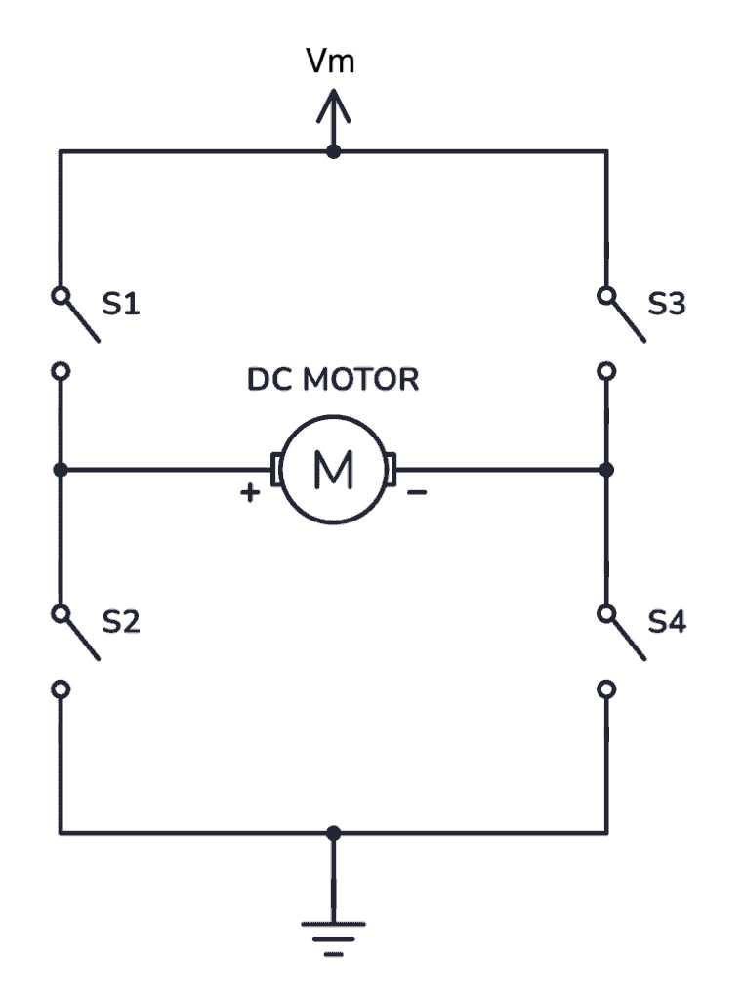
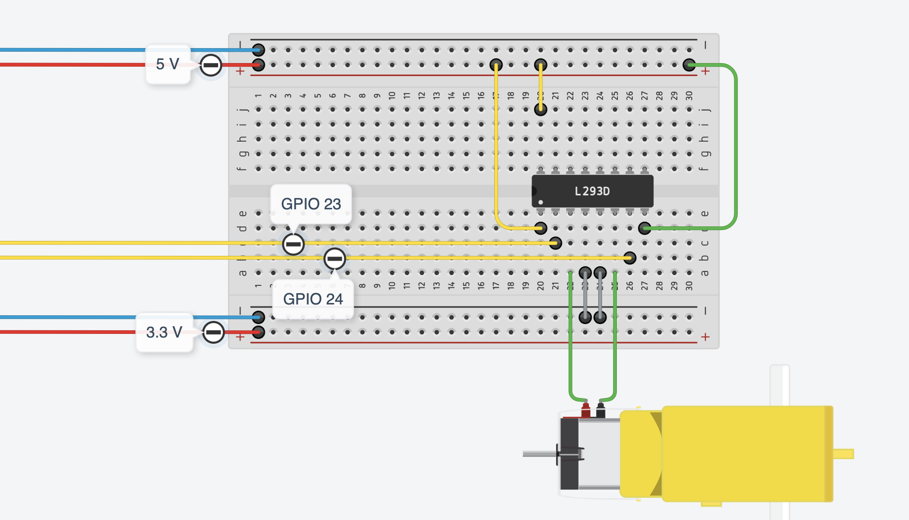
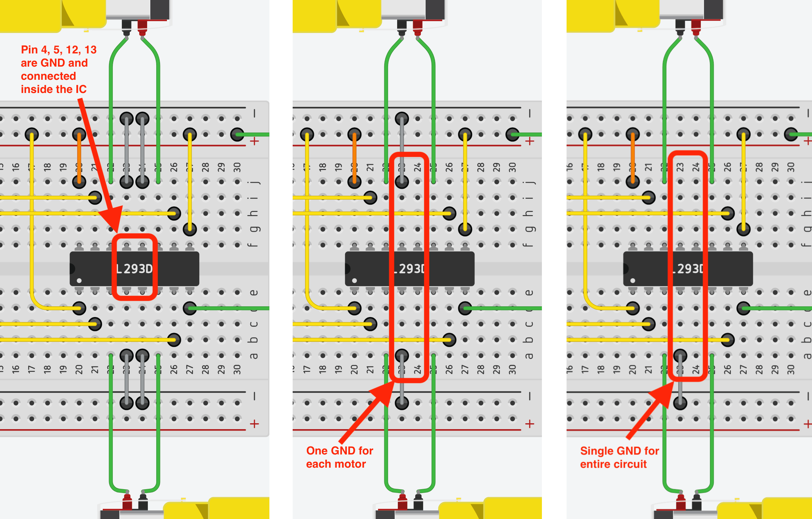
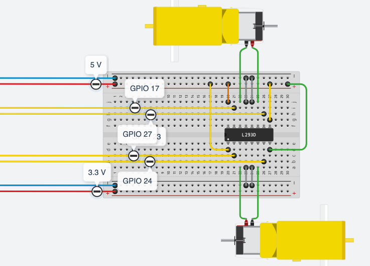
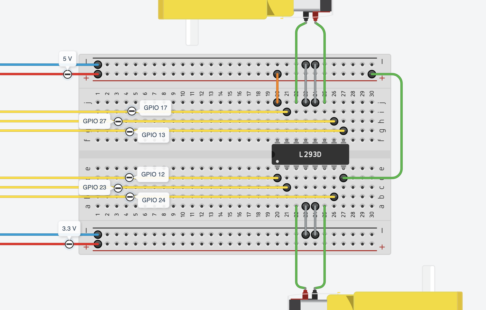

# Lab 03: Motors — H-Bridge Control

In Labs 01 and 02 you used GPIO pins to control an LED (output) and read a button (input). Today you add a motor — a fundamentally different kind of output that requires a driver chip between the Pi and the physical world.

**By the end of Part 1** you will have one motor wired through an L293D and running forward and reverse under Python control.

**By the end of Part 2** you will have two motors under PWM speed control — the direct foundation of the CPT robot drive system.

**Hardware (Part 1):** RPi + cobbler + breadboard, 1× L293D (DIP-16), 1× TT gearbox motor, jumper wires

**Hardware (Part 2):** Same + 1× additional TT gearbox motor

---

## 1. Why You Can't Drive a Motor Directly from GPIO

A GPIO output pin on the Raspberry Pi can source or sink at most **16 mA**. A small TT gearbox motor draws **150–400 mA** when running and much more at stall. Connecting a motor directly to a GPIO pin would immediately overdraw the pin — at best the Pi resets, at worst the GPIO circuitry is permanently damaged.

There's a second problem: **back-EMF**. When a spinning motor is switched off, the magnetic field in its coil collapses and generates a reverse voltage spike — sometimes several times the supply voltage, lasting microseconds. Without protection, this spike travels back up the wire and into your GPIO pin.

The solution is a **motor driver chip** that sits between the Pi and the motor:
- It takes low-current logic signals from the GPIO (safe for the Pi)
- It switches a separate, higher-current supply through the motor (safe for the motor)
- It includes built-in protection diodes to absorb back-EMF spikes

---

## 2. The H-Bridge

To run a motor forward and reverse, you need to reverse the direction of current through it. An **H-bridge** does this using four switches arranged in a pattern that looks like the letter H:



- **S1 + S4 closed:** current flows left-to-right through the motor → shaft spins one way
- **S2 + S3 closed:** current flows right-to-left → shaft spins the other way
- **S1 + S3, or S2 + S4:** both motor terminals at the same voltage → stop (brake)
- **All open:** motor coasts to a stop

The L293D implements this with transistors, driven by logic signals from your GPIO pins. You never interact with the switches directly — you just write HIGH or LOW to two input pins.

---

## 3. The L293D

The L293D is a **dual H-bridge** chip in a DIP-16 package — it fits directly across the centre channel of your breadboard and can drive two motors independently.

```
               L293D (top view)
            ┌────────────────┐
   EN1 ─── 1│                │16 ─── Vss  (logic power, 5V)
   IN1 ─── 2│                │15 ─── IN4
  OUT1 ─── 3│  Motor 1  │  2 │14 ─── OUT4
   GND ─── 4│                │13 ─── GND
   GND ─── 5│                │12 ─── GND
  OUT2 ─── 6│                │11 ─── OUT3
   IN2 ─── 7│                │10 ─── IN3
    Vm ─── 8│                │ 9 ─── EN2
            └────────────────┘
```

| Pin | Name | Role |
|-----|------|------|
| 1 | EN1 | Enable motor 1 — HIGH to run, LOW to disable |
| 2 | IN1 | Direction input A (from GPIO) |
| 3 | OUT1 | Motor 1 terminal A |
| 4, 5 | GND | Ground |
| 6 | OUT2 | Motor 1 terminal B |
| 7 | IN2 | Direction input B (from GPIO) |
| 8 | Vm | Motor power supply (5V from cobbler) |
| 9 | EN2 | Enable motor 2 |
| 10 | IN3 | Direction input C (from GPIO) |
| 11 | OUT3 | Motor 2 terminal A |
| 12, 13 | GND | Ground |
| 14 | OUT4 | Motor 2 terminal B |
| 15 | IN4 | Direction input D (from GPIO) |
| 16 | Vss | Logic power supply (5V from cobbler) |

**Vm vs Vss:** Both are powered from the cobbler's 5V rail, but they are separate pins with different roles. Vm powers the motors; Vss powers the chip's logic. Wire them separately — one jumper each.

> [!WARNING]
> **Vss (pin 16) must not exceed 7V.** If you use a higher-voltage supply for Vm (e.g. a 9V battery for more torque), Vss must still connect to 5V. Feeding 9V into pin 16 destroys the chip.

**Direction truth table for motor 1:**

| EN1 | IN1 | IN2 | Motor |
|-----|-----|-----|-------|
| HIGH | HIGH | LOW | Forward (shaft spins one way) |
| HIGH | LOW | HIGH | Reverse (shaft spins the other way) |
| HIGH | LOW | LOW | Stop (coast) |
| HIGH | HIGH | HIGH | Stop (brake) |
| LOW | × | × | Disabled |

Motor 2 (EN2, IN3, IN4, OUT3, OUT4) works identically.

---

## 4. Wiring — One Motor (Part 1)

Place the L293D spanning the breadboard centre channel. Pin 1 is marked with a notch or dot on one end of the chip.



> [!NOTE]
> The diagram above uses all four GND pins (4, 5, 12, 13). They are all internally connected inside the chip, so fewer wires work equally well on a breadboard. The figure below shows your options.
>
> 

> [!IMPORTANT]
> **Wire in this order:** GND → EN → Vss/Vm → GPIO → motor leads. EN1 and EN2 must be connected before power is applied — an unconnected EN pin can cause the chip to overheat and fail the moment power is connected.

**Connections:**

| From | To | Notes |
|------|----|-------|
| Cobbler GND | L293D pin 4 (GND) | Left-side ground — connect first |
| Cobbler 5V | L293D pin 1 (EN1) | Enable — connect before power rails |
| Cobbler 5V | L293D pin 16 (Vss) | Logic power |
| Cobbler 5V | L293D pin 8 (Vm) | Motor power |
| GPIO 23 | L293D pin 2 (IN1) | Direction A |
| GPIO 24 | L293D pin 7 (IN2) | Direction B |
| L293D pin 3 (OUT1) | Motor terminal (either) | |
| L293D pin 6 (OUT2) | Motor terminal (other) | |

**Before powering on:**
- Confirm pin 1 orientation (notch or dot)
- Confirm EN1 (pin 1) is connected — never leave it floating
- Confirm Vss (pin 16) and Vm (pin 8) are both connected to 5V — not to each other, not to GND
- Confirm GND is on pin 4 (left side) — not pin 16

> [!TIP]
> The motor terminals are not polarised — OUT1 and OUT2 just determine which shaft rotation you call "forward" and which you call "reverse". If you want to swap them, swap the two motor wires rather than changing the code.

---

## Part A — One Motor: Forward, Reverse, Stop

Create a new file:

```bash
nano ~/gpio/motors.py
```

```python
import RPi.GPIO as GPIO
import time

IN1 = 23
IN2 = 24

GPIO.setmode(GPIO.BCM)
GPIO.setup(IN1, GPIO.OUT)
GPIO.setup(IN2, GPIO.OUT)

def forward():
    GPIO.output(IN1, GPIO.HIGH)
    GPIO.output(IN2, GPIO.LOW)

def reverse():
    GPIO.output(IN1, GPIO.LOW)
    GPIO.output(IN2, GPIO.HIGH)

def stop():
    GPIO.output(IN1, GPIO.LOW)
    GPIO.output(IN2, GPIO.LOW)

try:
    print("Forward 2s")
    forward()
    time.sleep(2)

    print("Stop 0.5s")
    stop()
    time.sleep(0.5)

    print("Reverse 2s")
    reverse()
    time.sleep(2)

    print("Stop")
    stop()

finally:
    GPIO.cleanup()
    print("Done.")
```

Run it:

```bash
python3 ~/gpio/motors.py
```

The shaft should spin in one direction, pause, then spin the other way.

**If the motor does nothing:** confirm EN1 (pin 1) is connected to 5V — if it's floating or at GND, the chip is disabled and no signal on IN1/IN2 will do anything.

**If the motor runs but doesn't reverse:** IN1 and IN2 may be swapped, or both connected to the same GPIO pin. Check the wiring against the table above.

**If the Pi resets when the motor starts:** the USB power bank can't supply enough current. Try a different power bank, or reduce other loads.

**If the motor runs in only one direction regardless of IN1/IN2:** both IN pins may be wired to the same GPIO pin. Check continuity on the breadboard rows.

---

## 5. Wiring — Two Motors (Part 2)

Add the second motor using the other half of the L293D (pins 9–15). Pin 4 (GND) from Part 1 covers the left side. Add one GND wire for the right side now.



**Additional connections:**

| From | To | Notes |
|------|----|-------|
| Cobbler GND | L293D pin 13 (GND) | Right-side ground |
| Cobbler 5V | L293D pin 9 (EN2) | Enable — connect before power if rewiring |
| GPIO 27 | L293D pin 10 (IN3) | Motor B direction A |
| GPIO 17 | L293D pin 15 (IN4) | Motor B direction B |
| L293D pin 11 (OUT3) | Motor B terminal (either) | |
| L293D pin 14 (OUT4) | Motor B terminal (other) | |

**GPIO pins used across both motors:**

| Signal | BCM | Physical |
|--------|-----|----------|
| IN1 (motor A) | 23 | 16 |
| IN2 (motor A) | 24 | 18 |
| IN3 (motor B) | 27 | 13 |
| IN4 (motor B) | 17 | 11 |

---

## Part B — Two Motors: Simultaneous Control

Rewrite `motors.py` with both motors' pins and functions for each.

```python
import RPi.GPIO as GPIO
import time

IN1 = 23    # motor A
IN2 = 24
IN3 = 27    # motor B
IN4 = 17

GPIO.setmode(GPIO.BCM)
for pin in [IN1, IN2, IN3, IN4]:
    GPIO.setup(pin, GPIO.OUT)

def motor_a(direction):
    GPIO.output(IN1, direction == "forward")
    GPIO.output(IN2, direction == "reverse")

def motor_b(direction):
    GPIO.output(IN3, direction == "forward")
    GPIO.output(IN4, direction == "reverse")

def stop():
    for pin in [IN1, IN2, IN3, IN4]:
        GPIO.output(pin, GPIO.LOW)

try:
    print("Both forward 2s")
    motor_a("forward")
    motor_b("forward")
    time.sleep(2)
    stop()
    time.sleep(0.5)

    print("Both reverse 2s")
    motor_a("reverse")
    motor_b("reverse")
    time.sleep(2)
    stop()
    time.sleep(0.5)

    print("Differential: A forward, B reverse 2s")
    motor_a("forward")
    motor_b("reverse")
    time.sleep(2)
    stop()

finally:
    GPIO.cleanup()
    print("Done.")
```

Run it. Both shafts should spin together in the same direction, then together in the other direction, then in opposite directions simultaneously.

> [!NOTE]
> Both motors running in the same direction is what drives a robot straight. Motors running in opposite directions is what spins a robot in place (differential steering). On a desktop you're confirming the wiring is correct — the exact behaviour on a robot depends on how the motors are mounted.

**If one motor doesn't run:** confirm EN2 (pin 9) is connected to 5V — if EN2 is floating, the second motor channel is disabled regardless of IN3/IN4.

---

## 6. PWM Speed Control

So far EN1 is tied permanently to 5V, which means the motor is always either fully on or fully off. To control **speed**, you need to vary how much power reaches the motor.

**Pulse-width modulation (PWM)** does this by switching the enable pin on and off very rapidly — typically hundreds of times per second. The motor's inertia smooths out the switching, and the shaft spins as if it were receiving a fraction of full power.

The fraction of time the pin spends HIGH is called the **duty cycle**, expressed as a percentage:

```
Duty cycle 100%:  ████████████████  (full speed)
Duty cycle  50%:  ████░░░░████░░░░  (half speed)
Duty cycle  25%:  ██░░░░░░██░░░░░░  (quarter speed)
Duty cycle   0%:  ░░░░░░░░░░░░░░░░  (stopped)
```

### Rewiring EN1 and EN2

Remove the 5V jumper from EN1 (pin 1) and EN2 (pin 9). Replace each with a GPIO connection:

| From | To | Notes |
|------|----|-------|
| GPIO 12 | L293D pin 1 (EN1) | PWM speed control for motor A |
| GPIO 13 | L293D pin 9 (EN2) | PWM speed control for motor B |

> [!TIP]
> GPIO 12 and 13 (BCM numbering) are hardware PWM pins on the Raspberry Pi — the Pi's hardware generates the pulses without CPU involvement. `GPIO.PWM` works on any pin in software, but hardware PWM pins are smoother and more precise at the same speed.

**Updated GPIO pin summary:**

| Signal | BCM | Physical |
|--------|-----|----------|
| EN1 (motor A speed) | 12 | 32 |
| IN1 (motor A direction A) | 23 | 16 |
| IN2 (motor A direction B) | 24 | 18 |
| EN2 (motor B speed) | 13 | 33 |
| IN3 (motor B direction A) | 27 | 13 |
| IN4 (motor B direction B) | 17 | 11 |



---

## Part C — PWM Speed Control

Rewrite `motors.py` to use `GPIO.PWM` on the enable pins.

### Simple version

Start here. Set a direction and a speed (0–100) for each motor, run for a few seconds, stop.

```python
import RPi.GPIO as GPIO
import time

EN1 = 12
IN1 = 23
IN2 = 24

EN2 = 13
IN3 = 27
IN4 = 17

GPIO.setmode(GPIO.BCM)
for pin in [IN1, IN2, IN3, IN4, EN1, EN2]:
    GPIO.setup(pin, GPIO.OUT)

pwm_a = GPIO.PWM(EN1, 100)
pwm_b = GPIO.PWM(EN2, 100)
pwm_a.start(0)
pwm_b.start(0)

try:
    # Set direction: GPIO.HIGH = forward, GPIO.LOW = reverse
    GPIO.output(IN1, GPIO.HIGH)
    GPIO.output(IN2, GPIO.LOW)
    GPIO.output(IN3, GPIO.HIGH)
    GPIO.output(IN4, GPIO.LOW)

    # Set speed 0–100 for each motor
    pwm_a.ChangeDutyCycle(50)   # replace with your value
    pwm_b.ChangeDutyCycle(50)   # replace with your value

    time.sleep(3)

finally:
    pwm_a.stop()
    pwm_b.stop()
    del pwm_a, pwm_b
    GPIO.cleanup()
    print("Done.")
```

Try different values for each motor. Do they spin at the same speed? Does your robot go straight?

---

### Extended version

This version adds helper functions and a ramp sequence.

```python
import RPi.GPIO as GPIO
import time

EN1 = 12
IN1 = 23
IN2 = 24

EN2 = 13
IN3 = 27
IN4 = 17

GPIO.setmode(GPIO.BCM)
for pin in [IN1, IN2, IN3, IN4, EN1, EN2]:
    GPIO.setup(pin, GPIO.OUT)

pwm_a = GPIO.PWM(EN1, 100)
pwm_b = GPIO.PWM(EN2, 100)
pwm_a.start(0)
pwm_b.start(0)

def motor_a(direction):
    GPIO.output(IN1, direction == "forward")
    GPIO.output(IN2, direction == "reverse")

def motor_b(direction):
    GPIO.output(IN3, direction == "forward")
    GPIO.output(IN4, direction == "reverse")

def set_speed(speed_a, speed_b):
    pwm_a.ChangeDutyCycle(speed_a)
    pwm_b.ChangeDutyCycle(speed_b)

def stop():
    set_speed(0, 0)

try:
    motor_a("forward")
    motor_b("forward")

    print("Ramp up")
    for speed in range(0, 101, 5):
        set_speed(speed, speed)
        time.sleep(0.2)

    print("Full speed 2s")
    time.sleep(2)

    print("Ramp down")
    for speed in range(100, -1, -5):
        set_speed(speed, speed)
        time.sleep(0.2)

    stop()
    time.sleep(0.5)

    print("Motor A 30%, motor B 80%")
    set_speed(30, 80)
    time.sleep(3)

    stop()

finally:
    pwm_a.stop()
    pwm_b.stop()
    del pwm_a, pwm_b
    GPIO.cleanup()
    print("Done.")
```

**If a motor hums but doesn't spin:** the duty cycle is below the motor's stall threshold. Try starting the ramp at 20–30% instead of 0%.

**If one motor ignores speed changes:** confirm its EN pin is wired to the GPIO pin, not to 5V — if EN is still tied to 5V, that motor runs at full speed regardless of PWM output.

---

## Extensions

### A — Custom Sequence

Write a timed sequence using both motors at varying speeds and directions. Try at least three distinct states — for example: both motors at 60% forward for 2 seconds, then motor A at 80% and motor B at 40% for 2 seconds, then both reverse at 50% for 2 seconds, then stop.

### B — Button Start

Add the button from Lab 02 on GPIO 25. The motors should do nothing until the button is pressed, then execute the sequence once. Use the wait-for-release debounce pattern from Lab 02.

This is the CPT start button: one press launches the robot, which then runs its sequence autonomously.

### C — Refactor

The `motor_a()` and `motor_b()` functions are nearly identical. Refactor them into a single `set_direction(in_a, in_b, direction)` function that takes pin numbers as arguments. The calling code should then read:

```python
set_direction(IN1, IN2, "forward")
set_direction(IN3, IN4, "reverse")
```

Is this easier or harder to read than the named `motor_a`/`motor_b` approach? There's no single right answer — think about which you'd want to maintain on the competition day.

---

## Key Terms

| Term | Definition |
|------|-----------|
| **H-bridge** | A circuit of four switches that routes current through a motor in either direction |
| **Back-EMF** | A reverse voltage spike generated when a motor's field collapses — absorbed by the L293D's built-in diodes |
| **Vm** | Motor power supply pin on the L293D — powers the output transistors |
| **Vss** | Logic power supply pin on the L293D — powers the control circuitry; must not exceed 7V |
| **EN (enable)** | L293D enable pin — HIGH activates the channel; LOW disables it regardless of IN pins |
| **PWM** | Pulse-width modulation — rapidly switching a signal on and off to simulate a fraction of full power |
| **Duty cycle** | The percentage of time a PWM signal is HIGH; determines the effective power delivered to the motor |
| **Differential drive** | A two-motor drive system where steering is achieved by varying the speed or direction of each motor independently |
