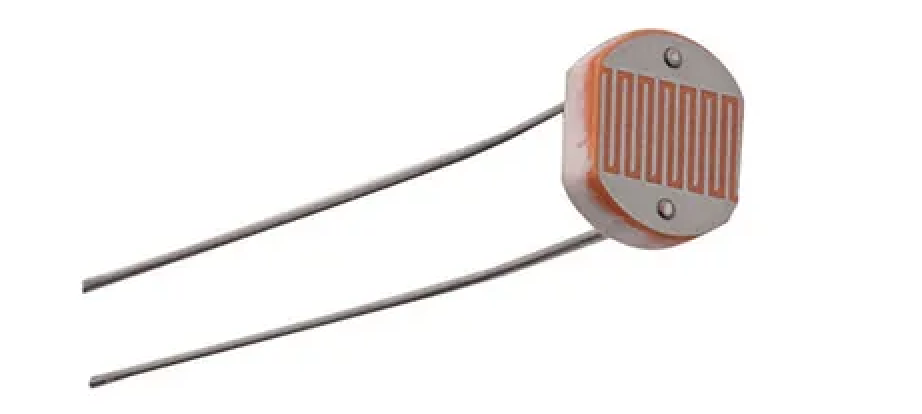
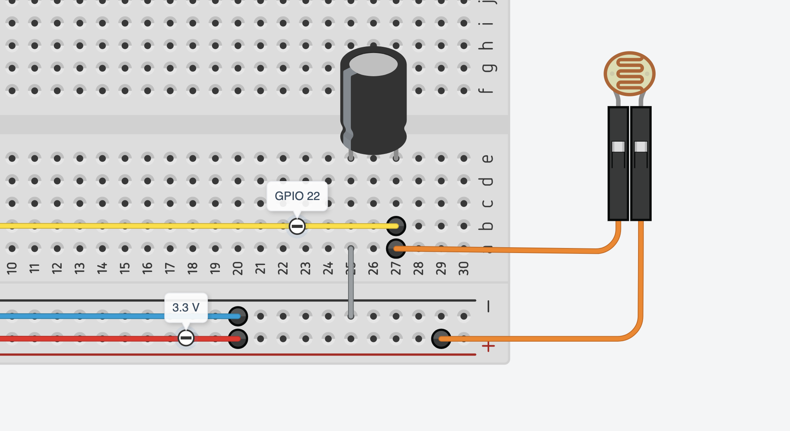

# Lab 04: Photoresistor — Light Sensing via RC Timing

Your CPT robot needs to detect the boundary of the arena — the line where the playing surface ends. The sensor that does this is a **photoresistor**: a component whose resistance changes with the amount of light hitting it. Less light (dark surface) means higher resistance; more light (bright surface) means lower resistance.

The challenge: the Raspberry Pi GPIO pins are **digital only**. They read HIGH or LOW — not a voltage level, not a number. This lab shows you the trick that all three robots from last year used to get a usable light reading anyway.

**By the end of Part A** you will have a working sensor circuit printing raw light readings to the terminal.

**By the end of Part B** you will have added an illuminator LED and calibrated your sensor's bright and dark values.

**By the end of Part C** you will have motor behaviour that responds to the sensor — cover the photoresistor, the motors reverse; uncover it, they go forward. This is the exact pattern your CPT robot needs.

**Hardware:** RPi + cobbler + existing breadboard, 1× photoresistor (LDR), 1× 10µF 50V electrolytic capacitor, 1× LED, 1× 330Ω resistor, jumper wires

---

## 1. The Problem: No Analog Input

A photoresistor's resistance varies continuously — it doesn't just snap between two states. Ideally you'd measure the voltage across it directly and map that to a light level. That requires an **analog-to-digital converter (ADC)**.

The Raspberry Pi has no ADC built in. Every GPIO pin is digital: it reads the voltage at its connection as either HIGH (above ~1.6V) or LOW (below ~1.6V) — nothing in between.

You need a workaround.

---

## 2. The RC Timing Trick

Instead of measuring voltage, you measure **time**. Here's the idea:

Connect a capacitor between the GPIO pin and GND, with the photoresistor between 3.3V and the GPIO pin:

```
3.3V ──── [photoresistor] ──── GPIO pin ──── [capacitor +] ──── GND
```

**Discharge:** Set the GPIO pin to OUTPUT LOW. This pulls the capacitor's voltage to 0V — it fully discharges.

**Charge:** Switch the GPIO pin to INPUT. Now the capacitor slowly charges toward 3.3V through the photoresistor.

**Measure:** Count how many times you can loop while the pin still reads LOW. When the capacitor voltage crosses ~1.6V, the pin snaps HIGH and the count stops.

```
Voltage at GPIO pin

 3.3V ─ ─ ─ ─ ─ ─ ─ ─ ─ ─ ─ ─ ─ ─ ─ ─ (target)

                  ╭─────────────────────  bright (fast charge, low count)
 1.6V ─ ─ ─ ─ ─ ─┼─ ─ ─ ─ ─ ─ ─ ─ ─ ─  ← pin reads HIGH
             ╭────╯
        ╭────╯                            dark (slow charge, high count)
  0V ───╯
  ↑
 discharge
```

The **count is proportional to resistance** — which is proportional to darkness. Bright light → low resistance → fast charge → **low count**. Dark → high resistance → slow charge → **high count**.

You're not reading voltage. You're reading time. Every component combination will give different numbers — there are no universal thresholds. You calibrate to your own circuit.

> [!NOTE]
> This technique appears in all three robots from last year's cohort and is documented in the official Raspberry Pi sensor guides. It works reliably for distinguishing a light-coloured surface from a dark one.

---

## 3. The Circuit

### Components

The photoresistor looks like a small disc with a wavy pattern on top and two leads. Polarity does not matter — you can place it either way.



Use **Dupont F-to-M jumpers** to connect the photoresistor leads into the breadboard — clip the female end onto each lead, male end into the breadboard row.

The 10µF capacitor is an **electrolytic** (cylindrical, with a stripe on one side). **Polarity matters:**
- The **positive leg** (longer, or the side without the stripe) goes toward the GPIO pin
- The **negative leg** (shorter, stripe side) goes to GND

Reversed polarity won't damage the circuit at 3.3V, but it won't charge correctly either.



### Pin assignment

Add these connections to your existing breadboard alongside the Lab 03 motor circuit.

| Signal | BCM | Physical |
|--------|-----|----------|
| Sensor (LDR + capacitor junction) | 22 | 15 |
| LED illuminator | 16 | 36 |

### Wiring

1. Place the photoresistor on the breadboard. One leg connects to the **3V3 rail** (or a row jumpered to pin 1). The other leg connects to a new row — call it the **sensor row**.
2. Connect the **sensor row** to **GPIO 22** on the cobbler (physical pin 15).
3. Place the capacitor: **positive leg in the sensor row**, negative leg in the GND rail.

That's the sensor circuit. The LED comes in Part B.

---

## Part A — Reading Raw Counts

Create a new file: `nano ~/gpio/sensor.py`

```python
import RPi.GPIO as GPIO
import time

SENSOR = 22

GPIO.setmode(GPIO.BCM)

def rc_time():
    GPIO.setup(SENSOR, GPIO.OUT)
    GPIO.output(SENSOR, GPIO.LOW)
    time.sleep(0.1)
    GPIO.setup(SENSOR, GPIO.IN)
    count = 0
    while GPIO.input(SENSOR) == GPIO.LOW:
        count += 1
    return count

try:
    while True:
        print(rc_time())
        time.sleep(0.2)
finally:
    GPIO.cleanup()
    print("Done.")
```

Run it: `python3 sensor.py`

You should see numbers printing every 0.2 seconds. Cover the photoresistor with your hand — the numbers should rise. Uncover it — they drop.

**If the numbers don't change:** check that the capacitor's positive leg is on the sensor row (not GND), and that the photoresistor has one leg on 3.3V.

**If the script hangs and prints nothing:** the capacitor is not charging — the pin never goes HIGH. Check that 3V3 is actually connected to the photoresistor, and that the sensor row is connected to GPIO 22.

### Calibrate your values

Run the script and record your readings. Every circuit will be different.

| Condition | Your count value |
|-----------|-----------------|
| Bright room light, sensor uncovered | |
| Hand fully over sensor (dark) | |
| Midpoint (your threshold) | ≈ halfway between the two |

Write your threshold value down — you'll use it in Part C.

---

## Part B — LED Illuminator

On your CPT robot, the photoresistor will face **downward** at the leading edge, reading reflected light off the arena surface. For reliable contrast between a black line and a white surface, you need a consistent light source — not ambient room light, which varies.

Add a **white LED** pointing down alongside the photoresistor. It illuminates the surface; the photoresistor reads the reflection. A white surface reflects more light back → lower resistance → lower count. A black surface absorbs light → higher resistance → higher count.

### Add the LED circuit

Wire exactly like the LED in Lab 01:

```
GPIO 16 (physical 36) ── [330Ω] ── LED(+) ── LED(−) ── GND
```

### Update the script

```python
import RPi.GPIO as GPIO
import time

SENSOR = 22
LED = 16

GPIO.setmode(GPIO.BCM)
GPIO.setup(LED, GPIO.OUT)
GPIO.output(LED, GPIO.HIGH)

def rc_time():
    GPIO.setup(SENSOR, GPIO.OUT)
    GPIO.output(SENSOR, GPIO.LOW)
    time.sleep(0.1)
    GPIO.setup(SENSOR, GPIO.IN)
    count = 0
    while GPIO.input(SENSOR) == GPIO.LOW:
        count += 1
    return count

try:
    while True:
        print(rc_time())
        time.sleep(0.2)
finally:
    GPIO.output(LED, GPIO.LOW)
    GPIO.cleanup()
    print("Done.")
```

### Test surface contrast

Hold a piece of **white paper** close to the sensor (5–10cm), then swap for a piece of **black paper** or a dark surface. The LED makes the difference between the two much sharper than ambient light alone.

Update your calibration table:

| Condition | Your count value |
|-----------|-----------------|
| White paper, LED on | |
| Black paper / dark surface, LED on | |
| Your updated threshold | ≈ halfway between the two |

> [!TIP]
> Point the LED so it illuminates roughly the same spot the photoresistor is reading. On the CPT robot, mount them side by side 5–10mm above the surface, both angled slightly inward.

---

## Part C — Motor Behaviour

Your motor circuit from Lab 03 is already wired. This script combines both systems: the sensor drives what the motors do.

Replace `THRESHOLD` with the value you found in Part B.

```python
import RPi.GPIO as GPIO
import time

SENSOR = 22
LED    = 16

EN1 = 12
IN1 = 23
IN2 = 24
EN2 = 13
IN3 = 27
IN4 = 17

THRESHOLD = 500   # replace with your calibrated value
SPEED = 60        # 0–100

GPIO.setmode(GPIO.BCM)
GPIO.setup(LED, GPIO.OUT)
GPIO.output(LED, GPIO.HIGH)

for pin in [IN1, IN2, IN3, IN4, EN1, EN2]:
    GPIO.setup(pin, GPIO.OUT)

pwm_a = GPIO.PWM(EN1, 100)
pwm_b = GPIO.PWM(EN2, 100)
pwm_a.start(SPEED)
pwm_b.start(SPEED)

def rc_time():
    GPIO.setup(SENSOR, GPIO.OUT)
    GPIO.output(SENSOR, GPIO.LOW)
    time.sleep(0.1)
    GPIO.setup(SENSOR, GPIO.IN)
    count = 0
    while GPIO.input(SENSOR) == GPIO.LOW:
        count += 1
    return count

def forward():
    GPIO.output(IN1, GPIO.HIGH)
    GPIO.output(IN2, GPIO.LOW)
    GPIO.output(IN3, GPIO.HIGH)
    GPIO.output(IN4, GPIO.LOW)

def reverse():
    GPIO.output(IN1, GPIO.LOW)
    GPIO.output(IN2, GPIO.HIGH)
    GPIO.output(IN3, GPIO.LOW)
    GPIO.output(IN4, GPIO.HIGH)

try:
    while True:
        reading = rc_time()
        print(reading)
        if reading > THRESHOLD:
            reverse()
        else:
            forward()
finally:
    pwm_a.ChangeDutyCycle(0)
    pwm_b.ChangeDutyCycle(0)
    pwm_a.stop()
    pwm_b.stop()
    del pwm_a, pwm_b
    GPIO.output(LED, GPIO.LOW)
    GPIO.cleanup()
    print("Done.")
```

Hold both motors by hand. Cover the photoresistor — both motors should reverse. Uncover it — both go forward.

**If the motors don't change direction:** your threshold may be wrong. Watch the printed readings and adjust `THRESHOLD` to a value between your bright and dark readings.

**If the behaviour is inverted** (forward when dark, reverse when light): your surface readings are reversed from what's expected — either swap `forward()` and `reverse()` in the `if` block, or rewire the LED so it illuminates the photoresistor better.

> [!NOTE]
> Each `rc_time()` call takes at least 100ms (the capacitor discharge sleep) plus the count time. The loop runs at roughly 3–8 readings per second — fast enough for bench testing. On the CPT robot, this means the sensor reacts within a fraction of a second, which is sufficient for edge detection at walking speed.

---

## Extension — Clean Functions and Module Structure

### `is_dark()`

Right now your loop calls `rc_time()` and compares to a threshold inline. Wrap this into a function so the rest of the code never sees the raw number:

```python
THRESHOLD = 500   # replace with your value

def is_dark():
    return rc_time() > THRESHOLD
```

Then the loop becomes:

```python
    while True:
        if is_dark():
            reverse()
        else:
            forward()
```

This is the pattern used in every robot from last year. The main loop reads like a description of behaviour; the low-level detail is hidden in the functions.

### Multiple readings for stability

A single count can be noisy — one stray bright frame can flip the reading. Average a few:

```python
def is_dark(samples=3):
    return sum(rc_time() for _ in range(samples)) / samples > THRESHOLD
```

This slows the loop (three RC readings instead of one) but makes the threshold decision more reliable. Useful if you see flickering behaviour near the boundary.

### Module structure

The robots from last year that were easiest to develop had their code split into two files:

- `sensor.py` — `rc_time()`, `is_dark()`, `THRESHOLD`, LED control
- `motor.py` — `forward()`, `reverse()`, `stop()`, PWM setup
- `main.py` — imports both, contains only the autonomous logic

You don't need to do this today. But when your CPT code grows past 60–70 lines, splitting it will make debugging much easier. Each file can be tested on its own before combining.

### Start delay

All last year's robots used a 5-second countdown before the autonomous loop started — triggered by a button press. This gives the operator time to set the robot in the ring and step back before the robot moves:

```python
print("Press button to start...")
while GPIO.input(BUTTON_PIN) == GPIO.LOW:
    time.sleep(0.05)

print("Starting in 5 seconds...")
time.sleep(5)
print("Go!")

while True:
    if is_dark():
        ...
```

The button circuit is identical to Lab 02. Pin BCM 25 is free to use if you want to add this today.
