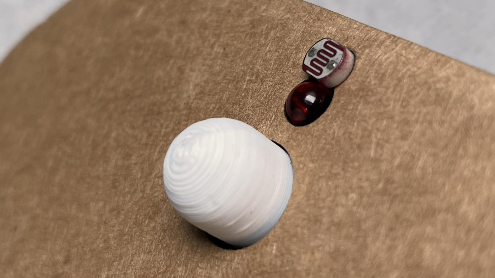
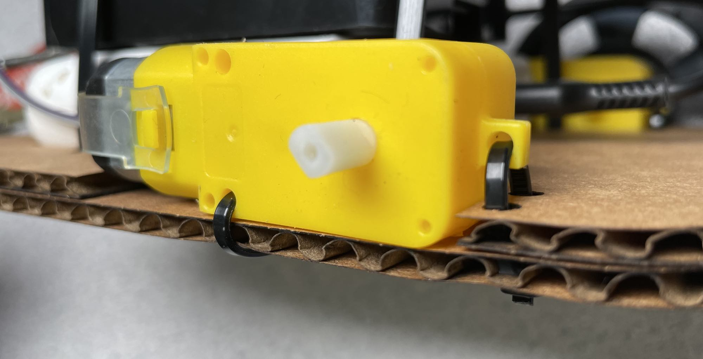
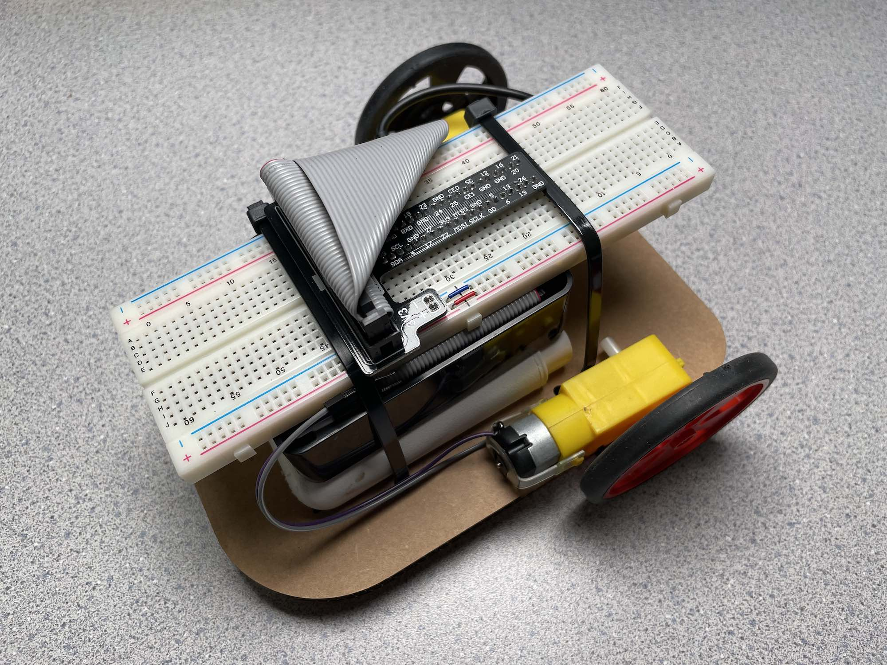
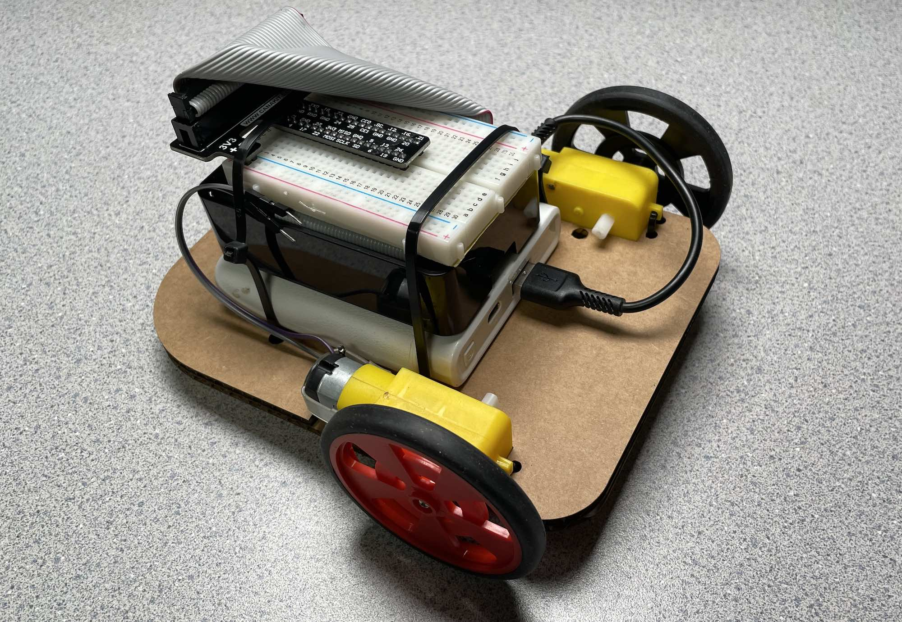
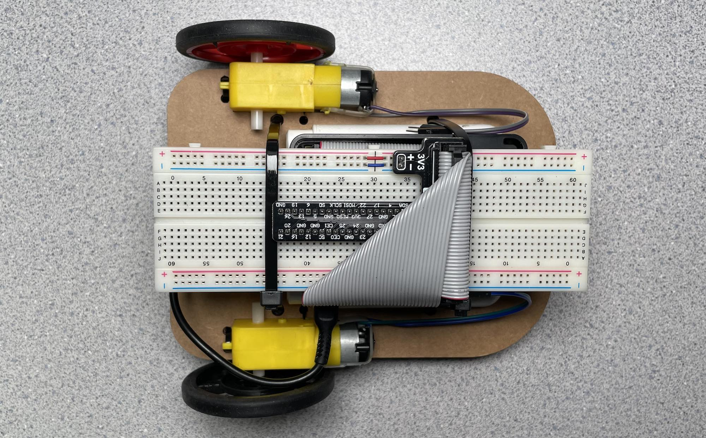

# Lab 05: Chassis Assembly

Your breadboard has a working sensor-motor system. Today you move it off the bench and onto wheels.

This is a **physical build lab**. There is no new code — you carry your sensor and motor circuits forward from Labs 03 and 04 and install them in a rolling chassis. By the end of this lab, your robot should drive forward, detect a dark surface at the nose, and reverse.

**By the end of Part A** you will have an assembled rolling chassis with both motors mounted and the front slider glued into place.

**By the end of Part B** you will have the sensor components installed and the electronics stack secured to the chassis.

**By the end of Part C** you will have all wiring connected and the robot running the edge-detection behaviour from Lab 04.

**Provided per group:** 2× pre-cut corrugated cardboard chassis layers, 4× small nylon zip ties, 4× medium nylon zip ties, 1× 3D-printed PLA front slider, glue

**You supply:** 2× TT gearbox motors + wheels, RPi in Canakit case (lid off), USB power bank, breadboard with Lab 03–04 circuit, jumper wires, ribbon cable + cobbler

> [!NOTE]
> **TT motor** stands for *Turtle* — named after the shape of the yellow plastic gearbox housing. The "130" in TT130 refers to the 130-size DC motor inside. The name originated with Chinese hobby motor manufacturers and became the generic term for this style of small plastic-gearbox motor.

---

> [!IMPORTANT]
> **Clean build standard.** This robot uses no tape and as little glue as possible — only where structurally necessary. Cable management, component alignment, and consideration for disassembly and recycling are part of the CPT rubric. Build as if someone else needs to take it apart cleanly at the end of the year.

---

## Part A — Chassis and Motor Mounting

### Step 1 — Glue the two chassis layers together

You have two pre-cut pieces of corrugated cardboard — a **bottom layer** (solid, with the slider recess and sensor holes at the nose) and a **top layer** (with a large rectangular cutout for the battery bay and motor slot notches on the sides). They stack to form a double-thickness chassis — the extra rigidity prevents the motors from twisting out of alignment when the robot pushes against another robot.

Before gluing, hold the two pieces together and check that the **zip tie holes align**. The motor mounting slots on each side and the nose sensor hole should line up exactly.

Apply glue to one face and press the two pieces together, hole-to-hole. Set aside under weight for a few minutes while you prepare the next steps.

> [!TIP]
> If you're using white or wood glue, use a thin, even coat — blobs trapped in the corrugation create uneven thickness. Hot glue works faster but sets before you can realign; apply it in a ring around the perimeter and press immediately.

### Step 2 — Glue the 3D-printed front slider

The front slider is a PLA hemisphere that glues into the recess on the **underside of the nose**. It provides a low-friction third contact point so the nose doesn't drag on the arena surface when the chassis tips forward under the weight of the electronics stack.

Apply a small amount of glue to the flat base of the hemisphere and press it firmly into the recess. Hold for 30 seconds.



While the glue sets on both the chassis layers and the slider, move on to motor preparation — you'll come back to mount them once the glue is firm.

### Step 3 — Mount the motors

Each TT gearbox motor mounts on one side of the chassis using **2× small zip ties**. The chassis has pre-cut holes for this — one hole in front of the motor body, one behind.

**Shaft selection:** TT motors have two output shafts — one on each side of the gearbox, different diameters. Check which shaft your wheel hub fits before deciding which side faces out. Once you've chosen an orientation, the wheel side faces outward and the motor body sits flat on top of the chassis edge.

**Zip tie threading — front:** Thread one zip tie through the hole in the bottom of the motor body, then loop it around the outside of the chassis edge and back up through the thru-hole in the chassis. Pull snug.

**Zip tie threading — rear:** Thread the second zip tie through the rear motor mounting point, then down through the two thru-holes in the chassis. Pull snug.

Pull snug but not crushing — corrugated cardboard compresses under high tension and won't recover.



Repeat for the second motor on the opposite side. Check that both motors are at the **same height and the same depth** — wheels should be parallel and clear the chassis edge by the same amount on both sides.

**Wheel mounting:** Press the wheel onto the correct shaft. Fit varies by wheel type — some are friction fit, some have a centre hole for a self-tapping screw. Do not use glue to secure a loose wheel; check with your teacher if the fit is too loose to hold reliably.

**Roll test:** Set the chassis on a flat surface. It should rest on both drive wheels and the front slider. If one side sits higher, the motor on that side is not fully seated — loosen the zip ties, reseat, and retighten.

---

## Part B — Sensor and Electronics Stack

### Step 4 — Install the sensor components

The nose of the chassis has a slot for the **LED illuminator and photoresistor**, both pointing downward toward the arena surface.

**LED:** Insert from the top, pressing the body down between the two chassis layers. The sandwich of cardboard holds it in place — no glue needed.

**Photoresistor:** Feed the leads up from the bottom through the chassis slot. On the top side, bend the leads flat against the cardboard to hold the body in place. Attach Dupont connectors to the leads — these will connect to your breadboard once the stack is mounted.

Leave both sets of leads extending upward for now.

> [!NOTE]
> LED colour matters for sensor contrast. **White or yellow** gives the best reflection signal off a light-coloured surface. Red works but is weaker. Avoid blue or green.

### Step 5 — Build the electronics stack

The stack sits on top of the chassis in this order, bottom to top:

1. **USB power bank** — sits in the battery bay cutout. The cutout keeps it from sliding; the zip ties will hold it down.
2. **RPi in Canakit case (lid removed)** — sits directly on top of the power bank. USB-A to micro-USB power cable connects them.
3. **Breadboard** — sits on top of the RPi case, cobbler plugged into the GPIO header. On a full-size breadboard the cobbler sits in the middle rather than at one end, which lets you shift the breadboard forward or back to balance the stack. If you prefer a more compact build, a half-size breadboard also fits — the trade-off is fewer available rows, so your circuit layout needs to be more efficient.

Before installing, plug the USB power cable between the power bank and the RPi. Connect the ribbon cable between the RPi GPIO header and the cobbler, and fold it into a compact loop — see Step 6.





### Step 6 — Fold the ribbon cable

The 40-pin ribbon cable is long enough to be a problem if left unmanaged. Fold it in neat, orthogonal (90°) bends so it sits entirely within the footprint of the breadboard. Do not aggressively crease the folds — the internal wires can break if the cable is kinked sharply. The goal is that the cable does not extend outside the stack perimeter and does not create a snagging point.



This is one of the most visible aspects of your clean build assessment. Take the time to fold it neatly.

### Step 7 — Secure the stack with medium zip ties

The stack is held down by two long loops, each made by **chaining 2× medium zip ties together** — insert the tail of one into the head of the next to create a single loop long enough to wrap around the entire stack and chassis. Use one chained pair at each end of the breadboard.

Thread each loop up through the chassis holes, over the breadboard edge, and back down through the adjacent holes. Pull snug.

The zip ties cross the breadboard at the ends — leave the centre of the breadboard clear so you can still insert and remove jumper wires.

> [!TIP]
> The power bank is the heaviest component and the most likely to shift. Check that it's seated in the battery bay cutout before pulling the zip ties tight — once tight, it's awkward to reposition.

---

## Part C — Wiring and Test

### Step 8 — Connect the motor wires

Your motor wires run from the motor bodies up to the breadboard. Route them along the chassis edge before connecting — no wires crossing open space at axle height where they can catch on wheels.

Connect exactly as in Lab 03. The L293D is already on your breadboard:

| Motor | L293D pins | BCM pins |
|-------|-----------|----------|
| Left  | IN1, IN2  | 23, 24   |
| Right | IN3, IN4  | 27, 17   |
| Left enable | EN1 | 12 |
| Right enable | EN2 | 13 |

If you are unsure which motor wire is which, run a quick forward test before tucking the wires down — swap the two wires on a motor to reverse its direction if one motor runs backward.

### Step 9 — Connect the sensor wires

The LED and photoresistor leads extend up from the nose slot into reach of the breadboard. Connect them to the same rows as your Lab 04 circuit:

| Component | BCM pin |
|-----------|---------|
| Photoresistor + capacitor junction | 22 |
| LED illuminator (via 330Ω) | 16 |
| 3V3 (photoresistor, one leg) | 3V3 rail |

Route the sensor leads along the underside of the breadboard or alongside the ribbon cable — not floating across open air.

### Step 10 — Boot and test

Connect the power bank to the RPi and let it boot. SSH in.

**Motor check first — hold the robot off the ground:**

```
python3 ~/gpio/motors.py
```

Verify both motors spin in the correct direction for forward and reverse before setting the robot down.

**Sensor check:**

```
python3 ~/gpio/sensor.py
```

Hold the nose over white paper — low count. Hold over a dark surface — high count. If the readings don't change, confirm the LED is on and the sensor wires are connected to the correct rows.

**Combined behaviour:**

Run your Lab 04 Part C script. Set the robot on a surface and cover the nose sensor — it should reverse. Uncover — forward.

Once this works on the bench, set the robot on the floor and watch it correct away from a dark area.

---

## What to Check Before Handing In

Before you pack up, verify the following — these are the criteria that carry into the CPT rubric:

- [ ] Both motors drive in the same direction for forward, opposite for reverse
- [ ] Sensor detects a dark surface reliably and triggers a motor direction change
- [ ] Ribbon cable is folded and contained within the stack footprint
- [ ] Motor and sensor wires are routed along the chassis, not floating
- [ ] No tape anywhere on the build
- [ ] All zip ties are trimmed flush (no sharp tails)
- [ ] Robot rests stably on both drive wheels and the front slider

---

## What Comes Next

This is the last guided lab. Starting next week, you own the design.

Your CPT robot needs to:
1. Stay in the ring (edge detection — you have this)
2. Find and push opponents out

You're free to extend the chassis, rearrange components, add sensors (HC-SR04 ultrasonic is available for extension), write more complex autonomous logic, or redesign the chassis entirely using the OnShape reference file:

[Chassis CAD reference (OnShape)](https://cad.onshape.com/documents/5348ff0bd57b3a2cea242434/w/6562db79663996135ecdf5b8/e/768ff86290f46d6c1236f710)

Custom chassis work should fit within an **11 × 17 inch** sheet of corrugated cardboard (270 × 420 mm work area with ~5 mm edge allowance). If you want to laser cut a custom chassis, speak to your teacher.

The guided build gives you a working platform. What you do with it from here is the CPT.
